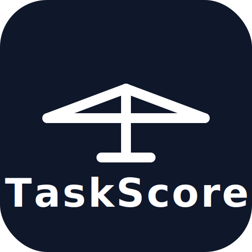

#  GlideComp

**GlideComp** is a web application for analyzing hanggliding and paragliding competition flights.

**What it does:**
- Pilots (or competition organizers) load IGC track log files and XCTask task files in the browser
- The app analyzes flights: task completion, scoring explanations, glide performance, thermal/climb analysis
- Full **CIVL GAP scoring** implementation (FAI Sporting Code Section 7F) — distance, time, leading, and arrival points for both PG and HG
- Includes 2D (Mapbox) and 3D (Three.js globe) map visualization of flight tracks
- Competition management features: pilot registration, task setup, scoring, penalties, with a full audit log for transparency

**How it's built:**
- **Client-side first** — IGC parsing and flight analysis happen entirely in the browser, no server required for core functionality
- **Frontend**: React SPA hosted on Cloudflare Pages, built with shadcn/ui components (Base UI foundation) and Tailwind CSS
- **Backend**: Cloudflare Workers API for competition management, with D1 (SQLite) database and R2 storage
- **Engine**: A dedicated `@glidecomp/engine` package handles geo calculations (WGS84 ellipsoid math, Vincenty formulas) and flight analysis

**Key design principles:**
- No server-side storage needed for basic use — drag-and-drop files and analyze locally
- All scoring decisions are explainable and auditable
- Every mutation affecting competition scores is audit-logged

The app is live at **[glidecomp.com](https://glidecomp.com)**.

### Features

- **Flight event detection** — automatic detection of takeoff, landing, thermals, glides, start/goal crossings, and turnpoint tagging
- **Thermal analysis** — entry/exit times, altitude gain, average climb rate
- **Glide analysis** — distance, altitude lost, L/D ratio, plus sink detection for poor glides
- **GAP scoring** — CIVL GAP scoring with distance, time, leading, and arrival points
- **Competition management** — create competitions, register pilots, upload IGC tracks, manage tasks, apply penalties, with full audit logging
- **Authentication** — Google OAuth login with user profiles
- **Task editor** — create and edit tasks with drag-to-reorder turnpoints, waypoint database search, and click-on-map placement
- **Multiple data sources** — drag & drop IGC/XCTSK files, import from XContest by task code, or import from AirScore by URL
- **Interactive map** — 2D (Mapbox) and 3D views with track overlay, task cylinders, and map annotations
- **Altitude sparkline** — clickable time-series chart linked to events and map position
- **Theme editor** — customizable UI themes with color and font controls, import/export support
- **Configurable units & detection** — speed, altitude, distance, climb rate units; adjustable thermal/glide detection thresholds

## Web Development

### Prerequisites

- [Bun](https://bun.sh/) (also requires Node.js 20+)
- A [MapBox](https://www.mapbox.com/) access token (for the map). If your token has URL restrictions, ensure `glidecomp.com` and `localhost:3000` are in the allowed URLs list.

### Setup

```bash
bun install

# Copy .env.example and add your MapBox token
cp .env.example .env
# Edit .env and set VITE_MAPBOX_TOKEN=your_token_here
```

### Running locally (Docker)

The easiest way to start everything. Only the frontend port is exposed:

```bash
docker compose up --build
```

To run multiple worktrees side-by-side, override the port:

```bash
PORT=3001 docker compose up --build
```

### Running locally (native)

Start the frontend and all API workers together:

```bash
bun run dev
```

This starts three services:
- **Frontend** — Vite dev server at http://localhost:3000
- **Auth API** — authentication worker at http://localhost:8788
- **Competition API** — competition management worker at http://localhost:8789

The auth worker requires a `.dev.vars` file in `web/workers/auth-api/` — see [docs/auth.md](docs/auth.md) for setup.

To start only the frontend (without any workers):

```bash
bun run dev:frontend
```

To use AirScore features, also start the AirScore API worker (http://localhost:8787) in a separate terminal:

```bash
bun run --filter airscore-api dev
```

The frontend automatically detects the local worker. If you'd rather skip the worker and use the production API instead:

```bash
VITE_AIRSCORE_URL=https://glidecomp.com/api/airscore bun run dev
```

### Tests and type checking

```bash
bun run test             # Run unit tests (engine + airscore worker) and type check
bun run test:comp        # Run competition API tests
bun run test:all         # Run all unit tests
bun run test:e2e         # Run Playwright end-to-end tests
bun run typecheck        # Type check root project
bun run typecheck:all    # Type check everything (frontend + engine + workers)
```

### Chrome MCP server set up

Read https://developer.chrome.com/blog/chrome-devtools-mcp-debug-your-browser-session

### Deployment

- Push to `master` → deploys to production
- Push to other branches → deploys to preview URL

```bash
bun run deploy           # Manual deploy to Cloudflare Pages
bun run deploy:worker    # Manual deploy AirScore API Worker
bun run deploy:comp      # Manual deploy Competition API Worker
bun run deploy:auth      # Manual deploy Auth API Worker
bun run deploy:all       # Deploy Pages + all Workers
```

**URLs:**
- Production: https://glidecomp.com
- Previews: https://{branch}.glidecomp.pages.dev

### CLI Scripts

**detect-events** - Detect flight events from an IGC file, outputting CSV:

```bash
bun run detect-events -- <flight.igc> [task.xctsk]

# Example with sample data
bun run detect-events -- \
  web/frontend/public/data/tracks/2025-01-05-Tushar-Corryong.igc \
  web/frontend/public/data/tasks/buje.xctsk
```

**get-xcontest-task** - Download a task from XContest by code:

```bash
bun run get-xcontest-task -- face
bun run get-xcontest-task -- --file task.json
```

**score-task** - Score multiple pilots against a task using CIVL GAP (FAI Sporting Code Section 7F):

```bash
bun run score-task <task.xctsk> <igc-file-or-folder>... [options]

# Scores identically to the web app. --wing (HG or PG) is REQUIRED for GAP
# scoring — the CLI has no comp record and won't guess. Given it, the run starts
# from the official per-category FAI/S7F defaults and each flag overrides one
# parameter. Flag names are the kebab-case of the gap_params keys the UI saves;
# units are the engine's (metres / seconds / 0-1 ratios). Grouped by function:
#
# Wing (required for GAP):
#   --wing <HG|PG>             Competition wing (`scoring`)
# Task mode:
#   --open-distance            Score as open distance (GAP options ignored)
# Nominal parameters:
#   --nominal-distance <m>     `nominalDistance` (default: 70% of task distance)
#   --nominal-goal <ratio>     `nominalGoal` 0-1 (default: 0.3)
#   --nominal-time <s>         `nominalTime` in seconds (default: 5400)
#   --minimum-distance <m>     `minimumDistance` in metres (default: 5000)
# Scoring terms (per-wing defaults; pass to override):
#   --no-use-leading           Disable leading (departure) points (`useLeading`)
#   --no-use-arrival           Disable arrival points (`useArrival`)
# Formula & advanced:
#   --leading-formula <weighted|classic>  `leadingFormula` (default: classic HG / weighted PG)
#   --leading-weight-formula <gap2020|s7f2024>  PG leading weight (default: gap2020)
#   --time-points-exponent <5/6|2/3>       `timePointsExponent` (default: 5/6)
#   (see --help for the full list, incl. nominal-launch, distance-origin, jump-the-gun,
#    leading-time-ratio)
# Output:
#   --json                     Output as JSON

# Example: score Corryong Cup 2026 Open Task 1 as HG with the official defaults
bun run score-task \
  web/samples/comps/corryong-cup-2026-open-t1/task.xctsk \
  web/samples/comps/corryong-cup-2026-open-t1/ \
  --wing HG
```

Example output:

```
=== Task Scoring Results (CIVL GAP) ===

Scoring config:
  Sport:          HG
  Leading:        on (classic)
  Time exponent:  5/6
  Arrival:        on
  Difficulty:     on
  Nominal:        dist 55.2 km / time 90 min / goal 30% / launch 96%

Task distance:    78.8 km
Pilots:           32 flying / 32 present
In goal:          12 (37.5%)
Best time:        1:37:55

Task Validity:    100.0%
Available Points: 1000 (dist: 486, time: 360, lead: 90, arr: 64)

   #  Pilot                            Dist     SS Time   Dist Pts   Diff Pts   Time Pts   Lead Pts    Arr Pts    Total
-----------------------------------------------------------------------------------------------------------------------
   1  Rohan Holtkamp                78.8 km     1:47:55      485.6      242.8      294.1       90.0       64.3      934
   2  Jon Durand                    78.8 km     1:37:55      485.6      242.8      360.1       21.2       44.2      911
   3  Peter  Burkitt                78.8 km     1:50:13      485.6      242.8      281.7       89.4       53.4      910
  ...
  13  Rich Reinauer                 76.9 km          LO      479.7      242.8        0.0        0.0        0.0      480
```

> The full HG table also shows a leading-coefficient (`LC`) column; it's elided here for width.

## Project Structure

```
web/
  frontend/              - Cloudflare Pages frontend (Vite + TypeScript)
  engine/                - Shared analysis library (IGC parsing, event detection, GAP scoring)
    cli/                 - CLI utilities (detect-events, get-xcontest-task, score-task)
  workers/
    auth-api/            - Authentication API (Cloudflare Worker + D1)
    competition-api/     - Competition management API (Cloudflare Worker + D1 + R2)
    airscore-api/        - AirScore caching proxy (Cloudflare Worker)
  scripts/               - Operational scripts (secrets, test emails)
e2e/                     - Playwright end-to-end tests
docs/                    - Feature and architecture specifications
```
