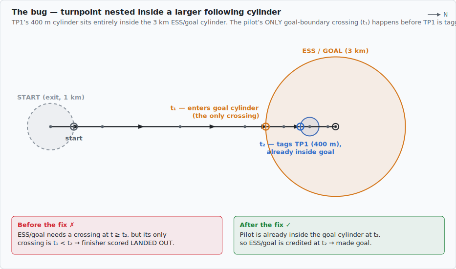
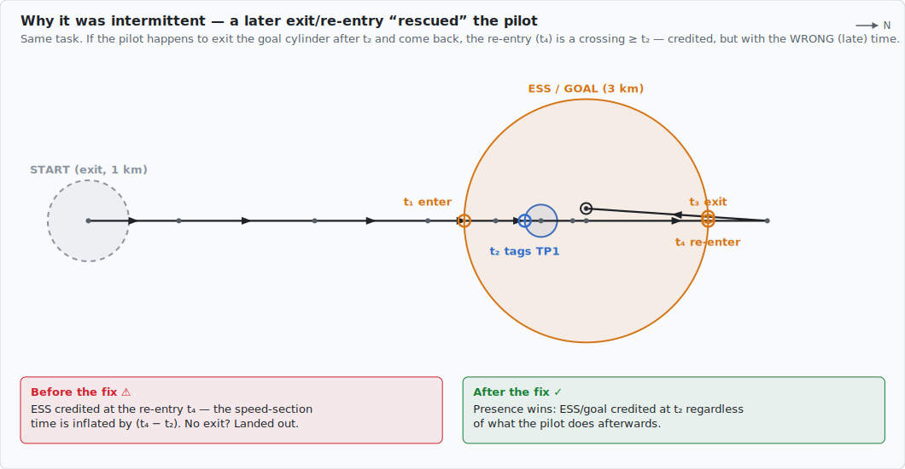
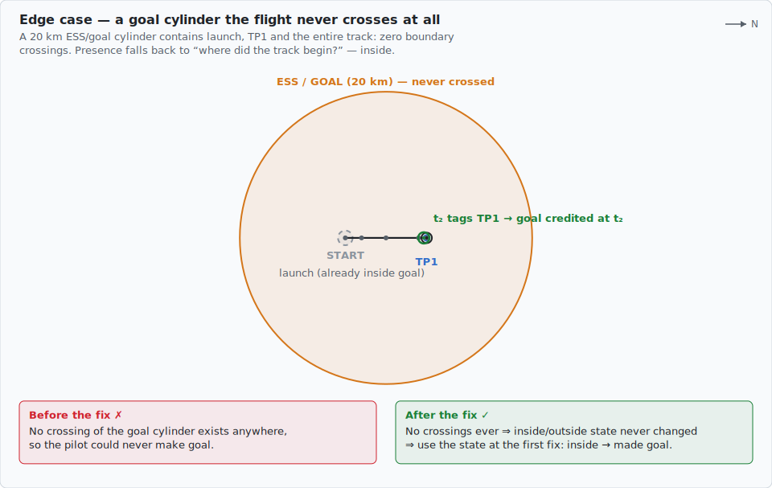
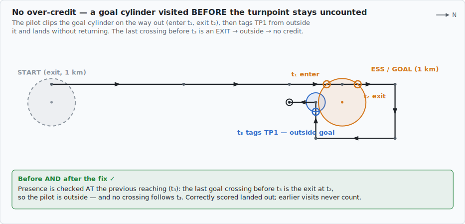

# Presence-based turnpoint reaching (nested / overlapping cylinders)

*2026-07-12 — companion to finding §1.1 of
[the web/engine code review](../2026-07-12-web-engine-code-review.md); shipped as
scoring engine v6.*

GAP/FS semantics for "reaching" a turnpoint are **presence-based**: a pilot has
reached a turnpoint once there is any track fix inside its cylinder (tolerance
band included, S7F §8.1) at or after the moment the previous turnpoint was
reached. GlideComp's sequencer (`web/engine/src/turnpoint-sequence.ts`) is built
on **boundary crossings** — normally equivalent, because to be inside a cylinder
you must have crossed into it after passing the previous one. The equivalence
breaks when a turnpoint's cylinder **contains or overlaps the previous
turnpoint's cylinder**: the pilot crosses the big boundary *first*, then tags
the previous turnpoint *inside* it, and the big cylinder's only crossing now
predates the time filter (`time >= prevReachingTime`).

The fix: before searching for a qualifying crossing, `buildForwardPath` checks
whether the pilot was **already inside** the cylinder at the previous reaching
moment. Crossings toggle the inside/outside state, so the state is read off the
last crossing strictly before that moment (or, if the cylinder was never
crossed at all, off where the track began). If inside, the turnpoint is credited
at the previous reaching time with `selectionReason: 'already_inside'`, which
the score explanation and the analysis panel surface to the pilot.

## Case 1 — the bug

A small final turnpoint nested inside a large ESS/goal cylinder. The pilot's
only goal-boundary crossing (t₁) happens before TP1 is tagged (t₂); a finisher
who lands in goal without ever exiting was scored **landed out**.

## Case 2 — why it was intermittent

If the pilot happened to exit the big cylinder after t₂ and come back, the
re-entry crossing satisfied the old time filter — so the same task/flight shape
sometimes scored and sometimes didn't. Worse, the credited time was the late
re-entry, inflating the speed-section time. Presence now credits t₂ regardless.

## Case 3 — a cylinder the flight never crosses

The extreme version: a goal cylinder so large the entire flight stays inside
it. There are no crossings at all to reason from, so the presence check falls
back to the track's first fix (the inside/outside state never changed).

## Case 4 — what must NOT change (no over-credit)

Presence is evaluated **at the previous reaching moment**, so a visit to a
later cylinder before its turn still counts for nothing: the last crossing
before t₃ is an exit, the pilot is outside, and with no crossing after t₃ the
task correctly ends at TP1.

Note the identical co-located ESS/goal cylinder (the common "speed section ends
at goal" setup) is deliberately untouched: its shared boundary crossing carries
the *same* timestamp as the previous reaching — not an earlier one — so it is
still credited by the crossing search (`first_crossing`), exactly as before
(scoring engine v3 behaviour).

## Where things live

- Fix: `buildForwardPath` in `web/engine/src/turnpoint-sequence.ts` (presence
  check + `'already_inside'` selection reason), scoring engine bumped to v6 in
  `web/engine/src/scoring-version.ts`.
- Tests: "turnpoint nested inside a larger following cylinder" describe block
  in `web/engine/tests/turnpoint-sequence.test.ts` — one test per case above.
- Explanations: `web/engine/src/score-explanation.ts` and
  `web/frontend/src/analysis/analysis-panel.ts` render the new reason.
- Diagrams: generated to scale from the test geometry by
  `diagrams/generate-nested-cylinder-diagrams.ts` (rerun with
  `bun docs/event-detection/diagrams/generate-nested-cylinder-diagrams.ts`).
