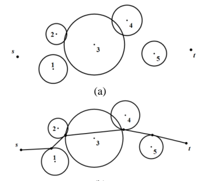
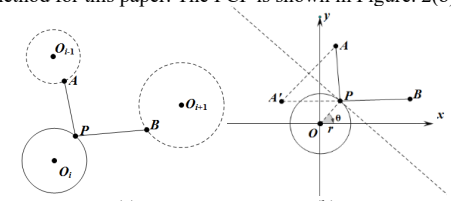
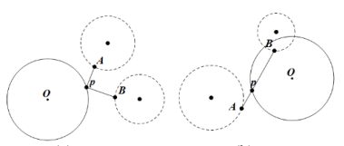
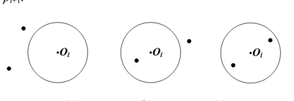
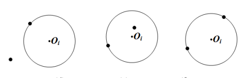
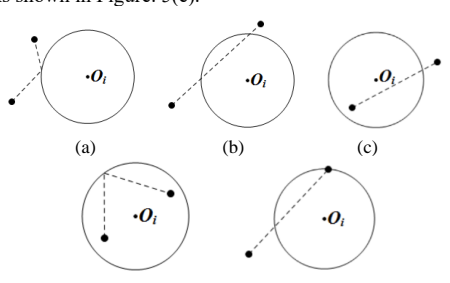
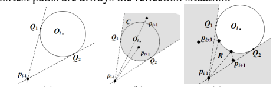
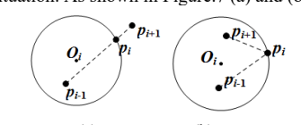
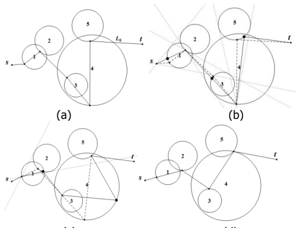

<!--
  Machine-readable transcription of Ding, Xie, Jiang: "An Efficient
  Algorithm for Touring n Circles", MATEC Web of Conferences 232, 03027
  (EITCE 2018), https://doi.org/10.1051/matecconf/201823203027.
  The source PDF is committed beside this file
  (matecconf_eitce2018_03027.pdf) — the paper is open access under the
  Creative Commons Attribution License 4.0, © The Authors, published by
  EDP Sciences.
-->

# Ding, Xie & Jiang (2018): An Efficient Algorithm for Touring n Circles — annotated transcription

**Why this paper is in GlideComp's reference set.** FAI Sporting Code
Section 7F (2026 Edition, §7.1.3) defines its route-optimisation algorithm
*by reference to this paper*: "PathFinder is the name we gave the algorithm
presented in Ding et al. (2018)". S7F's Annex B then extends the algorithm to
line control zones. The paper is therefore normative for FAI Category 1 task
and flown-distance calculation from 1 May 2026, and this transcription
exists so that the S7F 2026 reference
([../fai-s7f-xc-scoring-2026/](../fai-s7f-xc-scoring-2026/s7f-xc-scoring-2026.md))
is complete without leaving the repository.

**What S7F actually draws on.** The load-bearing parts for scoring are §2
(the PCP point-circle-point primitive and pre-processing) and §3.1–§3.3
(Theorem 1's reflection-vs-crossing case analysis, the R/C region division,
and the resulting traversal algorithm) — that is what PathFinder is. The
introduction's layered-manufacturing motivation, the unordered-circles/TSP
discussion, and §3.4's complexity experiments are context only; an engine
audit does not need them.

**Transcription conventions** match the S7F references (see
[../fai-s7f-xc-scoring-2024/INGESTION.md](../fai-s7f-xc-scoring-2024/INGESTION.md)):
formulas re-read from 150 dpi page rasters into LaTeX (the text layer
interleaves the paper's two columns), figures cropped with stand-in prose
descriptions, `<!-- PDF p.N -->` provenance comments, the paper's own
wording and grammar verbatim, and a source-extraction appendix at the end.

---

<!-- PDF p.1 -->

MATEC Web of Conferences **232**, 03027 (2018) — https://doi.org/10.1051/matecconf/201823203027
*EITCE 2018*

# An Efficient Algorithm for Touring *n* Circles

Yuepeng Ding1, Xiong Xie1 and Bo Jiang1,a

1Dalian Maritime University ,Linghai Road 1,Dalian,China

**Abstract.** This paper proposed an intelligent algorithm, which can build the shortest path of the intersecting circle sequences in the plane. The problem is transformed to a corresponding problem of computing the shortest path of three disjoint circles. And it is also an in-depth study of the traversal problem for the disjoint circle sequences. On the basis of the previous work, the algorithms are developed to construct such shortest path in polynomial time of O($kn$) where $1 \le k \le n$ under a given computational threshold. Since the algorithm is fully polynomial time consuming, this work can be conducted in layered manufacturing of rapid prototyping, displacement of wireless sensor networks, or other related computer-aided design and manufacturing applications.

## 1 Introduction

The study on such problems can be applied to layered manufacturing (LM) [1], sensor networks and other related computer-aided design and manufacturing. For example, in the layered manufacturing technology, the required geometry in model is cut with a laser beam on a thin material, and all cut geometric shapes are superimposed to obtain a 3D physical shape. In the production process of layered manufacturing, if we control the laser beams cut each geometric shape along the shortest traversal path, we will improve the productivity. In that case, we assume that the geometry in LM is circle, then the main problem in this paper is to find the shortest path of circles.

This touring problem, to find the shortest path of circular sequences in the plane, is an extension of the TSP problem [2]. The TSP problem is a classic combinatorial optimization problem and it can be described as follow. Travelers need to visit n cities, start from one city, visit each city only one time then return to the starting city, and the access path should be the shortest. When n cities are unordered in the TSP problem, this problem will be NP-hard [3]. Otherwise, the TSP problem can be solved optimally in linear time. Furthermore, if the access targets are abstracted as the circles, then it will be the main problem in this paper, which can be described as follows. The $n$ circles are numbered from 1 to $n$, i.e., $O_1; \ldots ; O_n$. In these circles, some of them may intersect each other, and the other may not. We need to choose one point on the border of each circle, which can yield the shortest traversal path of all the circles.

In 2008, Chou et al. proposed a function [4], which can find the shortest path between two points and a circle, by solving the equations. According to the equation, a dynamic point $p$ on the boundary of the circle $O$ can be deduced, which can build the shortest path between two fixed points and the circle $O$. This function is referred to the "point-circle-point" method, denoted as PCP.

Chou et al combined the PCP method in 2010 and proposed an algorithm, which can find the shortest path of disjoint-circle circular sequences in $O(kn)$, where $1 \le k \le n$ is related to the threshold given in the article, called Odd-Even[5].

Chou et al. combined PCP and Odd-Even algorithm in 2012 to design an new algorithm, named DBB (Dominant-Branch-and-Bound) [6], which can build the shortest path of disjoint unordered circles in O($kn{*}e^n$ ), where $1 \le k \le n$ is related to the threshold given in the article. The DBB algorithm mainly solves the problem of touring unordered circles in order, and it reduces the time complexity from the original $O(kn{*}n!)$ to $O(kn{*}e^n)$ by improving the branch-and-bound method.

In summary, the touring problems of disjoint circles, either ordered or unordered, have been solved in previous works. To the author's knowledge, there is no discussion about the problems of joint circles. Therefore, we analyzes this problem and designs an algorithm which can solve the traversing problem of circles in this paper, specifying that the circles are ordered and we give the start and end points to tour these circles. As shown in Figure.1 (a) and (b).

*Corresponding author:a Bo Jiang: bojiang@dlmu.edu.cn

© The Authors, published by EDP Sciences. This is an open access article distributed under the terms of the Creative Commons Attribution License 4.0 (http://creativecommons.org/licenses/by/4.0/).

<!-- PDF p.2 -->

*Figure 1. An example of the touring problem.*

Figure 1 has two sub-figures. (a) shows the problem instance: five circles numbered 1 to 5, with circle 3 the largest in the centre. Circle 2 (small, upper left) and circle 4 (small, upper right) each overlap circle 3; circle 1 sits below circle 2 at circle 3's lower left, touching/overlapping it; circle 5 is a small disjoint circle to the right of circle 3. A start point $s$ is a dot at the far left and an end point $t$ is a dot at the far right; no path is drawn. (b) shows the same five circles with the solution: a polyline runs from $s$ on the left through one point on each circle in numeric order — through the overlap region of circles 1, 2 and 3, across the top of circle 3 through its overlap with circle 4, then down through circle 5's boundary — and ends at $t$ on the right.

## 2 The PCP method

This paper will use the PCP method to solve the optimal access point on the circle $O_i$, so that we can compute the shortest path of three circles, called the partial shortest path, as shown in Figure. 2(a). We use this method to find the partial shortest path between $O_{i-1}$, $O_i$ and $O_{i+1}$, then the path of n circles can be optimized and shorten by computing the partial shortest path, until the shortest traversal path be solved. Therefore, PCP is a basic method for this paper. The PCP is shown in Figure. 2(b).

*Figure 2. The reflection path of two points and one circle.*

Figure 2 has two sub-figures. (a) shows three circles: a dashed circle labelled $O_{i-1}$ at the upper left with a point $A$ on its lower boundary, a solid circle labelled $O_i$ at the lower left with a point $P$ on its upper-right boundary, and a dashed circle labelled $O_{i+1}$ to the right with a point $B$ on its left boundary. Straight segments join $A$ to $P$ and $P$ to $B$: the partial shortest path through $O_i$ between its neighbours. (b) shows the PCP configuration in coordinates: a circle of radius $r$ centred at the origin $O$ of an $x$–$y$ axis system; a dynamic point $P$ lies on the circle's boundary at angle $\theta$ (marked at the centre between the radius $r$ to $P$ and the $x$-axis). Fixed point $A$ lies above the circle and fixed point $B$ to its right, each joined to $P$ by a segment; a point $A'$ is marked on the left on the $x$-axis, and a dashed diagonal line (the reflection line) runs through the figure.

The shortest path of the two interconnecting links $\left|\overline{Ap}+\overline{Bp}\right|$ with length $L$ can be denoted by

$$ L = min\{l(\theta_1),\ l(\theta_2), l(\theta_3), l(\theta_4), l(\theta_5), l(\theta_6), l(\theta_7), l(\theta_8)\} \tag{1} $$

Where

$$ l(\theta) = \sqrt{(x_A\text{-}r\cos\theta)^2 + (y_A\text{-}r\sin\theta)^2} + \sqrt{(x_B\text{-}r\cos\theta)^2 + (y_B\text{-}r\sin\theta)^2} $$

$$
\theta = \begin{cases}
\theta_1 = \text{-}\cos^{\text{-}1}(\dfrac{1}{4}k\text{-}n\text{-}\dfrac{1}{2}\sqrt{q\text{-}p}\,) \\[4pt]
\theta_2 = \cos^{\text{-}1}(\dfrac{1}{4}k\text{-}n\text{-}\dfrac{1}{2}\sqrt{q\text{-}p}\,) \\[4pt]
\theta_3 = \text{-}\cos^{\text{-}1}(\dfrac{1}{4}k\text{-}n+\dfrac{1}{2}\sqrt{q\text{-}p}\,) \\[4pt]
\theta_4 = \cos^{\text{-}1}(\dfrac{1}{4}k\text{-}n+\dfrac{1}{2}\sqrt{q\text{-}p}\,) \\[4pt]
\theta_5 = \text{-}\cos^{\text{-}1}(\dfrac{1}{4}k+n\text{-}\dfrac{1}{2}\sqrt{q+p}\,) \\[4pt]
\theta_6 = \cos^{\text{-}1}(\dfrac{1}{4}k+n\text{-}\dfrac{1}{2}\sqrt{q+p}\,) \\[4pt]
\theta_7 = \text{-}\cos^{\text{-}1}(\dfrac{1}{4}k+n+\dfrac{1}{2}\sqrt{q+p}\,) \\[4pt]
\theta_8 = \cos^{\text{-}1}(\dfrac{1}{4}k+n+\dfrac{1}{2}\sqrt{q+p}\,)
\end{cases}
$$

Where

$$ k = \frac{r(ax_B + bx_A)}{ab}, $$

$$ n = \frac{1}{2}\sqrt{\frac{l}{2} + \frac{1}{j}(\frac{g}{h} + h)}, $$

$$ p = \frac{m}{8a^3b^3n} $$

$$ q = l - \frac{1}{j}(\frac{g}{h} + h), $$

$$ a = x_A^2 + y_A^2, $$

$$ b = x_B^2 + y_B^2, $$

$$ c = 2r^2 x_A x_B + r^2 y_B^2 + x_B^2\left(r^2 - 4y_A^2\right) + 2r^2 y_A y_B + r2y_B^2 - 4y_A^2 y_B^2 + x_A^2\left(r^2 - 4b\right), $$

$$ d = 2x_A^2 x_B + x_B y_A \left(y_A - y_B\right) + x_A \left(2x_B^2 - y_B \left(y_A - y_B\right)\right), $$

$$ e = x_B^2(-r^2 + y_A^2) - 2x_A x_B \left(r^2 - y_A y_B\right) + x_A^2\left(-r^2 + y^2{}_B\right), $$

$$ f = 36r^2\left(6e\left(ax_B + bx_A\right)^2 + cd\left(ax_B + bx_A\right) + 6abd^2\right), $$

$$ h = \frac{1}{\sqrt[3]{2}}\sqrt{2c^3 - 288abce + 2f + \sqrt{-4g^3 + 4(c^3 - 144abce + f)^2}}, $$

$$ g = c^2 + 48abe + 24r^2 d\left(ax_B + bx_A\right), $$

$$ j = 12ab, $$

$$ m = r\left(r^2\left(ax_B + bx_A\right)^3 - abc\left(ax_B + bx_A\right) - 4a^2b^2d\right), $$

From the above derivation, an important lemma is given.

**Lemma 1.** The Euclidean shortest path in the two-dimensional plane, from one point outside the circle via one point on the border of the circle to one point outside the circle, can be computed using *Eq*. (1).

The proofs of the convergence and correctness of Lemma 1 can be found in [4].

<!-- PDF p.3 -->

*Figure 3. A counter-example for Odd-Even.*

Figure 3 has two sub-figures. (a) shows a solid circle $O$ at the left and two dashed circles: one above (its centre a dot, with point $A$ on its lower boundary, outside $O$) and one at the lower right (its centre a dot, with point $B$ to its left). A point $p$ lies on the boundary of $O$; segments $A$–$p$ and $p$–$B$ form a reflection path off circle $O$ — the reflection case, solvable by PCP. (b) shows a large solid circle $O$ at the right overlapped at its top by a small dashed circle, and a dashed circle at the lower left. Point $B$ lies near the top inside circle $O$ (within the overlap with the small dashed circle), point $A$ lies at the lower left outside circle $O$, and a point $P$ lies on $O$'s left boundary; segments join $B$ down to $P$ and $P$ to $A$. Because $B$ is inside $O$, the path cannot be a reflection.

In Odd-Even, after the pre-processing mentioned in this paper, the solution of the partial shortest path is only the case of reflection, and the reflection case mean that the partial shortest path of three circles is formed by the reflection path of light, which can be solved by PCP, as shown in Figure. 3(a). However, when the circles can be intersected, there will be a situation that cannot keep with the reflection situation, as shown in Figure. 3 (b). There are two points $A$ and $B$, and $A$ is outside the circle $O$. $B$ is inside the circle $O$. In this situation, we cannot apply the solution as the reflection situation. And it is easy to find that if we connect the two points $A$ and $B$ directly, then the intersection $p$ between the line segment $\overline{AB}$ and the circle $O$ will be the partial shortest path point. This case will be referred to as the crossing situation. Therefore, when the circles can be intersected, there are two ways to solve the partial shortest paths, such as the reflection situation and the crossing situation. So we will analyze the condition of the two situations and design corresponding traversal algorithms.

## 3 Results and discussion

### 3.1 Geometric analysis

**Theorem 1.** There are only the reflection situation and the crossing situation in solving the partial shortest path of the circle sequences, when the circles allow to be intersected.

**Proof.** This paper allows circles to intersect. The positional relationship of circles is: (a) disjoint, (b) tangent, (c) intersected, (d) contained. Under these four kinds of relationships, we use three circles to analyze the partial shortest path of a circle sequence. Therefore, we divides the partial area of the circle sequence into the outer area of the circle $O_i$, the inner area of the circle $O_i$, and the border of the circle $O_i$. During these divisions, we analyze all the possible positions of the circle $O_i$, the point $p_{i-1}$ and the point $p_{i+1}$ in the three areas. As shown in the Fig. 4. Since the point $p_{i-1}$ is symmetric to the point $p_{i+1}$, they can be interchanged without affecting the solution of the partial shortest path, which is to say one point can be the point $p_{i-1}$, and it also can be the point $p_{i+1}$.

*Figure 4. All positions of Oi, pi-1 and pi+1.*

Figure 4 has six sub-figures, each a circle labelled $O_i$ (centre dot) with two dots marking the neighbouring path points; no paths are drawn. (a) both points are outside the circle (upper left and lower left). (b) one point is inside the circle (below and left of the centre) and one point is outside (to the right). (c) both points are inside the circle (both in its right half). (d) one point is on the circle's boundary (upper left) and the other is outside (lower left). (e) one point is on the boundary (left) and the other is inside (above the centre). (f) both points are on the boundary (upper right and lower left).

We discuss the solutions of the partial shortest path based on the positions of the circle $O_i$ and the point $p_{i-1}$ and the point $p_{i+1}$. During the Figure. 4(a), we can obtain two possible solutions to the partial shortest path under (a) position, as shown in Figure. 5(a) and (b), which are in accord with the reflection situation and the crossing situation.

For the Figure. 4(b), either the point $p_{i-1}$ or the point $p_{i+1}$ is inner the circle $O_i$, it can be seen that the solution of the partial shortest path only satisfy the crossing situation. As shown in Figure. 5(c).

For the Figure.4(c), the point $p_{i-1}$ and the point $p_{i-1}$ are all inner the circle $O_i$, and the access path needs to access the circle first, so the solution of the partial shortest path only satisfy the reflection situation. As shown in Figure. 5(d).

For the Figure.4(d)~(f), if one point $p_{i-1}$ or $p_{i+1}$ is on circle $O_i$, then the access path must pass circle $O_i$ from the point $p_{i-1}$ to the point $p_{i+1}$, so the solution of the partial shortest path only satisfy the crossing situation. As shown in Figure. 5(e).

*Figure 5. Solutions of all the positions.*

Figure 5 has five sub-figures, each the circle $O_i$ (centre dot) with the two neighbouring points and a dashed path. (a) both points outside: the dashed path runs from one outside point to a reflection point on the upper-left boundary and back out to the other outside point (reflection situation). (b) both points outside: a single dashed line joins the point above the circle to the point at the lower left, passing straight through the circle (crossing situation). (c) one point outside (right) and one inside (lower left): a dashed line joins them, entering the circle through its boundary (crossing situation). (d) both points inside: dashed segments run from each interior point to a common point on the upper-left boundary (reflection situation — the path must reach the circle first). (e) one point on the boundary (top) and one outside (lower left): a dashed line joins them through the circle (crossing situation).

To sum up, all the positions of the circle $O_i$, the point $p_{i-1}$ and the point $p_{i+1}$ have only the reflection situation or the crossing situation, so Theorem 1 is proved.

### 3.2 The division of reflection and crossing

According to Theorem 1, we can sure that the solution of the partial shortest path contains only two situations, the reflection and the crossing. According to the division of convex polygons and related problems [7, 8], we divide the plane into two regions, called reflection region and crossing region, denoted by $R$ and $C$. According to the position relationship between circle $O_i$，the point $p_{i-1}$ and the point $p_{i+1}$, we divide the solution of the shortest path of the circle sequence into two cases.

In the first case, the point $p_{i-1}$ is outside the circle $O_i$. For this case, we can draw two tangent lines crossed $p_{i-1}$ and touched circle $O_i$. The tangent points are denoted by <!-- PDF p.4 --> $Q_1$ and $Q_2$, as shown in Figure. 6(a). We use $C$ denote the inward area that enclosed by the circle $O_i$ and the tangent lines, and the region of $C$ contains the circle boundary. As can be seen from Figure. 6(b), wherever the point $p_{i+1}$ is at any position in the region of $C$, the partial shortest paths are all belong to the crossing situation. We use $R$ denote the periphery area of the circle and tangent. As shown in Figure. 6(c), wherever the point $p_{i+1}$ is located at any position of $R$, the partial shortest paths are always the reflection situation.

*Figure 6. Division of the regions R and C.*

Figure 6 has three sub-figures built on the same construction: circle $O_i$ (centre dot) with two dashed tangent lines drawn from the external point $p_{i-1}$ (lower left), touching the circle at tangent points $Q_1$ (upper left) and $Q_2$ (lower right). (a) shows only this construction. (b) shades grey the wedge beyond the circle between the two tangent lines, labelled $C$: the inward area enclosed by the circle and the tangent lines, containing the circle boundary. Two sample positions of $p_{i+1}$ are marked as dots inside region $C$ — one beyond the circle within the wedge and one inside the circle. (c) shades grey the complementary periphery area, labelled $R$, outside the tangent wedge. Two sample positions of $p_{i+1}$ are marked in $R$ — one to the left of the circle and one at the lower right — with $p_{i-1}$ still at the lower left.

In the second case, when the point $p_{i-1}$ is inner the circle. We can see that as long as the point $p_{i+1}$ is outside the circle, there is only the crossing situation, and when the point $p_{i+1}$ is inner the circle, there is only the reflection situation. As shown in Figure.7 (a) and (b).

*Figure 7. Cases of pi+1 inner the circle.*

Figure 7 has two sub-figures. (a) shows circle $O_i$ with $p_{i-1}$ inside at the lower left and $p_{i+1}$ outside at the upper right; a dashed segment joins them, and $p_i$ is marked where the segment crosses the circle's boundary (crossing situation). (b) shows circle $O_i$ with both $p_{i-1}$ (lower centre) and $p_{i+1}$ (upper left, inside) in the interior; dashed segments run from each to the point $p_i$ on the circle's right boundary (reflection situation).

### 3.3 Algorithm

We assume that a set of circle sequences $O$ = {$O_1$, $O_2$; . . . ; $O_5$}, a starting point $s$, and an ending point $t$ are on the plane.

Step.1. We initialize an access path for this circle sequences, and denote the length of the path as $L_0$, then record the initialized path points $\rho$ = {$p_1$, $p_2$; . . . ; $p_5$}, as shown in Figure. 8(a).

Step.2. After fixing the contact point on each even circle, then we can divide the region $R$ and $C$ for all odd circles so that the solution method (reflection or crossing) can be determined, and finally the partial shortest path point on each odd-numbered circle can be solved by two methods. As shown in Figure. 8(b).

Step.3. After fixing the contact point on each odd circle, then we can divide the region $R$ and $C$ for all even circles so that the solution method (reflection or crossing) can be determined, and finally the partial shortest path point on each even-numbered circle can be solved by two methods. As shown in Figure. 8(c).

Step.4. We calculate the absolute difference between the lengths of two adjacent paths, denoted by $d$.

Step.5. If $d > \varepsilon$ repeat steps 2~4. If $d \le \varepsilon$ ($\varepsilon$ is the maximum numerical accuracy of the given computer), stop iterative calculation and output the sequence of path point $\rho$. The algorithm ends. As shown in Figure. 8(d).

*Figure 8. Four steps of Algorithm 2.*

Figure 8 has four sub-figures, all over the same five-circle instance of Figure 1 (circles numbered 1–5, start point $s$ at the left, end point $t$ at the right). (a) shows the initialized access path: solid segments from $s$ through an arbitrarily chosen contact point on each circle to $t$, including a vertical chord dropped inside circle 4; the segment toward $t$ is labelled $L_0$. (b) overlays many light tangent lines: with the contact points on the even circles fixed, tangent lines from the neighbouring path points divide the regions $R$ and $C$ around each odd circle, and dashed segments show the updated partial shortest path points on the odd circles. (c) shows the mirror step: with contact points on the odd circles fixed, tangent lines divide $R$ and $C$ around the even circles, and dashed segments show the updated even-circle path points. (d) shows the converged result: a clean polyline from $s$ through one point on each of the five circles to $t$ — the shortest traversal path — with no construction lines remaining.

With a set of circle sequences $O$ = {$O_1$, $O_2$; . . . ; $O_n$}, the algorithm for traversing $O$ consists of three parts: preprocessing, main algorithm, and partial shortest path point solution. In order to simplify the description, we separate the solution of the partial shortest path point into an algorithm, denoted as *GetoptPi*.

---

**Algorithm 1** *GetoptPi*

**Input**：$p_{i-1}$, $p_{i+1}$, $O_i$。
**Output**：Returns the shortest path point $p_i$ on the circle $O_i$.

1 **if** ($p_{i-1}$ is outside circle $O_i$ and not on circle $O_i$) **then**
2 &nbsp;&nbsp;After calculating the two tangents of circle $O_i$ past point $p_{i-1}$, then we use the tangents to divide the regions $C$ and the regions $R$, as shown in Figure. 6 (b) and (c);
3 &nbsp;&nbsp;**if**($p_{i-1}$ in the regions $C$)**then**
4 &nbsp;&nbsp;&nbsp;&nbsp;$p_i$ = The first point of intersection of line $p_{i-1}p_{i+1}$ and circle $O_i$;
5 &nbsp;&nbsp;**else** $p_i$ = ***PCP***($p_{i-1}$, $p_{i+1}$, $O_i$);
6 **else**
7 &nbsp;&nbsp;**if**($p_{i+1}$ is outside circle $O_i$ and not on circle $O_i$) **then**
8 &nbsp;&nbsp;&nbsp;&nbsp;$p_i$ = ***PCP***($p_{i-1}$, $p_{i+1}$, $O_i$);
9 &nbsp;&nbsp;**else** $p_i$ = The first point of intersection of line $p_{i-1}p_{i+1}$ and circle $O_i$;
10 **return** $p_i$;

---

**Algorithm 2**

**Input**：The circle sequence $O$ = {$O_1$, $O_2$; . . . ; $O_n$}, the starting point $s$, the ending point $t$, and the number of circles $n$.
**Output**：The shortest traversal path $\rho$ from point $s$ to point $t$, where $\rho = \{s, p_1, p_2, ..., p_n, t\}$.

1 $\varepsilon = 10^{-10}$, where $\varepsilon > 0$ is the precision;
2 We should calculate the set of initial path points of all circles in the circle sequence, denoted as $\rho$, and the path length of $\rho$ is denoted as $L_0$;
3 $j$ = 1, where $j$ is the number of loop times;
4 $i$ = 1, where $i$ is the number of circles;
5 **do**{
6 **while** ($i < n + 1$){
7 After fixing the contact point on each even circle then we apply ***GetoptPi*** ($p_{i-1}$, $p_{i+1}$, $O_i$) to update $p_i$ in $\rho$ with <!-- PDF p.5 --> parameters on each odd circle;
8 $i = i + 2$; }
9 We calculate the new path length when i is odd, denoted as $L_j^o$;
10 i=2;
11 **while** ($i < n + 1$){
12 After fixing the contact point on each odd circle then we apply ***GetoptPi*** ($p_{i-1}$, $p_{i+1}$, $O_i$) to update $p_i$ in $\rho$ with parameters on each even circle;
13 i = i + 2; }
14 Calculate the new path length when i is even, denoted as $L_j^e$;
15 $j$++;
16 }**until** $L_j^e - L_j^o \le \varepsilon$;
17 **Output** $\rho$;

---

The proofs of the convergence and correctness of Algorithm 2 are given below.

### 3.4 Algorithm feasibility and time complexity analysis

**Theorem 2.** Algorithm 2 can yield the shortest path of $n$ circles, which allows circles to intersect each other.

**Proof.** Light traverses along the least-time path, so a shortest *n-gon* inside another convex *n-gon* can be shown to follow the light fully reflection [5, 11]. The algorithm starts from the starting point $s$, then it finds the shortest path point on the circle sequence by using solution of the reflection situation or the crossing situation. Finally, it reaches the end point $t$. For the reflection situation, it satisfies the total reflection of light. For the crossing situation, it also satisfies the linear propagation of light. Therefore, the path ultimately sought by this algorithm satisfies the light propagation path, and it is the shortest path.

**Theorem 3.** Algorithm 2 is convergent in polynomial time of $O(kn)$, where $1 \le k \le n$ under a given computational threshold.

**Proof.** The initial length $L_0$ is determined by selecting arbitrary points on each circle. Clearly $L_j^e \le L_j^o$ holds during the ‘‘Do until” in steps. The convergence criterion now depends on $j$, and $j$ depends on $\varepsilon$. If $\varepsilon$ is specified, then $j$ is bounded. Since $L_j^e \le L_j^o$ holds in every iteration, and unlimited computing precision is not required, one $j = \omega$ exists in which the computational threshold is reached, i.e.

$$ \exists\ j = \omega, \text{s.t.}\ L_\omega^e - L_\omega^o \le \varepsilon. $$

Because for a sequence of n circles, calculating at least one shortest path requires $O(n)$, so $k \ge 1$. It may also require multiple iterations, and each iteration requires $O(n)$, so the total time complexity is $O(\omega n)$，let $O(\omega n)$ = $O(kn)$ ，since unlimited precision is not required, a computational threshold can be specified to end the process before $O(n^2)$ [5, 9, 10], meaning that $k \le n$. Therefore, the algorithm is convergent at $O(kn) \le O(n^2)$, where $1 \le k \le n$ under a given computational threshold.

## 4 Conclusion

The problem of layered manufacturing (LM) is introduced in this work. The studied problem can be simplified as computing the shortest n-gon connecting $n$ circles. Although the shortest path of $n$ disjoint ordered circles can be solved by Algorithm Odd–Even, no algorithm provides the exact steps to build the shortest path of $n$ circles, which allow circles to intersect each other. This work proposed an efficient algorithm to conquer the problem. Algorithm 2 provides the base model to steadily construct the shortest path of $n$ circles in polynomial time of $O(kn)$, where $1 \le k \le n$ under a given computational threshold.

This work does not discuss the case where the n circles are the shortest paths in the unordered case, and the time complexity in the unordered case increases by at least $n!$, which is one of the future works. The other future work will consider optimizing the traversal algorithm proposed in this paper, and find a method that can be more concise and universally applicable than Lemma1 for solving the partial shortest path points.

## Acknowledgements

This work was supported in part by National Natural Science Foundation of China under grant 61702242 and Liaoning Province Natural Science Foundation under grant 20170540147.

## References

1. K. Tang and A. Pang. Optimal connection of loops in laminated object manufacturing, Computer-Aided Design, 2003(35): 1011-1022.
2. Dror, M., Efrat, A., Lubiw, A., Mitchell, J.S.B.: Touring a sequence of polygons. In: Proceedings of the STOC 2003, pp. 473–482 (2003)
3. Fellows M, Tan X, Zhu B. Frontiers in Algorithmics and Algorithmic Aspects in Information and Management: Third Joint International Conference, FAW-AAIM 2013, Dalian,China. Computer Science and General Issues)[M]. Springer Publishing Company, Incorporated, 2013.
4. Chou S Y, Chou C C, Chen Y K. A base function for generating contour traversal paths in stereolithography apparatus applications[J]. Expert Systems with Applications, 2008, 35(1–2):235-244.
5. Chou C C. An efficient algorithm for relay placement in a ring sensor networks[M]. Pergamon Press, Inc. 2010.
6. Chou C C. On the Shortest Path Touring n Circles[J]. International Journal of Advancements in Computing Technology, 2012, 4(10):356-364.
7. Tan X, Jiang B. An improved algorithm for computing a shortest watchman route for lines[J]. Information Processing Letters, 2018, 131:51-54.
8. Tan X, Jiang B. The Touring Polygons Problem Revisited[J]. Ieice Transactions on Fundamentals of <!-- PDF p.6 --> Electronics Communications & Computer Sciences, 2018, 101.
9. Tan X, Jiang B. Efficient Algorithms for Touring a Sequence of Convex Polygons and Related Problems[C]// International Conference on Theory and Applications of Models of Computation. Springer, Cham, 2017:614-627.
10. Ahadi A, Mozafari A, Zarei A. Touring a sequence of disjoint polygons: Complexity and extension[J]. Theoretical Computer Science, 2014, 556:45-54.
11. Liu, T. L., Chuang, H. Z., & Wang, W. H. Shortest circumferential inscribed convex n-gon inside a convex n-gon. Research papers from Senior High School version, 29th Taiwan National Primary and High School Science Fair (in Chinese), 1989.

---

## Appendix (not part of the paper): Source-extraction notes

The transcription above is faithful to the published PDF. This appendix
records where the source itself is quirky, where judgement was exercised,
and what the text layer got wrong. Page numbers are PDF pages.

### Source quirks reproduced verbatim (do not "fix")

- **p.2, equation for `c`**: the fifth term prints `r2y_B^2` with a
  baseline 2 — almost certainly a typo for $r^2 y_B^2$ (raster-verified at
  4× zoom); transcribed as printed. The equation for `e` prints its last
  term with exponent before subscript ($y^2{}_B$), unlike every other term.
- **p.3**: "the point $p_{i-1}$ and the point $p_{i-1}$ are all inner the
  circle $O_i$" — the second occurrence should logically be $p_{i+1}$;
  printed as $p_{i-1}$ twice.
- The parameter list on p.2 defines `h` before `g` although `h`'s formula
  uses `g`; order kept.
- Grammatical quirks kept throughout ("we analyzes … and designs",
  "described as follow", "an new algorithm", "we divides", "inner the
  circle", "are all belong to"), full-width Chinese punctuation where
  printed (`，`, `：`, `。`), the mixed quote glyphs in "‘‘Do until”", the
  affiliation's stray spacing, and Reference 3's unbalanced parenthesis.

### Editorial judgement calls

- **Figure 4 spans two crops**: the pipeline clustered its six sub-figures
  as `p03-fig4.png` ((a)–(c)) and `p03-fig1.png` ((d)–(f)); both are
  referenced under the one caption. `p05-fig3.png` is not a figure (an
  inline-equation sliver) and is unreferenced.
- Some crops clip sub-figure labels at their edges; each figure's prose
  description names the sub-figures explicitly, so nothing is lost.
- p.5, Proof of Theorem 3: a small-face superscript readable as
  $L_j^\varepsilon$ or $L_j^e$ was transcribed $L_j^e$, matching its second,
  unambiguous occurrence. Algorithm 2's italicisation of `i` is
  inconsistent in the print; mirrored approximately.

### What the PDF text layer gets wrong

- Two-column reading order interleaves the columns on pp.1, 3, 4, 5.
- The whole p.2 equation block shreds vertically (the θ list one character
  per line; `k`, `n`, `p`, `q` reduced to bare `=` lines); every equation
  was re-read from zoomed raster crops.
- Superscripts vanish ($O(kn{*}e^n)$ reads as `O(kn*en)`,
  $10^{-10}$ as `10-10`, $L_j^e$ as `L ej`), and Algorithm 1's opening
  lines interleave character-by-character.

### Verification status

All six pages transcribed from 150 dpi rasters with the text layer as an
aid; equations verified at 2–4× zoom crops. The transcription, including
the two flagged typos, was produced in one agent pass and re-checked at
assembly against the figure crops and the report above.
