<!--
  Machine-readable transcription of the FAI Sporting Code, Section 7F —
  XC Scoring, edition of 1 May 2024. Produced from the official PDF
  (sporting_code_s7_f_-_xc_scoring_2024.pdf); see INGESTION.md in this
  directory for the pipeline and for how to ingest a future edition.
-->

# FAI Sporting Code Section 7F — XC Scoring (1 May 2024) — annotated transcription

**This file is a transcription, not the authority.** The authoritative
document is the CIVL-published PDF. Wording, spelling, numbering and even the
source's own typos are reproduced verbatim; what this file adds is machine
readability:

- **Formulas** are LaTeX (`$$ … $$` display, `$…$` inline), reconstructed from
  page rasters because the PDF text layer garbles every Word equation object.
- **Discipline colour coding is made textual.** In the PDF, blue highlight
  means *hang-gliding only* and orange means *paragliding only* (§1.4). Here:
  `> **HG only:** …` / `> **PG only:** …` blockquotes for exclusive
  paragraphs, `*(Hang-gliding only.)*` / `*(Paragliding only.)*` directly
  under a heading for exclusive subsections, and `**[HG: …]**` / `**[PG: …]**`
  for phrases. Unmarked text applies to both disciplines.
- **Figures** are raster crops in `figures/`, each with a prose description
  complete enough to stand in for the image.
- **`<!-- PDF p.NN -->`** comments mark where each source page begins.
- **`<!-- UNREADABLE … -->`** marks the few places where the source PDF
  itself is truncated or corrupted — see the "Source-extraction notes"
  appendix at the end for the list; nothing has been invented to fill them.
- Annex A (§16) restarts its own internal numbering at 1; its headings are
  nested one level deeper here so they cannot be confused with body sections.

---

<!-- PDF p.01 -->

# FAI Sporting Code — Section 7F – XC Scoring

**CIVL GAP Centralised Cross-Country Competition Scoring for Hang Gliders and Paragliders, Classes 1 to 5**

- 2024 Edition
- Effective 1st May 2024

Fédération Aéronautique Internationale
Maison du Sport International, Av. de Rhodanie 54, CH-1007 Lausanne (Switzerland)
Tél. +41 (0)21 345 10 70 — Fax +41 (0)21 345 10 77 — E-mail: sec@fai.org — Web: www.fai.org

<!-- PDF p.02 -->

**FEDERATION AERONAUTIQUE INTERNATIONALE**
**MSI - Avenue de Rhodanie 54 – CH-1007 Lausanne – Switzerland**

Copyright 2024

All rights reserved. Copyright in this document is owned by the Fédération Aéronautique Internationale (FAI). Any person acting on behalf of the FAI or one of its Members is hereby authorised to copy, print, and distribute this document, subject to the following conditions:

1. The document may be used for information only and may not be exploited for commercial purposes.
2. Any copy of this document or portion thereof must include this copyright notice.
3. Regulations applicable to air law, air traffic and control in the respective countries are reserved in any event. They must be observed and, where applicable, take precedence over any sport regulations

Note that any product, process or technology described in the document may be the subject of other Intellectual Property rights reserved by the Fédération Aéronautique Internationale or other entities and is not licensed hereunder.

<!-- PDF p.03 -->

## RIGHTS TO FAI INTERNATIONAL SPORTING EVENTS

All international sporting events organised wholly or partly under the rules of the Fédération Aéronautique Internationale (FAI) Sporting Code¹ are termed *FAI International Sporting Events*². Under the FAI Statutes³, FAI owns and controls all rights relating to FAI International Sporting Events. FAI Members⁴ shall, within their national territories⁵, enforce FAI ownership of FAI International Sporting Events and require them to be registered in the FAI Sporting Calendar⁶.

An event organiser who wishes to exploit rights to any commercial activity at such events shall seek prior agreement with FAI. The rights owned by FAI which may, by agreement, be transferred to event organisers include, but are not limited to advertising at or for FAI events, use of the event name or logo for merchandising purposes and use of any sound, image, program and/or data, whether recorded electronically or otherwise or transmitted in real time. This includes specifically all rights to the use of any material, electronic or other, including software, that forms part of any method or system for judging, scoring, performance evaluation or information utilised in any FAI International Sporting Event⁷.

Each FAI Air Sport Commission⁸ may negotiate agreements, with FAI Members or other entities authorised by the appropriate FAI Member, for the transfer of all or parts of the rights to any FAI International Sporting Event (except World Air Games events⁹) in the discipline¹⁰, for which it is responsible¹¹ or waive the rights. Any such agreement or waiver, after approval by the appropriate Air Sport Commission President, shall be signed by FAI Officers¹².

Any person or legal entity that accepts responsibility for organising an FAI Sporting Event, whether or not by written agreement, in doing so also accepts the proprietary rights of FAI as stated above. Where no transfer of rights has been agreed in writing, FAI shall retain all rights to the event. Regardless of any agreement or transfer of rights, FAI shall have, free of charge for its own archival and/or promotional use, full access to any sound and/or visual images of any FAI Sporting Event. The FAI also reserves the right to arrange at its own expense for any and all parts of any event to be recorded.

Footnotes:

1. FAI Statutes, Chapter 1, para. 1.6
2. FAI Sporting Code, Gen. Section, Chapter 4, para 4.1.2
3. FAI Statutes, Chapter 1, para 1.8.1
4. FAI Statutes, Chapter 2, para 2.1.1; 2.4.2; 2.5.2 and 2.7.2
5. FAI By-Laws, Chapter 1, para 1.2.1
6. FAI Statutes, Chapter 2, para 2.4.2.2.5
7. FAI By-Laws, Chapter 1, paras 1.2.2 to 1.2.5
8. FAI Statutes, Chapter 5, paras 5.1.1, 5.2, 5.2.3 and 5.2.3.3
9. FAI Sporting Code, Gen. Section, Chapter 4, para 4.1.5
10. FAI Sporting Code, Gen. Section, Chapter 2, para 2.2.
11. FAI Statutes, Chapter 5, para 5.2.3.3.7
12. FAI Statutes, Chapter 6, para 6.1.2.1.3

<!-- PDF p.04 -->

**Editor's note:**

Hang-gliding and paragliding are sports in which both men and women participate. Throughout this document the words "he", "him" or "his" are intended to apply equally to either sex unless it is specifically stated otherwise.

<!-- PDF p.05 -->

## Contents

- 1 Introduction — PDF page 8
  - 1.1 Scope — PDF page 8
  - 1.2 Sources — PDF page 8
  - 1.3 Changes from previous edition — PDF page 8
  - 1.4 Differences between Hang-Gliding and Paragliding — PDF page 8
- 2 The GAP Philosophy — PDF page 9
  - 2.1 History — PDF page 9
  - 2.2 Scoring Process — PDF page 11
- 3 Definitions — PDF page 13
- 4 Use of Tracklog Data — PDF page 14
  - 4.1 Position — PDF page 14
  - 4.2 Distance — PDF page 14
  - 4.3 Altitude — PDF page 14
  - 4.4 Time — PDF page 14
- 5 Competition Parameters — PDF page 15
  - 5.1 Nominal Launch — PDF page 15
  - 5.2 Nominal Distance — PDF page 15
  - 5.3 Minimum Distance — PDF page 15
  - 5.4 Nominal Goal — PDF page 16
  - 5.5 Nominal Time — PDF page 16
  - 5.6 Score-back Time — PDF page 16
- 6 Task Setting — PDF page 17
  - 6.1 Definition of a task — PDF page 17
    - 6.1.1 Race task — PDF page 17
    - 6.1.2 Open distance task — PDF page 17
  - 6.2 Definition of control zones — PDF page 17
    - 6.2.1 Turnpoint cylinder — PDF page 17
    - 6.2.2 Line control zone — PDF page 18
    - 6.2.3 Definition of goal — PDF page 20
  - 6.3 Start procedures — PDF page 21
    - 6.3.1 Air start — PDF page 21
    - 6.3.2 Ground start — PDF page 21
    - 6.3.3 Race to goal — PDF page 21
    - 6.3.4 Elapsed time — PDF page 22
  - 6.4 Distances — PDF page 22
    - 6.4.1 Route optimization algorithm — PDF page 22
    - 6.4.2 Task distances — PDF page 22
<!-- PDF p.06 -->
- 7 Flying a task — PDF page 24
  - 7.1 Re-starting — PDF page 24
- 8 Task evaluation — PDF page 25
  - 8.1 Cylinder tolerance — PDF page 25
  - 8.2 Line tolerance — PDF page 25
  - 8.3 Reaching a cylinder — PDF page 25
    - 8.3.1 Start time — PDF page 26
  - 8.4 Reaching (validating) a line — PDF page 26
  - 8.5 Reaching goal — PDF page 27
    - 8.5.1 Goal cylinder — PDF page 27
    - 8.5.2 Goal line — PDF page 27
  - 8.6 Flown distance — PDF page 28
    - 8.6.1 Race task — PDF page 28
    - 8.6.2 Open distance task — PDF page 28
  - 8.7 Time for speed section — PDF page 28
- 9 Task Validity — PDF page 29
  - 9.1 Launch Validity — PDF page 29
  - 9.2 Distance Validity — PDF page 29
  - 9.3 Time Validity — PDF page 30
- 10 Points Allocation — PDF page 31
- 11 Pilot score — PDF page 33
  - 11.1 Distance points — PDF page 33
    - 11.1.1 Difficulty calculation — PDF page 33
  - 11.2 Time points — PDF page 34
    - 11.2.1 Examples — PDF page 35
  - 11.3 Leading points — PDF page 35
    - 11.3.1 Leading coefficient — PDF page 36
    - 11.3.2 Example — PDF page 38
  - 11.4 Arrival points — PDF page 38
- 12 Special cases — PDF page 40
  - 12.1 ESS but not goal — PDF page 40
  - 12.2 Early start — PDF page 40
  - 12.3 Stopped tasks — PDF page 41
    - 12.3.1 Stop task time — PDF page 41
    - 12.3.2 Requirements to score a stopped task — PDF page 41
    - 12.3.3 Stopped task validity — PDF page 41
    - 12.3.4 Scored time window — PDF page 41
    - 12.3.5 Time points for pilots at or after ESS — PDF page 42
<!-- PDF p.07 -->
  - 12.3.6 Distance points with altitude bonus — PDF page 42
  - 12.4 Penalties — PDF page 42
- 13 Task ranking — PDF page 44
- 14 Competition ranking — PDF page 45
- 15 FTV – Fixed Total Validity — PDF page 46
- 16 Annex A: Algorithm for finding shortest path — PDF page 47

<!-- PDF p.08 -->

## 1 Introduction

This document contains all definitions required to score centralised cross-country competitions for both hang-gliding and paragliding. Its main purpose is to serve as an addendum to sections 7A and 7B of the FAI sporting code. Additionally, it should serve as an educational tool for all parties involved in such competitions, as a reference for the implementation of scoring systems, as well as a basis for future improvements and modifications.

### 1.1 Scope

The document's scope is restricted to scoring of FAI Category 1 cross-country competitions for hang-gliding and paragliding: World and Continental championships in both sports. CIVL's rule setting targets these competitions exclusively, whereas organisers of FAI Category 2 competitions as well as non-sanctioned competitions are free to score their competitions however they like. Most of them do follow CIVL's lead, though, so this document should also cover the majority of Category 2 events as well.

### 1.2 Sources

The remainder of this document is based on:

"The GAP Guide" (2011 edition)

FAI Sporting Code Section 7A for Hang-Gliding (2013 edition)

FAI Sporting Code Section 7B for Paragliding (2013 edition)

The scoring implementation within CIVL's scoring software, FS (aka "FScomp")

Appendix C of the Paragliding World Cup Association's 2013 Competition Rules

### 1.3 Changes from previous edition

Changes from the previous edition of this document are marked in red colour. If the section title is marked in red it means the whole section text was added or changed.

### 1.4 Differences between Hang-Gliding and Paragliding

Initially, both hang-gliding and paragliding competitions used the same system for scoring, generally known as "GAP". But over time, through their two separate sporting codes, the two disciplines introduced more and more changes that would only apply to one, but not the other. This mainly in non-standard situations such as stopped tasks, pilots landing just short of goal, or pilots crossing the start line too early. Where not explicitly stated otherwise, the contents of this document always apply to both disciplines. Definitions applying only to one, but not the other, are clearly marked as such.

> **HG only:** Text marked in blue applies exclusively to hang-gliding.

> **PG only:** Text marked in orange applies exclusively to paragliding.

<!-- PDF p.09 -->

## 2 The GAP Philosophy

CIVL's scoring system is generally known as "GAP", named after the first-name initials of its three inventors Gerolf Heinrichs (G), Angelo Crapanzano (A) and Paul Mollison (P). Their intention was to "create a fair scoring system easily adaptable to any competition anywhere in the world, both for hang gliding and paragliding, with a philosophy that is easy for the pilot to understand, regardless of the mathematical complexity of the underlying formulas".

### 2.1 History

Work on GAP started in 1998, and it was officially introduced in 2000, to allow scoring of competitions based on GPS track logs, instead of photographic evidence as it had been used until then.

**2002**

An updated version, named "GAP 2002" was published. This introduced the concept of leading points, which are calculated by comparing the complete track logs of all pilots in a task. Leading points replaced the departure points used in GAP 2000

**2005**

A variation of GAP 2002 was introduced in Australia, named "OzGAP" or "OzGAP 2005". The difference to GAP lies mainly in the way arrival points are calculated, but this was never adopted by CIVL.

**2008**

"GAP 2008" was officially released. The main scoring mechanisms remained unchanged from the 2002 edition, but the implementation of GAP 2008 included several rules introduced in the sporting codes for either hang-gliding or paragliding. These cover stopped tasks, starting too early, and landing between the end of the speed section and goal.

**2011**

"GAP 2011" marked another software release where the main scoring remained unchanged from the 2002 definition and implementation. The main changes were all for paragliding: altitude bonus in stopped tasks, as well as a reduced number of available points in stopped tasks and in tasks with no pilots in goal.

**2012**

The "Jump the Gun" rule for early starts in hang-gliding competitions changed in S7A. This was implemented in FS, but this was also released, unfortunately, as "GAP 2011".

**2014**

The edition introduced several significant changes for paragliding, a few of which also applied to hang gliding. Most of those changes originated from the Paragliding World Cup Association (PWCA), and 2014 was the first time that both CIVL and PWCA scored their paragliding competitions using the same formula. The changes were:

Nominal launch parameter, see 5.1(hang gliding and paragliding)

1. Final glide decelerator(paragliding)
2. Goal shape, see 6.2.3 (paragliding)
3. Purely linear distance points, see 11.1 (paragliding)
4. Adjusted formula for leading points, see 11.3 (paragliding)
5. No more arrival points, see 11.4 (paragliding)
6. Scoring of stopped tasks, see 12.3 (hang gliding and paragliding)
7. Use of FTV for competition scoring, see 15(paragliding)

**2015**

<!-- PDF p.10 -->

This 2015 edition applies the 2014 changes in leading points calculations for paragliding now also to hang gliding. In paragliding, the use of final glide deceleration methods is no longer mandatory. QNH is now used as the primary altitude measurement. Distance calculations continue to be based on the FAI sphere, the introduction of a new distance measurement regime, based on the WGS84 ellipsoid, has been postponed.

**2016**

In Paragliding, the leading points weight (maximum available leading points) is doubled compared to the previous version. This reduces the available time points. Also, if no pilot is in goal, the weight is now calculated as the ratio between task distance and actual distance covered by the pilot who flew the furthest. The maximum in this case is 0.1 (equivalent to 100 points for a task with task quality 1).

In hang gliding, the penalty for jumping the gun was increased for one point every three seconds to one point every 2 seconds.

**2018**

Distance measurement for paragliding is based on the WGS84 ellipsoid. For FAI Category 1 events, a lower turnpoint radius tolerance is chosen. In hang-gliding, the goal line is now also replaced by a semi-circle facing away from the previous turnpoint.

**2020**

The changes are:

1. Remove final glide decelerators
2. No more prescribed turnpoint direction (including start)
3. Clarify task distance calculation
4. Clarify rule for restarts for races with multiple start gates and for elapsed time tasks
5. Use a constant leading weight for paragliding
6. Task results are given with one decimal point, only round once when calculating competition results
7. Adopt the PWCA's leading points calculation for paragliding
8. Adopt the PWCA's time points calculation for paragliding and hang-gliding
9. Minimum time for stopped tasks depends on Nominal Time
10. Stopped tasks: Redistribute removed time points as distance points
11. FTV: Use best score for FTV validity

**2021**

The changes are:

1. Start the Leading Coefficient graph used for leading points calculation at task start time (11.3.1)
2. Fix error in time points reduction formula in stopped tasks with multiple start gates (12.3.5)
3. Clarification of order in which penalties are applied (12.3)

**2022**

The changes are related to the method of Task distance calculation (chapter 6.4.2)

**2023**

The changes are:

1. Use GNSS altitude as default (chapter 4.3)
2. Paragliding: New points distribution, using Leading Time Ratio (LTR) (chapters 6.1.1 and 10)
<!-- PDF p.11 -->
3. Hang-gliding Class 2: No more Arrival Points (chapter 10)
4. Simplification and correction of some mistakes in formulas for Leading Coefficient (chapter 11.3.1)
5. Line as a control zone

### 2.2 Scoring Process

Scoring follows a nine-step process, as depicted in Figure 1:

Setting the competition parameters, or "GAP parameters", according to the competition site, the expected pilot level and the expected tasks. This happens once for each competition, at the outset, and must not be changed throughout the competition. See section 5.

Setting a task – this happens typically once per day on flyable days. See section 6.

Letting the pilots fly the task. See section 7.

Evaluating the task, by collecting all pilots' track logs for this task, and determining for each pilot the distance flown and, if the end of speed section was reached, in what time this happened. See section 8.

Calculating the task validity based on the task's statistical values such as fastest time to ESS, number of pilots in goal, average distance flown and several others. See section 9.

Points allocation: Calculating the maximum number of points awarded for distance, speed, leading and arrival, based on the task validity and the statistical values found in the task evaluation. See section 10.

Scoring each pilot's flight, by calculating the awarded points for distance, speed, leading and arrival. The outcome, the pilots' total score, is the sum of these four values. See sections11 and 12.

Ranking all pilots according to their total score for the task results. See section 13.

Aggregation of task results for competition scoring and ranking. See section14.

<!-- PDF p.12 -->

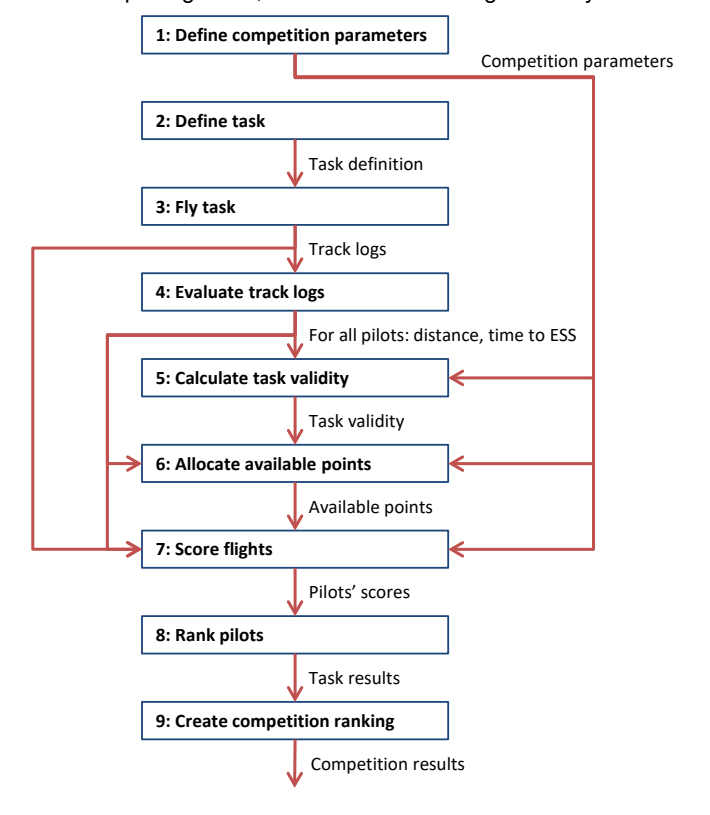

*Figure 1: Scoring process*

The figure is a vertical flowchart of nine numbered boxes connected by downward arrows, each arrow labelled with the data it carries:

- **1: Define competition parameters** — its output, labelled "Competition parameters", branches off to the right and feeds forward into steps 5, 6 and 7.
- **2: Define task** → arrow labelled "Task definition" →
- **3: Fly task** → arrow labelled "Track logs" → (this output also branches left and feeds forward into step 7)
- **4: Evaluate track logs** → arrow labelled "For all pilots: distance, time to ESS" → (this output also branches and feeds forward into steps 6 and 7)
- **5: Calculate task validity** (also receives "Competition parameters") → arrow labelled "Task validity" →
- **6: Allocate available points** (also receives "Competition parameters" and the step-4 output) → arrow labelled "Available points" →
- **7: Score flights** (also receives "Competition parameters", "Track logs" from step 3, and the step-4 output) → arrow labelled "Pilots' scores" →
- **8: Rank pilots** → arrow labelled "Task results" →
- **9: Create competition ranking** → final arrow labelled "Competition results".

<!-- PDF p.13 -->

## 3 Definitions

The definitions of flights, locations, distances and times of CIVL GAP are described in Section 7A 5.2.1.

- Flight
- Free flight
- Competition task
- Competition flight
- Take-off
- Speed section
- Start of speed section (SSS)
- Turnpoint (TP)
- Control zone
- End of speed section (ESS).
- Goal
- Landing place
- Task distance
- Flown distance
- Finish point
- Race start
- Start time
- Start gate
- Window open time
- Task deadline
- Finish time
- Task time
- Landing time

<!-- PDF p.14 -->

## 4 Use of Tracklog Data

### 4.1 Position

Coordinates of positions, such as turn points or pilot positions, are always given as WGS84 coordinates, based on the WGS84 ellipsoid. The coordinate format is UTM by default, but other formats can be chosen by organisers as appropriate.

### 4.2 Distance

In general, task evaluation occurs in the x/y plain, therefore distance measurements are always exclusively horizontal measurements. All distances are calculated on the WGS84 ellipsoid.

For altitude bonus in stopped tasks (12.3.6), altitude is also considered, but this does not affect distance calculations between two geographic points.

### 4.3 Altitude

All altitude evaluation is primarily based on GNSS altitude, as recorded in the flight instrument tracklog. Recorded barometric altitude (the International Standard Atmosphere pressure altitude, QNE), from the primary tracklog or a backup log, and if necessary corrected by the scoring software for the pressure conditions of the task (QNH), may be taken into consideration only in case of problems with GNSS altitude logging.

Category 2 event organisers may choose to use barometric altitude instead of GNSS altitude.

### 4.4 Time

Time evaluation is based on UTC time, as given in GPS tracklogs. For better readability, times of the day may be expressed in local time for the competition location.

<!-- PDF p.15 -->
## 5 Competition Parameters

Before the first task, the following parameters must be defined by the meet director, or another person or group as defined by the competition's local regulations:

Nominal Launch

Nominal Distance

Minimum Distance

Nominal Goal

Nominal Time

The values set for these parameters define how each task's validity is calculated. They should therefore be chosen very carefully, considering the realistic potential of the flying site. Setting the values too low will prevent the formula from distinguishing between demanding, high-quality tasks and quick, easy low-quality tasks which are sometimes the only option due to weather conditions.

> **PG only:** In paragliding competitions, the following must also be defined by the same person or group who defines the first five competition parameters above:
> - Score-back time for stopped task

### 5.1 Nominal Launch

When pilots do not take off for safety reasons, to avoid difficult launch conditions or bad conditions in the air, Launch Validity is reduced (see section 9.1). Nominal Launch defines a threshold as a percentage of the pilots in a competition. Launch Validity is only reduced if fewer pilots than defined by that threshold decide to launch.

The recommended default value for Nominal Launch is 96%, which means that Launch Validity will only be reduced if fewer than 96% of the pilots present at launch chose to launch.

### 5.2 Nominal Distance

Nominal distance should be set to the expected average task distance for the competition. Depending on the other competition parameters and the distances actually flown by pilots, tasks shorter than Nominal Distance will be devalued in most cases. Tasks longer than nominal distance will usually not be devalued, as long as the pilots fly most of the distance.

In order for GAP to be able to distinguish between good and not-so-good tasks, and devalue the latter, it is important to set nominal distance high enough[^13].

[^13]: See also this excellent series of articles on the subject: Part 1:http://ozreport.com/1360767307; Part 2: http://ozreport.com/1360858575; Part 3: http://ozreport.com/1360944246

### 5.3 Minimum Distance

The minimum distance awarded to every pilot who takes off. It is the distance below which it is pointless to measure a pilot's performance. The minimum distance parameter is set so that pilots who are about to "bomb out" will not be tempted to fly into the next field to get past a group of pilots – they all receive the same number of points anyway.

<!-- PDF p.16 -->
### 5.4 Nominal Goal

The percentage of pilots the meet director would wish to have in goal in a well-chosen task. This is typically 20 to 40%. This parameter has a very marginal effect on distance validity (see section 9.2).

### 5.5 Nominal Time

Nominal time indicates the expected task duration, the amount of time required to fly the speed section. If the fastest pilot's time is below nominal time, the task will be devalued. There is no devaluation if the fastest pilot's time is above nominal time.

Nominal time should be set to the expected "normal" task duration for the competition site, and nominal distance / nominal time should be a bit higher than typical average speeds for the area.

### 5.6 Score-back Time

> **PG only:** In a stopped task, this value defines the amount of time before the task stop was announced that will not be considered for scoring. The default is 5 minutes, but depending on local meteorological circumstances, it may be set to a longer period for a whole competition. See also section 12.3.1.

<!-- PDF p.17 -->
## 6 Task Setting

### 6.1 Definition of a task

A task can be either a race task or an open distance task.

#### 6.1.1 Race task

A race task definition consists of:

- A launch point, given as WGS84 coordinates
- Several control zones
- A goal
- An indication which of the control zones is the start (start of speed section)
- If goal does not serve as end of speed section: An indication which of the control zones is the end of speed section
- A launch time window
- A start procedure, including timing
- Optionally, a task deadline
- Leading-Time-Ratio (LTR): The portion of points out of the pool reserved to either time or leading points that will be allocated to leading points. Can be set between 0% (no leading points) and 50% (of all the points not allocated to distance points, half go to leading, and half to time points). The default LTR is 26%. See also section 10 Points Allocation.

#### 6.1.2 Open distance task

An open distance task definition consists of:

- A launch point, given as WGS84 coordinates
- A number of control zones
- Optionally, an indication which of the control zones is the start
- Optionally, a direction for the final, open distance leg
- A launch time window
- If a start control zone exists: A start time
- A task deadline

### 6.2 Definition of control zones

Control zones are geographical areas which must be reached by the pilots during a task. The types of control zones are: turnpoint cylinder (circle), line and goal semi-circle.

#### 6.2.1 Turnpoint cylinder

A turnpoint cylinder is defined as:

- A centre point *c*, given as WGS84 coordinates
- A radius *r*, given in meters

<!-- PDF p.18 -->
A turnpoint cylinder is then given as the cylinder with radius *r* around the axis which cuts the x/y plain orthogonally at the cylinder's centre point *c*. For task evaluation purposes, only the cylinder's projection in the x/y plain is considered: a circle of radius *r* around *c*.

Note that the designation of "enter" or "exit" cylinder has been removed, to reduce a potential source of confusion and task setting errors. Whether a turnpoint is considered reached is determined either by the presence of a single tracklog point inside the turnpoint cylinder's tolerance band, or by the presence of two consecutive tracklog points which lie on opposite sides of the turnpoint cylinder boundary (a "crossing"). The direction in which such a crossing occurs is irrelevant.

Task setters may still choose to indicate whether the start or subsequent turnpoint cylinders are "enter" or "exit", to explain their intended task route. But pilots are not bound to those indications.

#### 6.2.2 Line control zone

The line definition requires:

- Waypoint (the two coordinates)
- Distance from the waypoint
- Orientation
- Length

The Waypoint is one of the official competition waypoints. The line control zone has one Centerpoint and two Endpoints. Geodetic coordinates of those 3 points must be calculated following the procedures described below.

Distance from the waypoint specifies how far from the Waypoint is the Centerpoint. It must be expressed in kilometers with one decimal digit after the decimal point. Default value for the Distance (if it's not specified) is 0.0 km. Distance must be between -100.0 and 100.0 km.

Orientation specifies at what world direction (relative to the true north) we must travel from the defining Waypoint in order to reach the Centerpoint. Travel distance must be exactly the Distance above. Orientation can be expressed in one of two ways: (1) as decimal degrees in multiples of 2.5° and (2) as capital letters. There is no default orientation - it must be specified.

Length specifies how far from the Centerpoint are the two Endpoints. It must be expressed in kilometers with one decimal digit after the decimal point. Default value for the Length (if it's not specified) is 1.0 km. Length must be between 0.1 and 50.0 km.

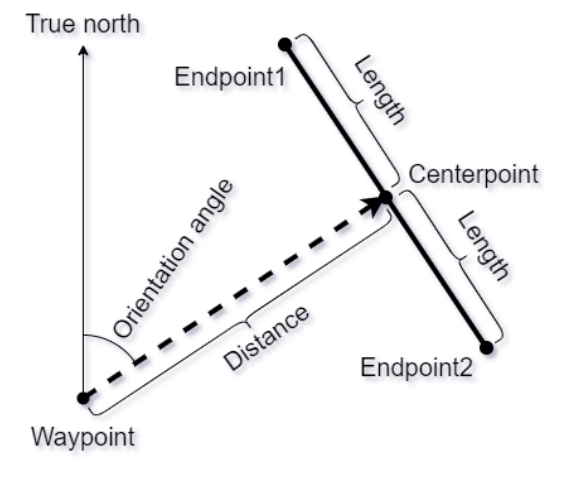
*Line control zone construction for a non-zero Distance (uncaptioned in the source).*

The diagram shows how a line control zone is built from its four defining values. A vertical arrow labelled "True north" rises from the Waypoint at the lower left. A dashed arrow leaves the Waypoint towards the upper right; the angle between true north and this dashed arrow, measured clockwise at the Waypoint, is marked "Orientation angle", and the dashed arrow's extent is marked "Distance". The dashed arrow ends at the Centerpoint. Through the Centerpoint runs the control-zone line itself, drawn as a thick solid segment perpendicular-ish to the arriving direction, running from Endpoint1 (upper left) through the Centerpoint to Endpoint2 (lower right). Each half of the segment, from the Centerpoint to an Endpoint, carries a brace labelled "Length" — so the full line spans two times Length.

Procedure for calculating the 3 points:

<!-- PDF p.19 -->
- Calculate geodesic line starting from the definition Waypoint and initial azimuth equal to the Orientation angle.
- On this geodesic line find the point at travel distance equal to Distance. This is the Centerpoint.
- Find the arriving azimuth.
- From the Centerpoint calculate a geodesic line at azimuth equal to the arriving azimuth (from step 3) plus 90.0°.
- On this geodesic line find the point at travel distance equal to Length. This is the Endpoint1.
- From the Centerpoint calculate another geodesic line at azimuth equal to the arriving azimuth (from step 3) minus 90.0°.
- On this geodesic line find the point at travel distance equal to Length. This is the Endpoint2.

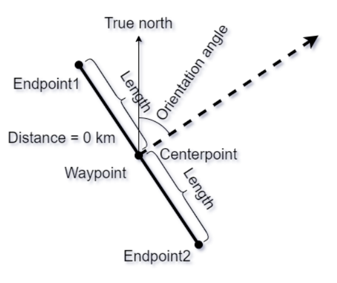
*Line control zone construction for the zero-Distance case (uncaptioned in the source).*

The diagram shows the degenerate case "Distance = 0 km". The Waypoint and the Centerpoint are the same point, labelled with both names, at the centre of the figure. A vertical arrow labelled "True north" rises from this point, and a dashed arrow labelled "Orientation angle" leaves it towards the upper right; the angle between them, at the shared point, is the orientation. The control-zone line runs as a thick solid segment from Endpoint1 (upper left) through the shared Waypoint/Centerpoint to Endpoint2 (lower right), perpendicular to the dashed orientation arrow. Each half of the segment carries a brace labelled "Length".

Procedure for calculating the 3 points in case of zero Distance:

- The Centerpoint in this case is exactly the same as the defining Waypoint.
- From the Centerpoint calculate a geodesic line at azimuth equal to Orientation angle minus 90.0°.
- On this geodesic line find the point at travel distance equal to Length. This is the Endpoint1.
- From the Centerpoint calculate another geodesic line at azimuth equal to Orientation angle plus 90.0°.
- On this geodesic line find the point at travel distance equal to Length. This is the Endpoint2.

Orientation may be expressed as a decimal number (the angle in degrees between true north and distance vector in clockwise direction), but it also can be expressed as capital letters. The possible options for the capital letters and their meanings are:

1. N = 0.0°
2. NNE = 22.5°
3. NE = 45.0°
4. ENE = 67.5°
5. E = 90.0°
6. ESE = 112.5°
7. SE = 135.0°
8. SSE = 157.5°
9. S = 180.0°
10. SSW = 202.5°
11. SW = 225.0°
12. WSW = 247.5°
<!-- PDF p.20 -->
13. W = 270.0°
14. WNW = 292.5°
15. NW = 315.0°
16. NNW = 337.5°

Total length of the line will always be equal to two times the Length. For example the default total line length will be 2.0 kilometers because the default Length is 1.0 km. Minimum total line length will be 200 meters because the minimum Length is 0.1 km = 100 meters.

Negative value for the Distance means the same absolute distance but in the opposite direction. For example line oriented at NE at distance -5.0 km will be absolutely the same as line at distance 5.0 km, but oriented at SW.

#### 6.2.3 Definition of goal

A goal can be:

- A turnpoint cylinder or
- A goal line, defined by:
  - A centre point *c*, given as WGS84 coordinates
  - A length *l*, given in meters
  - A previous point p, given as WGS84 coordinates

##### 6.2.3.1 Goal line

The goal line control zone consists of the semi-circle with radius *l/2* behind the goal line, when coming from the last turn point that is different from the goal line centre. Entering that zone without prior crossing of the goal line is equivalent to crossing the goal line.

Physical lines can be used in addition to the official, virtual goal line as defined by WGS84 coordinates, to increase attractiveness for spectators and media, and to increase visibility for pilots. Physical lines must be at least 50m long and 1m wide, made of white material and securely attached to the ground. The physical line must match as closely as possible the corresponding virtual line as defined by the goal GPS coordinates and the direction of the last task leg. It must not be laid out further from the previous turn point than the goal GPS coordinates.

By default, the goal line length *l* is set to 400m.

<!-- PDF p.21 -->
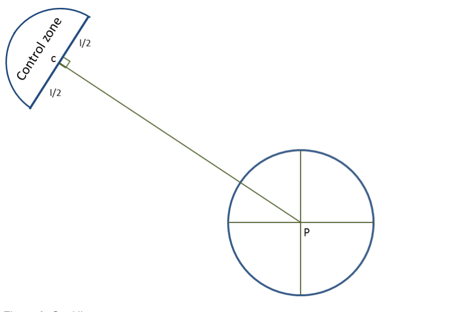
*Figure 2: Goal line*

The diagram shows the goal-line geometry. At the lower right is a large circle representing the previous turnpoint, with its centre marked "P" and crosshair lines through it. From P a thin straight line runs up and to the left to the goal line centre, marked "c". At c, perpendicular to that incoming line (a small right-angle square marks the perpendicularity), lies the goal line itself, drawn as a straight segment; the two halves of the segment either side of c are each labelled "l/2". Behind the goal line — on the far side from P — a semi-circular arc of radius l/2 closes the region, and this half-disc is labelled "Control zone". The control zone is thus the semi-circle sitting behind the goal line, facing away from the last turn point.

### 6.3 Start procedures

Start procedures define how an individual pilot's start time is determined. A start can be either air- or ground-started, and it can be either a race to goal or an elapsed time start.

#### 6.3.1 Air start

For air-started tasks, the competitors are free to launch any time during the launch window, and to fly about, regardless of any turnpoint or start cylinders, up to their race start. Race start is defined as the crossing of the start control zone (cylinder or line) for the last time before continuing to fly through the remainder of the task.

#### 6.3.2 Ground start

In a ground-started task, the race starts with the pilots' launch. Since a launch can be difficult to detect from an IGC tracklog, the task setters must set a cylinder around the launch area as the first turnpoint. A pilot's start is registered when he exits this cylinder for the first time. In the case of a race to goal task, the launch window open time is the same as the first (or only) start gate time.

#### 6.3.3 Race to goal

A race to goal start is defined by one or more so-called "start gates". The first – or only – start gate is given as a daytime. Subsequent start gates are given as a time interval, along with the number of start gates.

Example 1: "We have a Race to Goal task; the start gate opens at 13:00"

Example 2: "We have a Race to Goal task with 5 start gates from 13:30 at a 20 minutes interval." – the start gate times in this case are 13:30, 13:50, 14:10, 14:30, and 14.50.

Pilots are free to start any time after the first (or single) start gate. A pilot's start time is then defined as the time of the last start gate after which he started flying the speed section of the task.

<!-- PDF p.22 -->
Example 3: Given the start gates from Example 2 above, pilot A, crossing the start cylinder at 13:49:01, will be given a start time of 13:30. Any pilot starting after 14:50 will be given a start time of 14:50.

Starting before the first (or only) start gate is considered a failed start. Some refer to this as "jumping the gun". The two disciplines handle failed starts differently, see section 12.2.

#### 6.3.4 Elapsed time

An elapsed time start is defined by a single "start gate", given as a daytime. Pilots are free to start any time after this start gate. A pilot's start time is then defined as the time at which he started flying the speed section of the task. Each pilot has therefore an individual start time.

Example 1: "We have an Elapsed Time task, the start gate opens at 12:30" – pilot A starting at 12:31:03 has a start time of 12:31:03, pilot B starting at 15:48:28 has a start time of 15:48:28.

### 6.4 Distances

#### 6.4.1 Route optimization algorithm

At the core of all distance calculations lies an algorithm that calculates the shortest path from a given start position through a series of control zones to a destination (which can be a cylinder, a goal line or a point). The algorithm used to determine this path is defined in Appendix A. The result of this algorithm is a set of points on the control zone contours that represent the optimal crossing points for shortest overall distance. Distance is then calculated by iterating through those points, calculating the distance between two subsequent points (leg distance), and building the sum of those leg distances.

$$\mathit{routeElement} = \mathit{point}(\mathit{lat}, \mathit{lon}) \;|\; \mathit{cylinder}(\mathit{lat}, \mathit{lon}, \mathit{radius}) \;|\; \mathit{goal}(\mathit{lat}, \mathit{lon}, \mathit{radius})$$

$$\mathit{routeDefinition} = \{\mathit{routeElement}_1, \ldots, \mathit{routeElement}_n\}$$

$$\mathit{path} = \{\mathit{point}_1, \ldots, \mathit{point}_n\} \quad \text{where}\ \mathit{point}_x = \mathit{point}(\mathit{lat}_x, \mathit{lon}_x)$$

$$\mathit{getShortestPath}(\mathit{routeDefinition})\ \text{returns}\ \mathit{path}$$

$$\mathit{pathDistance}(\mathit{path}) = \sum_{1}^{n-1} \mathit{distance}(\mathit{path}.\mathit{point}_i,\ \mathit{path}.\mathit{point}_{i+1})$$

#### 6.4.2 Task distances

Task distance is defined as the distance of the optimized path from launch to goal. Speed section distance is defined as the distances of the optimized path from launch to ESS, minus the distance of the pre-start portion.

$$\mathit{launch} = \mathit{point}(\mathit{lat}_{\mathit{launch}}, \mathit{lon}_{\mathit{launch}})$$

$$\mathit{task} = \begin{Bmatrix} \mathit{launch}, \\ \mathit{preTurnpoint}_1, \ldots, \mathit{preTurnpoint}_m, \\ \mathit{startOfSpeedSection}, \\ \mathit{turnpoint}_1, \ldots, \mathit{turnpoint}_n, \\ \mathit{endOfSpeedSection} \\ \mathit{postTurnpoint}_1, \ldots, \mathit{PostTurnpoint}_n, \\ \mathit{goal} \end{Bmatrix}$$

$$\mathit{taskPath} = \mathit{getShortestPath}(\mathit{task})$$

$$\mathit{taskDistance} = \mathit{pathDistance}(\mathit{taskPath})$$

$$\mathit{launchToESS} = \begin{Bmatrix} \mathit{launch}, \\ \mathit{preTurnpoint}_1, \ldots, \mathit{preTurnpoint}_m, \\ \mathit{startOfSpeedSection}, \\ \mathit{turnpoint}_1, \ldots, \mathit{turnpoint}_n, \\ \mathit{endOfSpeedSection} \end{Bmatrix}$$

$$\mathit{launchToESSPath} = \mathit{getShortestPath}(\mathit{launchToESS})$$

<!-- PDF p.23 -->

$$
\begin{aligned}
\mathit{launchToESSDistance}\qquad\qquad\qquad&\\
= \mathit{getShortestpathDistance}(\mathit{postSpeedSectionDefinition})\,&\mathit{preSpeedSectionDistance}\\
= \mathit{pathDistance}(\mathit{launchToEssPath})\,&\mathit{preSpeedSectionDistance}\\
= \mathit{pathDistance}(\mathit{launchToESSPath}[0..\mathit{startOfSpeedSectionIndex}])&
\end{aligned}
$$

$$
\mathit{postSpeedSectionDefinition} = \left\{
\begin{gathered}
\mathit{taskPart1Path}.\mathit{point}_{\mathit{last}},\\
\mathit{postTurnpoint}_1, \ldots, \mathit{postTurnpoint}_n,\\
\mathit{goal}
\end{gathered}
\right\} \mathit{speedSectionDistance}
$$

$$
= \mathit{launchToESSDistance} - \mathit{preSpeedSectionDistance}
$$

<!-- PDF p.24 -->

## 7 Flying a task

There are 2 task types: race task and open distance task. The definitions are given in Section 7A-5.2.2.

### 7.1 Re-starting

In tasks that are either set as Race to Goal with multiple start gates, or as Elapsed Time task, a pilot may decide to return to the start and take a later start time after already having flown a portion of the speed section.

<!-- PDF p.25 -->

## 8 Task evaluation

From each pilot’s track, task evaluation determines the distance this pilot flew along the task, and the time this pilot took to fly the speed section.

### 8.1 Cylinder tolerance

To compensate for the very slight distance measurement differences resulting from the use of different distance measurement algorithms in flight recorders and evaluation programs, a tolerance, consisting of a percentage and an absolute minimum, is applied when determining whether a pilot reached a cylinder. This had to be introduced so that a pilot reading the distance to the next cylinder centre from his flight instrument can rely on having reached the turnpoint when the distance displayed by the instrument is smaller than the defined turnpoint cylinder radius.

For Cat 1, the tolerance is set to 0.1%.

For Cat 2, the maximum tolerance is 0.5%, to allow pilots to still use equipment that calculates distances on the FAI sphere.

$$\mathit{tolerance} = 0.1\% \,|\, 0.5\%$$

$$\mathit{minTolerance} = 5m$$

$$\mathit{turnpoint}_i : \mathit{innerRadius}_i = \min(\mathit{radius}_i * (1 - \mathit{tolerance}), \mathit{radius}_i - \mathit{minTolerance})$$

$$\mathit{turnpoint}_i : \mathit{outerRadius}_i = \max(\mathit{radius}_i * (1 + \mathit{tolerance}), \mathit{radius}_i + \mathit{minTolerance})$$

### 8.2 Line tolerance

For the same reasons a tolerance is applied for the line control zones. The tolerance % is the same as for the cylinder control zones. The absolute tolerance for each line control zone (in meters) is calculated from the Distance and the Length (whichever is greater). The minimum tolerance is also 5 meters.

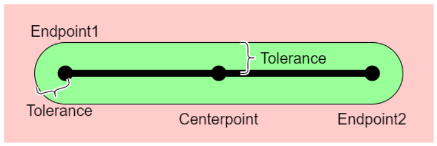
*Line control zone tolerance.*

The diagram shows a thick horizontal line segment running from a point labelled "Endpoint1" on the left, through a marked "Centerpoint" in the middle, to "Endpoint2" on the right. Surrounding the whole segment is a green stadium-shaped (pill-shaped) band — a rectangle with semicircular caps beyond each endpoint — drawn on a pink background that represents the area outside the control zone. Two curly-brace callouts, each labelled "Tolerance", indicate the half-width of the green band: one at the lower-left shows the radial margin extending beyond Endpoint1, and one above the line between Centerpoint and Endpoint2 shows the perpendicular margin between the line and the band's edge. The green band is thus the set of all points within the tolerance distance of the line.

### 8.3 Reaching a cylinder

To determine whether a pilot reached a specific cylinder in the task, the pilot’s track log must show evidence that:

17. The pilot reached the previous cylinder in the task definition
18. It contains at least one valid crossing for the cylinder, defined as a single tracklog point inside the turnpoint cylinder’s tolerance band, which was recorded
    a. after the valid crossing of the previous cylinder in the task definition
    b. not earlier than the start time
    c. no later than the task deadline

<!-- PDF p.26 -->

$$
\begin{aligned}
&\forall i : \exists \mathit{turnpoint}_i :\\
&\mathit{crossings}_i = \forall j : \operatorname{distance}(\mathit{turnpoint}_i.\mathit{center}, \mathit{trackpoint}_j) >= \mathit{innerRadius}_i\\
&\land \operatorname{distance}(\mathit{turnpoint}_i.\mathit{center}, \mathit{trackpoint}_j) <= \mathit{outerRadius}_i : \mathit{trackpoint}_j
\end{aligned}
$$

Crossing time for each valid crossing is the time at which the corresponding tracklog point was recorded.

$$\mathit{crossing}_{i,j}.\mathit{time} = \mathit{trackpoint}_j.\mathit{time}$$

Finally, given all *n* crossings for a turnpoint cylinder, sorted in ascending order by their crossing time, the time when the cylinder was reached is determined.

In Race to Goal tasks with single start gate, the reaching time for a turnpoint is always the first crossing time after the start gate time, and after the reaching time of the previous turnpoint.

$$
\begin{aligned}
&\mathit{reachingTime}_i = \mathit{crossing}_{i,n}.\mathit{time} :\\
&n = \min(m) : \mathit{crossing}_m.\mathit{time} > \mathit{reachingTime}_{i-1}
\end{aligned}
$$

In Race to Goal tasks with multiple start gates, and in Elapsed Time tasks, the reaching time for SSS is that turnpoint’s last crossing time that is before all the subsequent turnpoint’s reaching times. The reaching time for any turnpoint after SSS is that turnpoint’s first crossing time after the previous turnpoint’s reaching time.

$$
\begin{aligned}
&\mathit{turnpoint}_i = \mathit{SSS} : \mathit{reachingTime}_i = \mathit{crossing}_{i,n}.\mathit{time} :\\
&n = \max(m) : \mathit{crossing}_{i,m}.\mathit{time} < \mathit{reachingTime}_{i+1}\\
&\mathit{turnpoint}_i \neq \mathit{SSS} : \mathit{reachingTime}_i = \mathit{crossing}_{i,n}.\mathit{time} :\\
&n = \min(m) : \mathit{crossing}_{i,m}.\mathit{time} > \mathit{reachingTime}_{i-1}
\end{aligned}
$$

#### 8.3.1 Start time

In Race to Goal tasks the start time for pilots who reached SSS after the first start gate time is equal to the last start gate time before their SSS reaching time.

$$
\begin{aligned}
&\forall p : p \in \mathit{PilotsFlown} \land \exists \mathit{reachingTime}_{p,\mathit{SSS}} : \mathit{startTime}_p = \mathit{SSS}.\mathit{gateTime}_n :\\
&n = \max(m) : \mathit{SSS}.\mathit{gateTime}_m < \mathit{reachingTime}_{p,\mathit{SSS}}
\end{aligned}
$$

In Elapsed Time tasks, the pilot’s start time is equal to their reaching time of SSS.

$$\forall p : p \in \mathit{PilotsFlown} \land \exists \mathit{reachingTime}_{p,\mathit{SSS}} : \mathit{startTime}_p = \mathit{reachingTime}_{p,\mathit{SSS}}$$

### 8.4 Reaching (validating) a line

If there is a tracklog point closer to the line than the tolerance - the line control zone is considered as reached and the pilot can continue to fly to the next control zone in the task.

<!-- PDF p.27 -->

Line control zone may also be validated if in the tracklog are present two consecutive points - one on one side of the line and the other on the other side of the line. Timestamps of the two TL points must also be evaluated - the speed one must travel with in order to go around the line must be > 120 km/h.

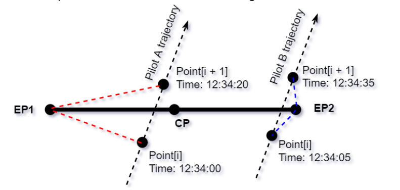
*Validating a line crossing from two tracklog points on opposite sides of the line.*

The diagram shows a thick horizontal line from "EP1" (left) to "EP2" (right), with its midpoint marked "CP". Two dashed straight trajectories cross the line diagonally from lower-left to upper-right, each ending in an arrowhead. The left trajectory, labelled "Pilot A trajectory", crosses the line between EP1 and CP; on it are two dots: "Point[i], Time: 12:34:00" below the line and "Point[i + 1], Time: 12:34:20" above the line. Red dashed lines connect EP1 to each of Pilot A's two points, forming the shortest go-around path via the line's end. The right trajectory, labelled "Pilot B trajectory", crosses the line just left of EP2; on it are "Point[i], Time: 12:34:05" below the line and "Point[i + 1], Time: 12:34:35" above the line, with blue dashed lines connecting the two points to EP2 as Pilot B's go-around path.

The above diagram shows the trajectories of two pilots crossing a line. They both don't have a point in the tolerance zone - the validation must be done by evaluating times and distances.
Pilot A has two points (Point[i] and Point[i + 1]) on the two opposite sides of the line. Time between the two points is 20 seconds. The length of the red dashed line is 2.0 km. Therefore the speed required to go around the line is 2000 m / 20 s = 100 m/s = 360 km/h.
Pilot B has also two points on the two sides of the line, the time between the two points is 30 seconds and the length of the blue line is 800 m. Therefore the speed required to go around the line is 800 m / 30 s = 26.67 m/s = 96 km/h. For pilot A - the line is validated (speed > 120 km/h), but for pilot B - the line is NOT validated (speed < 120 km/h).

### 8.5 Reaching goal

#### 8.5.1 Goal cylinder

Verification of a pilot reaching a goal cylinder is achieved by the same method as verification of reaching a turnpoint cylinder (8.3)

#### 8.5.2 Goal line

To reach goal in the case of a goal line, the goal line must be crossed in flight. This is achieved when a line drawn between two adjacent points in the pilot’s tracklog crosses the goal line in the correct direction.

> **PG only:** Entering the goal control zone (semi-circle behind the goal line, see 6.2.3.1) from any direction without prior crossing of the goal line is equivalent to crossing the goal line. To determine whether the goal control zone was reached, the same tolerance calculations apply as for full cylinders (see 8.1).

If a physical line is used, crossing either the virtual or the physical goal line counts as having reached goal. An official observation (through a goal marshal or similar) of a pilot crossing the line in flight overrules a negative goal crossing decision based on the pilot’s tracklog. Not crossing a physical goal line for obvious safety reasons must be considered in the pilots’ favour.

> **HG only:** The physical goal line is crossed when the hang glider’s nose cuts the line, in the correct direction, before a landing is made.

> **PG only:** The physical goal line is crossed when the paraglider pilot’s leading foot cuts the line, in the correct direction, before a landing is made.

<!-- PDF p.28 -->

### 8.6 Flown distance

#### 8.6.1 Race task

To determine a pilot’s flown distance, a first step determines which turnpoints he reached considering all timing restrictions: launch within launch time window, valid start, but only until the task deadline time. After the last turnpoint the pilot reached, for every remaining track point, the shortest distance to goal is calculated using the method described in section 6.4.1. The flown distance is then calculated as task distance minus the shortest distance the pilot still had to fly. Therefore, for scoring, the pilot’s best distance along the course line is considered, regardless of where the pilot landed in the end.

If a pilot flies less than minimum distance, he will be scored for this minimum distance. This also applies to pilots who are not able to produce a valid tracklog, but for whom launch officials verify launch within the launch window.

If a pilot reaches goal, he will be scored for the task distance.

$$\forall p: p \in \mathit{PilotsLandingBeforeGoal}: \mathit{bestDistance}_p = \max\Big(\mathit{minimumDistance}, \Big|\ \ \Big|\, \mathit{taskDistance} - \min\big(\forall \mathit{track}_p.\mathit{point}_i\, \mathit{sho}\cdots$$
<!-- UNREADABLE: p.28, the first bestDistance formula runs off the right edge of the page in the source PDF itself; both raster and text layer end at "min(∀track_p.point_i sho". The clipped remainder is not recoverable from this document. -->

$$\forall p: p \in \mathit{PilotsReachingGoal}: \mathit{bestDistance}_p = \mathit{taskDistance}$$

#### 8.6.2 Open distance task

In an open distance task, if a pilot lands before the last of any given control zones, his flown distance is calculated according to 8.6.1. For pilots flying further than the last control zone, the flown distance is calculated by adding the pilot’s best distance flown in the open distance part of the task (after the last control zone) to task distance between launch and the last control zone. If the task gave a direction for the open distance leg, then the pilot’s best distance projected onto that direction is considered.

### 8.7 Time for speed section

The time a pilot took to fly the speed section is determined by his start time (which is influenced by the task’s start procedure and the time he crossed the start of speed section control zone) and the time when he crossed the end of speed section after reaching all previous turn points. The smallest unit for time measurement is one second.

Pilots who do not reach the end of speed section do not get a time.

$$\forall p: p \in \mathit{PilotsReachingESS}: \mathit{time}_p = \mathit{timeAtESS}_p - \mathit{startTime}_p$$

<!-- PDF p.29 -->

## 9 Task Validity

The task validity is a value between 0 and 1 and measures how suitable a competition task is to evaluate pilots’ skills. It is calculated for each task after the task has been flown, by multiplying the three validity coefficients: Launch validity, distance validity, and time validity.

$$\mathit{TaskValidity} = \mathit{LaunchValidity} * \mathit{DistanceValidity} * \mathit{TimeValidity}$$

### 9.1 Launch Validity

Launch validity depends on nominal launch and the percentage of pilots actually present at take-off who launched. If the percentage of pilots on take-off who launch is equal to nominal launch, or higher, then launch validity is 1. If, for example, only 20% of the pilots present at take-off launch, launch validity goes down to about 0.1.

The reasoning behind launch validity: Launch conditions may be dangerous, or otherwise unfavourable. If a significant number of pilots at launch think that the day is not worth the risk of launching, then the gung-ho pilots who did go will not get so many points. This is a safety mechanism.

‘Pilots present’ are pilots arriving on take-off, with their gear, with the intention of flying. For scoring purposes, ‘Pilots present’ are all pilots not in the ‘Absent’ status (ABS): Pilots who took off, plus pilots present who did not fly (DNF). DNFs need to be attributed carefully. A pilot who does not launch due to illness, for instance, is not a DNF, but an ABS.

$$\mathit{LVR} = \min\left(1, \frac{\mathit{NumberOfPilotsFlying}}{\mathit{NumberOfPilotsPresent} * \mathit{NominalLaunch}}\right)$$

$$\mathit{LaunchValidity} = 0.027 * \mathit{LVR} + 2.917 * \mathit{LVR}^2 - 1.944 * \mathit{LVR}^3$$

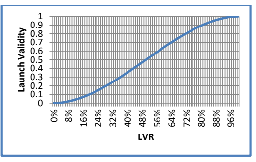

**Figure 3: Launch validity curve**

The figure is a line chart of the launch validity polynomial. The horizontal axis is labelled "LVR" and runs from 0% to 96% with tick labels every 8% (0%, 8%, 16%, 24%, 32%, 40%, 48%, 56%, 64%, 72%, 80%, 88%, 96%); the vertical axis is labelled "Launch Validity" and runs from 0 to 1 with tick labels every 0.1. A single blue S-shaped curve starts at 0 for LVR = 0%, rises slowly at first, passes through roughly 0.5 near LVR ≈ 50%, then flattens and reaches 1 as LVR approaches 100%. The plot area has a fine vertical gridline background.

### 9.2 Distance Validity

Distance validity depends on nominal distance, nominal goal, the longest distance flown and the sum of all distances flown beyond minimum distance. If the task distance is quite short in relation to nominal distance, the day is probably not a good measure of pilot skill because there would not be many decisions to make.

If a task is longer than nominal distance, the day will not be devalued because of distance validity, even if the nominal goal parameter value is not achieved, as long as a fair percentage of pilots fly a good distance. This sounds like a vague statement, but the task setter should try to set tasks that are reasonable for the day and achievable. If everyone lands in goal, you must ask if this was a valid test of skill - it probably was if the fastest time and the distance flown were reasonably long. If everyone lands short of goal, was it an unsuitable task but still a good test of pilot skill? You also can have the case where a task that is shorter than nominal distance, has a distance validity of almost 1. This will happen when a large percentage of

<!-- PDF p.30 -->

the pilots fly a large percentage of the course but, in this case, you still have a practical devaluation because there will be little spreading between pilots’ scores.

In the formula below, ‘p’ denotes an individual pilot.

$$\mathit{SumOfFlownDistancesOverMinDist} = \sum_{p} \max\big(0, \mathit{FlownDist}_p - \mathit{MinDist}\big)$$

$$\mathit{NomDistArea} = \frac{\big((\mathit{NomGoal} + 1) * (\mathit{NomDist} - \mathit{MinDist})\big) + \max\Big(0, \big(\mathit{NomGoal} * (\mathit{BestDist} - \mathit{NomDist})\big)\Big)}{2}$$

$$\mathit{DVR} = \frac{\mathit{SumOfFlownDistancesOverMinDist}}{\mathit{NumPilotsFlying} * \mathit{NomDistArea}}$$

$$\mathit{DistanceValidity} = \min(1, \mathit{DVR})$$

### 9.3 Time Validity

Time validity depends on the fastest time to complete the speed section, in relation to nominal time. If the fastest time to complete the speed section is longer than nominal time, then time validity is always equal to 1.

If the fastest time is quite short, the day is probably not a good measure of pilot skill because there would not be many decisions to make and, because of this, luck can distort scores as there will be little possibility to recover any accidental loss of time.

If no pilot finishes the speed section, then time validity is not based on time but on distance: The distance of the pilot who flies the furthest in relation to nominal distance is then used to calculate the time validity the same way as if it was the time.

If one pilot reached ESS: $\mathit{TVR} = \min\left(1, \frac{\mathit{BestTime}}{\mathit{NominalTime}}\right)$

If no pilot reached ESS: $\mathit{TVR} = \min\left(1, \frac{\mathit{BestDistance}}{\mathit{NominalDistance}}\right)$

$$\mathit{TimeValidity} = \max\Big(0, \min\big(1, -0.271 + 2.912 * \mathit{TVR} - 2.098 * \mathit{TVR}^2 + 0.457 * \mathit{TVR}^3\big)\Big)$$

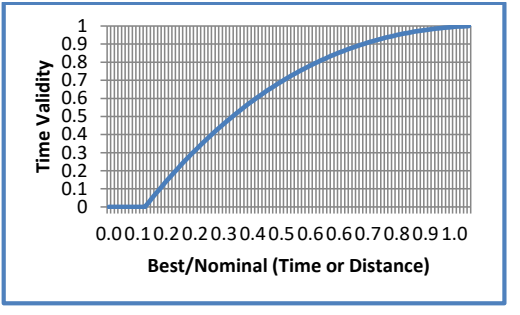

**Figure 4: Time validity curve**

The figure is a line chart of the time validity polynomial. The horizontal axis is labelled "Best/Nominal (Time or Distance)" with tick labels printed as 0.0, 0.1, 0.2, 0.2, 0.3, 0.4, 0.5, 0.6, 0.6, 0.7, 0.8, 0.9, 1.0 (the duplicated 0.2 and 0.6 are as printed, from rounding of the underlying tick values); the vertical axis is labelled "Time Validity" and runs from 0 to 1 with tick labels every 0.1. A single blue curve stays at 0 until roughly 0.1 on the horizontal axis, then rises steeply and concave-down, passing about 0.5 near 0.3, and levels off to 1 by roughly 0.8. The plot area has a fine vertical gridline background.

<!-- PDF p.31 -->

## 10 Points Allocation

The available points for each task are 1000\*Task Validity. These points are distributed between distance points, time points, leading points, and arrival points. The distribution depends on the percentage of pilots who reached goal before the task deadline, compared to pilots who launched, as well as the chosen goal form. It is expressed in terms of weight factors for each of the four categories: Distance weight, time weight, leading weight, and arrival weight. Weight factors are always between 0 and 1. A weight factor of 0.5 for distance, for example, means that 50% of the day's available overall points are available for distance points.

$$\mathit{GoalRatio} = \frac{\mathit{NumberOfPilotsInGoal}}{\mathit{NumberOfPilotsFlying}}$$

$$\mathit{DistanceWeight} = 0.9 - 1.665 * \mathit{GoalRatio} + 1.713 * \mathit{GoalRatio}^2 - 0.587 * \mathit{GoalRatio}^3$$

> **HG only:**
>
> $$\mathit{LeadingWeight} = \frac{1 - \mathit{DistanceWeight}}{8} * 1.4$$
>
> $$\mathit{HGClass} \neq 2 : \mathit{ArrivalWeight} = \frac{1 - \mathit{DistanceWeight}}{8}$$
>
> $$\mathit{HGClass} = 2 : \mathit{ArrivalWeight} = 0$$

> **PG only:** In paragliding, the parameter *LeadingTimeRatio* is set for each task, with a value between 0 and 50%, default is 26%. This parameter defines the ratio between leading and time weight. A value of 26% means that 26% of the weight not allocated to distance weight is allocated to leading weight, and the remaining 74% to time weight.
>
> $$\mathit{GoalRatio} = 0 : \mathit{LeadingWeight} = (1 - \mathit{DistanceWeight})$$
>
> $$\mathit{GoalRatio} > 0 : \mathit{LeadingWeight} = (1 - \mathit{DistanceWeight}) * \mathit{LeadingTimeRatio}$$
>
> $$\mathit{ArrivalWeight} = 0$$

$$\mathit{TimeWeight} = 1 - \mathit{DistanceWeight} - \mathit{LeadingWeight} - \mathit{ArrivalWeight}$$

$$\mathit{AvailableDistancePoints} = 1000 * \mathit{TaskValidity} * \mathit{DistanceWeight}$$

$$\mathit{AvailableTimePoints} = 1000 * \mathit{TaskValidity} * \mathit{TimeWeight}$$

$$\mathit{AvailableLeadingPoints} = 1000 * \mathit{TaskValidity} * \mathit{LeadingWeight}$$

$$\mathit{AvailableArrivalPoints} = 1000 * \mathit{TaskValidity} * \mathit{ArrivalWeight}$$

> **HG only:**
>
> 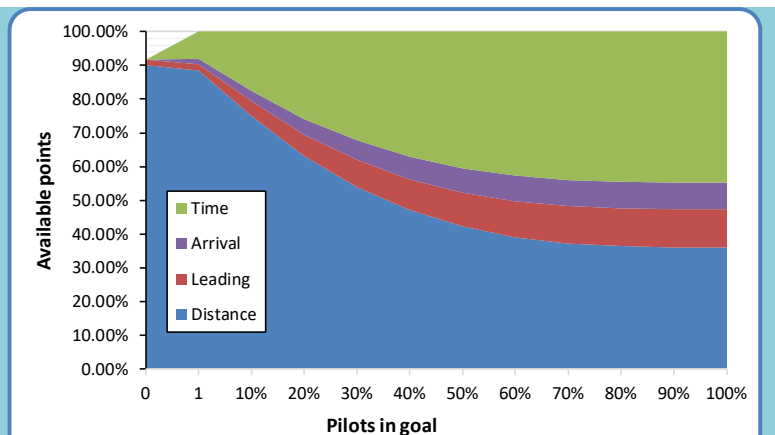
>
> *Figure 5: Points allocation for hang gliding, Class 1 and Class 5*
>
> A stacked-area chart. The x axis is "Pilots in goal", labelled 0, 1, then 10% through 100% in 10% steps; the y axis is "Available points", from 0.00% to 100.00%. Four bands are stacked bottom-to-top: Distance (blue), Leading (red), Arrival (purple), Time (green). With no pilots in goal, the Distance band fills about 90% of the points, with thin Leading and Arrival slivers on top and no Time points. As the fraction of pilots in goal grows, the Distance band shrinks steadily, flattening out at about 36% at 100% in goal, while Leading (to about 47%) and Arrival (to about 55%) widen slightly and the Time band grows to occupy the remainder (about 45% of the points at 100% in goal).

<!-- PDF p.32 -->

> **HG only:**
>
> 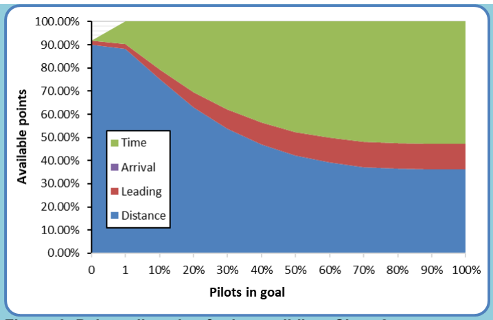
>
> *Figure 6: Points allocation for hang gliding, Class 2*
>
> The same stacked-area chart as Figure 5 (x axis "Pilots in goal": 0, 1, 10%–100%; y axis "Available points": 0.00%–100.00%), for Class 2. The legend lists Time (green), Arrival (purple), Leading (red) and Distance (blue), but the Arrival band has zero height throughout (Class 2 has no arrival points). Distance falls from about 90% at zero pilots in goal to about 36% at 100%; the Leading band on top of it reaches up to about 47%; Time fills the remainder, growing to about 53% of the points at 100% in goal.
>
> From the above it follows that in hang-gliding, if nobody reaches ESS, then a maximum of 900 points are available for distance and 18 points for leading but, of course, no points for time nor arrival. This is also the maximum possible number of points for an open distance task.
>
> $$\mathit{numberOfPilotsAtESS} = 0 :$$
>
> $$\mathit{AvailableDistancePoints} = 1000 * \mathit{TaskValidity} * \mathit{DistanceWeight}$$
>
> $$\mathit{AvailableTimePoints} = 0$$
>
> $$\mathit{AvailableLeadingPoints} = 1000 * \mathit{TaskValidity} * \mathit{LeadingWeight}$$
>
> $$\mathit{AvailableArrivalPoints} = 0$$
>
> $$\mathrm{Max}(\mathit{AvailableDistancePoints}) = 900$$
>
> $$\mathrm{Max}(\mathit{availableLeadingPoints}) = 18$$
>
> $$\mathrm{Max}(\mathit{availableTotalPoints}) = 918$$

> **PG only:**
>
> 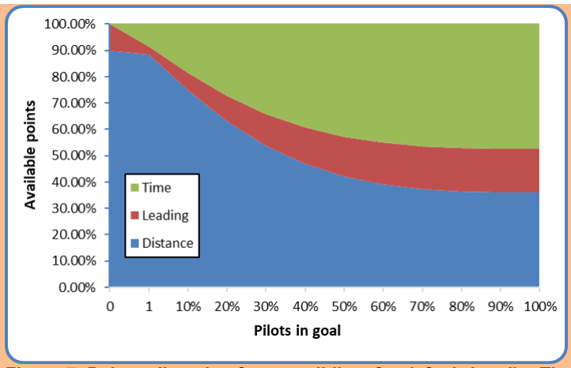
>
> *Figure 7: Points allocation for paragliding, for default* LeadingTimeRatio *of 26%*
>
> A stacked-area chart with the same axes as Figures 5 and 6 (x axis "Pilots in goal": 0, 1, 10%–100%; y axis "Available points": 0.00%–100.00%). The legend lists only Time (green), Leading (red) and Distance (blue) — paragliding has no arrival points. At zero pilots in goal, Distance takes about 90% of the points and Leading the entire remaining 10% (no Time points, since with GoalRatio = 0 all non-distance weight goes to leading). Once pilots reach goal, the Leading band narrows to 26% of the non-distance weight: Distance falls to about 36% at 100% in goal, Leading on top of it reaches to about 52%, and Time fills the remaining ≈48%.

<!-- PDF p.33 -->

## 11 Pilot score

Each pilot's score is the sum of that pilot's distance, time, leading and arrival points, rounded to one decimal place:

$$\forall p : p \in \mathit{PilotsLaunched} : \mathit{TotalScore}_p = \mathit{DistancePoints}_p + \mathit{TimePoints}_p + \mathit{LeadingPoints}_p + \mathit{ArrivalPoints}_p$$

### 11.1 Distance points

The distance considered for each pilot to calculate distance points is that pilot's best distance along the course line, up until the pilot landed or the task deadline was reached, whichever comes first.

> **HG only:** One half of the available distance points are assigned to each pilot linearly, based on the pilot's distance flown in relation to the best distance flown in the task. The other half is assigned taking into consideration the difficulty of the kilometers flown.
>
> $$\mathit{LinearFraction}_p = \frac{\mathit{Distance}_p}{2 * \mathit{BestDistance}}$$
>
> $$\mathit{iDist10}_p = \mathrm{int}\left(\mathit{Distance}_p * 10\right)$$
>
> $$\mathit{DifficultyFraction}_p = \mathit{DiffScore}_{\mathit{iDist10}_p} + \left(\left(\mathit{DiffScore}_{\mathit{iDist10}_p + 1} - \mathit{DiffScore}_{\mathit{iDist10}_p}\right) * \left(\mathit{Distance}_p * 10 - \mathit{iDist10}_p\right)\right)$$
>
> $$\mathit{DistancePoints}_p = \left(\mathit{LinearFraction}_p + \mathit{DifficultyFraction}_p\right) * \mathit{AvailableDistancePoints}$$

> **PG only:** The available distance points are assigned to each pilot linearly, based on the pilot's distance flown in relation to the best distance flown in the task.
>
> $$\mathit{DistancePoints}_p = \frac{\mathit{Distance}_p}{\mathit{BestDistance}} * \mathit{AvailableDistancePoints}$$

In the case of a stopped task, a pilot's distance may be increased by an altitude bonus (see 12.3.2).

#### 11.1.1 Difficulty calculation

> **HG only:** To measure the relative difficulty of each 100 meters of the task, we consider the number of pilots who landed in the successive few kilometers, and the distance flown.
>
> In a first step, for each 100-meter section of the task, the number of pilots who landed in that section is counted. Pilots who landed before minimum distance are counted as having landed at minimum distance. Only pilots who landed out are considered for this calculation, pilots who reached goal are not counted.
>
> $$\forall i : i < \mathrm{int}(\mathit{MinDist} * 10) : \mathit{PilotsLanded}_i = 0$$
>
> $$\mathit{PilotsLanded}_{\mathrm{int}(\mathit{MinDist} * 10)} = \sum_{\forall \mathit{Pilot} : \mathrm{int}(\mathit{Pilot}.\mathit{Distance} * 10) \le \mathrm{int}(\mathit{MinDist} * 10)} 1$$
>
> $$\forall i : i > \mathrm{int}(\mathit{MinDist} * 10) \land i \le \mathrm{int}(\mathit{MaxDist} * 10) : \mathit{PilotsLanded}_i = \sum_{\forall q : q \in \mathit{PilotsLandedOut} : \mathrm{int}\left(\mathit{Distance}_q * 10\right) = i} 1$$
>
> Then the difficulty for each 100-meter section of the task is calculated by counting the number of pilots who landed further along the task. If 100 pilots land out on a flight of 100 km, the next 3 km are considered. If 10 pilots land out in 100 km, the next 30 km are considered. The variable LookAheadDist contains the number of 100-meter slots to look ahead for this.
>
> $$\mathit{LookAheadDist} = \max\left(30, \mathrm{round}\left(\frac{30 * \mathit{BestDistanceFlown}}{\mathit{NumberOfPilotsLandedOut}}, 0\right)\right)$$
>
> $$\forall i : \le \mathrm{int}(\mathit{MaxDist} * 10) : \mathit{Difficulty}_i = \sum_{j=i}^{j=\min\left(i + \mathit{LookAheadDist},\, \mathrm{int}(\mathit{BestDistanceFlown} * 10)\right)} \mathit{PilotsLanded}_j$$
>
> $$\mathit{SumOfDifficulty} = \sum_i \mathit{Difficulty}_i$$
>
> Relative difficulty is then calculated by dividing each 100-meter slot's difficulty by twice the sum of all difficulty values.
>
> $$\forall i : i \le \mathrm{int}(\mathit{MaxDist} * 10) : \mathit{RelativeDifficulty}_i = \frac{\mathit{Difficulty}_i}{2 * \mathit{SumOfDifficulty}}$$
>
> Finally, we can calculate the difficulty score percentage for each 100-meter slot.
<!-- PDF p.34 -->
>
> $$\forall i : i \le \mathrm{int}(\mathit{MinDist} * 10) : \mathit{DiffScore}_i = \sum_{j=0}^{j=\mathrm{int}(\mathit{MinDist} * 10)} \mathit{RelativeDifficulty}_j$$
>
> $$\forall i : i > \mathrm{int}(\mathit{MinDist} * 10) \land i < \mathrm{int}(\mathit{BestDistanceFlown} * 10) : \mathit{DiffScore}_i = \sum_{j=0}^{j=i} \mathit{RelativeDifficulty}_j$$
>
> $$\forall i : i \ge \mathrm{int}(\mathit{BestDistanceFlown} * 10) : \mathit{DifffScore}_i = 0.5$$

> **PG only:** The difficulty calculation does not apply to paragliding.

##### 11.1.1.1 Example for difficulty calculation

> **HG only:** For an example of how the difficulty calculation works, see Figure 8: Note how the slope of the green curve (the total Distance points) becomes steeper before an area where many pilots landed and flatter just after. The red circles show these areas before the big group at the 41 km mark, and after the 46 km mark. There are two reasons for this:
>
> For safety and retrieval reasons, we do not want to encourage pilots to fly only a short distance past a group of landed pilots.
>
> If a pilot lands somewhere, he or she probably got into trouble just before, and then glided a while before landing.
>
> 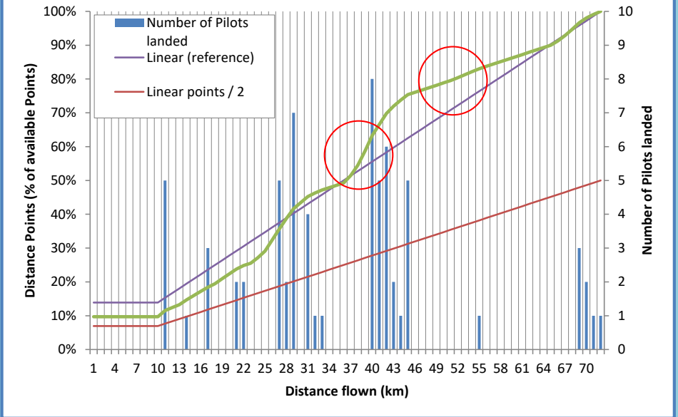
>
> *Figure 8: Sample Distance Points*
>
> A combination chart over "Distance flown (km)" (x axis, labelled 1 to 70 in steps of 3). The left y axis is "Distance Points (% of available Points)" from 0% to 100%; the right y axis is "Number of Pilots landed" from 0 to 10. Blue vertical bars show the number of pilots landed at each distance (clusters of bars around 10–12 km, 16–17 km, 21–22 km, 27–31 km, a large group around 40–45 km — including an 8-pilot bar at about 40 km — one bar around 55 km, and a few around 68–71 km). Three lines are overlaid: a straight purple "Linear (reference)" line rising from about 14% to 100%, a straight red "Linear points / 2" line rising from about 7% to 50%, and a green curve (the total Distance points) that starts flat at about 10%, then climbs with a slope that steepens ahead of each landing cluster and flattens just after it, ending at 100% at the best distance. Two red circles mark these slope changes: one on the green curve around the 37–41 km area (before the big group at the 41 km mark) and one around 47–52 km (after the 46 km mark).

### 11.2 Time points

Time points are assigned to the pilot as a function of best time and pilot time – the time the pilot took to complete the speed section. Slow pilots will get zero points for speed if their time to complete the speed section is equal to or longer than the fastest time plus the square root of the fastest time. All times are measured in hours.

$$\mathit{SpeedFraction}_p = max\left(0, 1 - \sqrt[6]{\left(\frac{\mathit{Time}_p - \mathit{BestTime}}{\sqrt{\mathit{BestTime}}}\right)^{5}}\right)$$

<!-- PDF p.35 -->

$$\mathit{TimePoints}_p = \mathit{SpeedFraction}_p * \mathit{AvailableTimePoints}$$

#### 11.2.1 Examples

For three examples of Time Point distributions for tasks with different best times, see Figure 9 and Table 1. The best time is defined as the time of the fastest pilot over the speed section who also reached the goal.

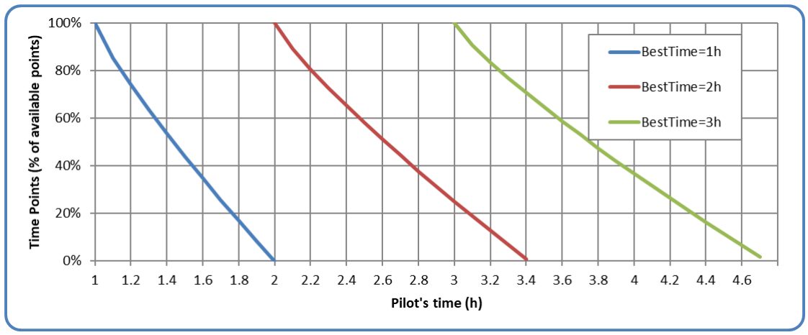

*Figure 9: Sample time point distributions*

A line chart. The x axis is "Pilot's time (h)", from 1 to 4.6 in steps of 0.2; the y axis is "Time Points (% of available points)", from 0% to 100%. Three curves are drawn, one per best time: "BestTime=1h" (blue), "BestTime=2h" (red) and "BestTime=3h" (green). Each curve starts at 100% where the pilot's time equals the best time (at 1, 2 and 3 hours respectively) and falls away, steeply at first and then more gradually before steepening again near zero, reaching 0% at the best time plus the square root of the best time: the blue curve at 2 h, the red curve at about 3.4 h, and the green curve at about 4.7 h.

| Fastest Time | 80% Time Points time | 50% Time Points time | 0 Time Points time |
| ---: | ---: | ---: | ---: |
| 1:00 | 1:08:42 | 1:26:07 | 2:00:00 |
| 2:00 | 2:12:18 | 2:36:56 | 3:24:51 (3.41 hours) |
| 3:00 | 3:15:04 | 3:45:14 | 4.43:55 (4.73 hours) |

*Table 1: Sample time point distribution (times in hours:minutes:seconds)*

### 11.3 Leading points

Leading points are awarded to encourage pilots to start early and to reward the risk involved in flying in the leading group. Pilots will get leading points even if they landed before goal or the end of speed section.

$$\mathit{LC}_{\mathrm{min}} = \min\left(\forall p : p \in \mathit{PilotsFlown} : \mathit{LC}_p\right)$$

$$\mathit{LeadingFactor}_p = \max$$
<!-- UNREADABLE: p.35, the LeadingFactor equation is truncated in the source PDF itself — it ends after "max" with no arguments -->

To get an impression of the way leading points are awarded depending on a task's minimal leading coefficient, see Figure 10.

<!-- PDF p.36 -->

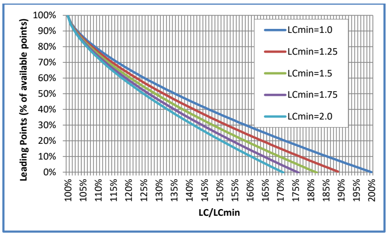

*Figure 10: Leading points for various LC<sub>min</sub>*

A line chart. The x axis is "LC/LCmin", from 100% to 200% in steps of 5%; the y axis is "Leading Points (% of available points)", from 0% to 100%. Five curves are drawn, one per minimum leading coefficient: "LCmin=1.0" (dark blue), "LCmin=1.25" (red), "LCmin=1.5" (green), "LCmin=1.75" (purple) and "LCmin=2.0" (light blue). All five start at 100% of the available leading points when LC/LCmin is 100% and decay together steeply at first, then spread apart: the larger the LCmin, the faster the curve falls. The LCmin=1.0 curve reaches 0% at LC/LCmin = 200%; the LCmin=1.25 curve at about 190%; LCmin=1.5 at about 182%; LCmin=1.75 at about 176%; and LCmin=2.0 at about 170%.

#### 11.3.1 Leading coefficient

Each started pilot's track log is used to calculate the leading coefficient (LC), by calculating the area underneath a graph defined by each track point's time, and the distance to ESS at that time. The times used for this calculation are given in seconds from the first start gate time (as defined for the task), to the time when the last pilot reached ESS. For pilots who land out after the last pilot reached ESS, the calculation keeps going until they land. The distances used for the LC calculation are given in kilometres and are the distance from each point's position to ESS, starting from SSS, but never more than any previously reached distance. This means that the graph never "goes back": even if the pilot flies away from goal for a while, the corresponding points in the graph will use the previously reached best distance towards ESS.

Calculation of the leading coefficient (LC) for each pilot follows this formula:

$$\mathit{bestTrackPoint}_p = \mathit{trackPointWithShortestDistanceToESS})$$

$$\mathit{minToESS}(tp_0) = \mathit{speedSectionDistance}$$

$$\forall i : i > 0, tp_i \in \mathit{trackPointsInSS}_p : \mathit{minToESS}(tp_i) = \min\left(\mathit{minToESS}(tp_{i-1}), \mathit{distToESS}(tp_i)\right)$$

$$\mathit{taskTime}(\mathit{trackPoint}) = \min(\mathit{trackpoint}.\mathit{time}, \mathit{taskDeadline}) - \mathit{firstTaskStartTime}$$

$$\mathit{maxTime} = \min(\max(\mathit{lastOutlandingTime}, \mathit{lastESStime}), \mathit{taskDeadline})$$

> **HG only:**
>
> $$\mathit{leadingArea}_p = \sum_{i : tp_i \in \mathit{trackPointsInSS}_p} \left(\mathit{minToESS}(tp_{i-1})^2 - \mathit{minToESS}(tp_i)^2\right) * \mathit{taskTime}(tp_i)$$
>
> $$\mathit{missingArea}_p = \mathit{maxTime} * \mathit{minToESS}\left(\mathit{bestTrackPoint}_p\right)^2$$
>
> $$\mathit{LC}_p = \frac{\mathit{leadingArea}_p + \mathit{missingArea}_p}{1800 * \mathit{speedSectionDistance}^2}$$

<!-- PDF p.37 -->

> **HG only:**
> 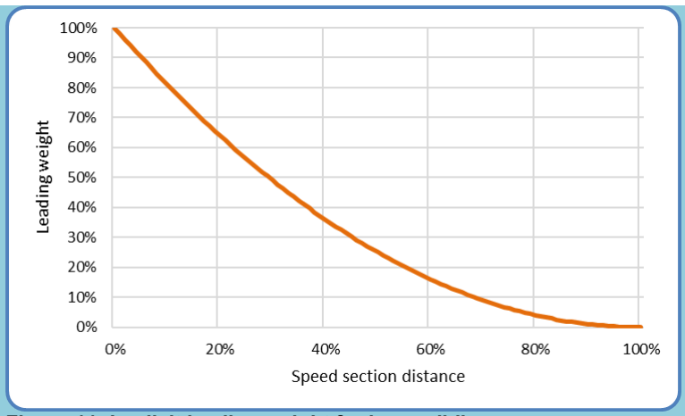
> *Figure 11: Implicit leading weight for hang-gliding*
>
> The chart plots "Leading weight" (y axis, 0% to 100% in 10% gridline steps) against "Speed section distance" (x axis, 0% to 100% in 20% labelled steps). A single orange curve starts at 100% leading weight at 0% speed section distance and decreases monotonically with a convex (flattening) shape: roughly 60% weight at 20% distance, about 37% at 40%, about 15% at 60%, about 4% at 80%, reaching 0% at 100% of the speed section distance. Distance flown early in the speed section therefore carries the most leading weight, tapering smoothly to nothing at ESS.

> **PG only:**
>
> $$\mathit{leadingArea}_p = \sum_{i:\,tp_i \in \mathit{trackPointsInSS}_p} \mathit{weight}$$
>
> $$\mathit{missingArea}_p = \mathit{weightFalling}\left(\mathit{distToEss}\left(\mathit{bestTrackPoint}_p\right)\right) * \mathit{maxTime} * \mathit{distToESS}\left(\mathit{bestTrackPoint}_p\right)$$
>
> $$\mathit{LC}_p = \frac{\mathit{leadingArea}_p + \mathit{missingArea}_p}{1800 * \mathit{speedSectionDistance}}$$
>
> $$\mathit{weight}(\mathit{missingDistance}) = \mathit{weightRising}(\mathit{missingDistance}) * \mathit{weightFalling}(\mathit{missingDistance})$$
>
> $$\mathit{weightRising}(\mathit{missingDistance}) = \left(1 - 10^{\frac{9 * \mathit{missingDistance}}{\mathit{speedSectionDistance}} - 9}\right)^{5}$$
>
> $$\mathit{weightFalling}(\mathit{missingDistance}) = \left(1 - 10^{\frac{-3 * \mathit{missingDistance}}{\mathit{speedSectionDistance}}}\right)^{2}$$
>
> 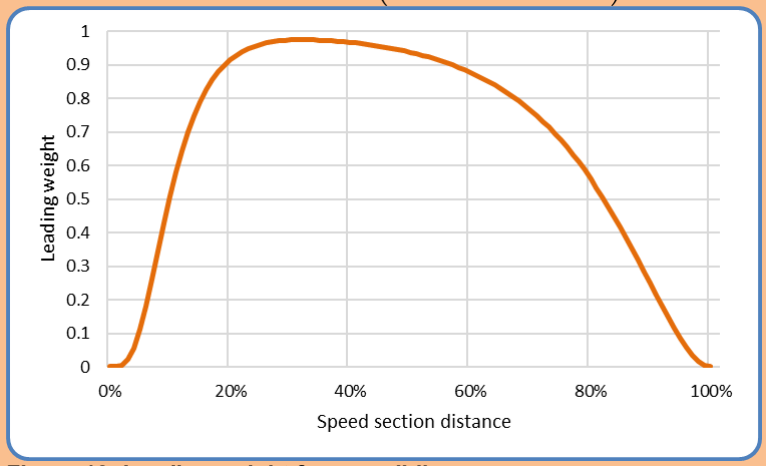
> *Figure 12: Leading weight for paragliding*
>
> The chart plots "Leading weight" (y axis, 0 to 1 in 0.1 gridline steps) against "Speed section distance" (x axis, 0% to 100% in 20% labelled steps). A single orange curve starts at 0 at 0% distance, rises very steeply between roughly 5% and 20% of the speed section distance, peaks at about 0.97–0.98 around 30–35%, then declines gently across the middle of the speed section (about 0.9 at 60%, about 0.6 at 80%) before falling steeply back to 0 at 100%. It is the product of the rising and falling weight functions above: distance in the early-middle part of the speed section counts most, while the very beginning and the final approach to ESS carry almost no leading weight.

<!-- PDF p.38 -->

### 11.3.2 Example


*Figure 13: Sample track log graphs for LC calculation*

The chart is titled "Track log evaluation for Leading Coefficent calculation". The x axis is "Speedsection distance in km (SS distance 62km)", from 0 to just past 60 km; the y axis is "Time in SS in seconds", labelled at 0, 3600 and 7200. Four stepped, rising track log lines are drawn, named in a legend: Green, Orange, Black and Blue.

- **Blue** starts at time 0 (first to enter the speed section) and rises steadily, reaching 62 km at roughly 5,800 seconds.
- **Green** also starts at time 0 and tracks close to Blue/Orange, but its solid line ends at about 23 km and roughly 2,700 seconds; from there a green dashed horizontal line at about 6,100 seconds runs out to 62 km — the completed ("filled-in") portion of the track for a pilot who landed short.
- **Orange** starts near time 0, climbs to about 33 km, then shows a dashed vertical jump to about 4,600 seconds followed by a dashed horizontal segment to about 42 km — a gap in the track log completed by the dotted line — before continuing solid to 62 km at about 6,100 seconds (the highest finishing time).
- **Black** starts last (its line begins at a few hundred seconds at 0 km) but rises with the shallowest slope after about 22 km, crossing 62 km at the lowest time (roughly 5,500 seconds) — the smallest area under its graph.

Blue was the first to enter the speed section, but Black was the first pilot to cross the end of speed section. Green started at the same time as Blue, but landed short, after about 23km and just over 40 minutes of flight inside the speed section.

Black was fastest, therefore will get the most time points, but he started late, probably had pilots out front to show the way during the first 22km but was leading after that.

If a pilot lands along the course (Green), or if his track log is interrupted (Orange), his track log is completed as shown by the dotted lines: Missing parts are calculated as if the dotted line was the actual track log, so LC becomes bigger, lowering the leading points for that pilot, compared to a track where that part is not missing. A pilot landing just short of goal will be less penalised and could even get full leading points if he led for a long while.

The pilot who used best the earliest part of the day (i.e., Black, who has the smallest area below the track log graph) gets all the available leading points, while the others get their points according to the same formula used for the time points for the same reasons. If the task in the example is fully valid, and 30% of pilots reached goal, then Black will get all of the available 81 leading points and full time points, as he was fastest; Blue gets 45 leading points because he started early but was slower; Orange receives only 18 leading points as he was slow and had a gap in his track log; Green gets 0 points even though he started early, because he was the slowest and landed fairly short.

## 11.4 Arrival points

> **HG only:** Arrival points depend on the position at which a pilot crosses ESS: The first pilot completing the speed section receives the maximum available arrival points, while the others are awarded arrival points according to the number of pilots who reached ESS before them. The last pilot to reach ESS will always receive at least 20% of the available arrival points.

<!-- PDF p.39 -->

> **HG only:**
>
> $$\mathit{AC}_p = 1 - \frac{\mathit{PositionAtESS}_p - 1}{\mathit{NumberOfPilotsReachingESS}}$$
>
> $$\mathit{ArrivalFraction}_p = 0.2 + 0.037 * \mathit{AC}_p + 0.13 * \mathit{AC}_p^{2} + 0.633 * \mathit{AC}_p^{3}$$
>
> $$\mathit{ArrivalPoints}_p = \mathit{ArrivalFraction}_p * \mathit{AvailableArrivalPoints}$$
>
> 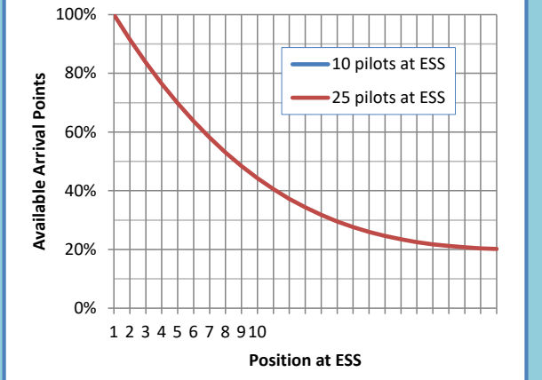
>
> *Figure 14: Sample arrival points distributions*
>
> (No figure crop was extracted for this chart; description from the page render.) The chart plots "Available Arrival Points" (y axis, 0% to 100% in 20% labelled steps) against "Position at ESS" (x axis, positions 1 to 10 labelled, grid continuing beyond). A legend names two series: a blue line "10 pilots at ESS" and a red line "25 pilots at ESS". The visible curve (the two series largely overlap, red drawn on top) starts at 100% of available arrival points for position 1 and decreases convexly with increasing arrival position, flattening towards the guaranteed floor of 20% for the last pilots to reach ESS.

> **PG only:** No arrival points are awarded in Paragliding.

<!-- PDF p.40 -->

## 12 Special cases

## 12.1 ESS but not goal

In a task where ESS and goal are not identical, a pilot may reach ESS, but not goal.

Reaching goal is seen as 'validating' one's speed section performance. A pilot who does not reach goal after reaching ESS will lose a portion of his time points, as defined by the scoring system penalty parameter for this situation. He will also score full distance points for the distance covered and his full leading points. The timepoint penalty for not reaching goal is seen as a safety measure, since it encourages pilots to plan their final glide to ESS with enough altitude to safely reach goal.

For paragliders the scoring system parameter is to be set at 0% (i.e. no time points awarded) as this discourages high-speed final glides low to the ground.

For hang gliders the default scoring system parameter of 80% is recommended but can be changed by the local regulations to suit particular sites.

PG

$$\forall p: p \in \mathit{PilotsLandedBetweenESSandGoal}: \mathit{TotalScore}_p = \mathit{DistancePoints}_p + \mathit{LeadingPoints}_p + 0 * \left(\mathit{TimePoints}_p\right)$$

HG

$$\forall p: p \in \mathit{PilotsLandedBetweenESSandGoal}: \mathit{TotalScore}_p = \mathit{DistancePoints}_p + \mathit{LeadingPoints}_p + 0.8 * \left(\mathit{TimePoints}_p + \mathit{ArrivalPoints}_p\right)$$

## 12.2 Early start

An early start occurs if a pilot's last SSS control zone boundary crossing occurred before the first (or only) start gate time.

> **PG only:** In paragliding, pilots who perform an early start are only scored for the distance between the launch point and the SSS control zone, as calculated when determining the complete task distance (see 6.4.1).

> **HG only:** In hang-gliding, the so-called "Jump the Gun"-rule applies: If the early start occurred within a time that is close to the first (or only) start gate time, the pilot is scored for his complete flight, but a penalty is then applied to his total score.

The penalty calculation is based on two values X and Y, which are set in S7A, but can be changed at the task briefing (presumably by the meet director and/or the task committee). For each X seconds a pilot starts early, he incurs a 1-point penalty, up to a maximum of Y seconds. If a pilot starts more than Y seconds early, he will only be scored for minimum distance.

$$X_{\mathrm{default}} = 2$$

$$Y_{\mathrm{default}} = 300$$

$$\mathit{timeDiff}_p = \mathit{firstStartGateTime} - \mathit{lastStartTime}_p$$

$$\mathit{timeDiff}_p <= 0: \mathit{jumpTheGunPenalty}_p = 0$$

$$\mathit{timeDiff}_p > Y: \mathit{jumpTheGunPenalty}_p = 0, \mathit{totalScore}_p = \mathit{scoreForMinDistance}$$

$$0 < \mathit{timeDiff}_p <= Y: \mathit{jumpTheGunPenalty}_p = \frac{\mathit{timeDiff}_p}{X}$$

$$\mathit{totalScore}_p = \max\left(\mathit{totalScore}_p - \mathit{jumpTheGunPenalty}_p, \mathit{scoreForMinDistance}\right)$$

<!-- PDF p.41 -->

## 12.3 Stopped tasks

### 12.3.1 Stop task time

A task can be stopped at any time by the meet director. The time when a stop was announced for the first time is the "task stop announcement time". This time must be recorded to score the task appropriately. For scoring purposes, a "task stop" time is calculated. This is the time which determines whether a task will be scored at all. Pilots' flight will only be scored up to this task stop time.

> **HG only:** In hang-gliding, stopped tasks are "scored back" by a time that is determined by the number of start gates and the start gate interval: The task stop time is one start gate interval, or 15 minutes in case of a single start gate, before the task stop announcement time.
>
> $$\mathit{numberOfStartGates} = 1: \mathit{taskStopTime} = \mathit{taskStopAnnouncementTime} - 15\mathrm{min}.$$
>
> $$\mathit{numberOfStartGates} > 1: \mathit{taskStopTime} = \mathit{taskStopAnnouncementTime} - \mathit{startGateInterval}$$

> **PG only:** In paragliding the score-back time is set as part of the competition parameters (see section 5.6).
>
> $$\mathit{taskStopTime} = \mathit{taskStopAnnouncementTime} - \mathit{competitionScoreBackTime}$$

### 12.3.2 Requirements to score a stopped task

Stopped tasks will be scored only if they ran for a sufficiently long time.

$$\mathit{minimumTime} = \min\left(1h, \frac{\mathit{NominalTime}}{2}\right)$$

$$\mathit{typeOfTask} = \mathit{RaceToGoal} \land \mathit{numberOfStartGates} = 1:$$

$$\mathit{taskStopTime} - \mathit{startTime} < \mathit{minimumTime}: \mathit{taskValidity} = 0$$

$$\mathit{TypeOfTask} \neq \mathit{RaceToGoal} \lor \mathit{numberOfStartGates} > 1:$$

$$\mathit{taskStopTime} - \max\left(\forall p: p \in \mathit{StartedPilots}: \mathit{startTime}_p\right) < \mathit{minimumTime}: \mathit{taskValidity} = 0$$

### 12.3.3 Stopped task validity

*(Paragliding only.)*

For stopped tasks, an additional validity value, the Stopped Task Validity, is calculated and applied to the Task Validity.

$$\mathit{DayQuality}_{\mathit{stopped}} = \mathit{LaunchValidity} * \mathit{DistanceValidity} * \mathit{TimeValidity} * \mathit{StoppedTaskValidity}$$

Stopped Task Validity is calculated taking into account the task distance, the flown distances of all pilots, the number of launched pilots and the number of pilots still flying at the time when the task was stopped.

$$\mathit{NumberOfPilotsReachedESS} > 0: \mathit{StoppedTaskValidity} = 1$$

$$\mathit{NumberOfPilotsReachedESS} = 0:$$

$$\mathit{StoppedTaskValidity} = \min$$

<!-- UNREADABLE: p.41, the StoppedTaskValidity formula is truncated in the source PDF itself — the line ends at "min" with no argument printed; nothing further appears on the page. -->

### 12.3.4 Scored time window

For stopped Race to Goal tasks with a single start gate, scoring considers the same time window for all pilots: The time between the race start and the task stop time.

$$\mathit{typeOfTask} = \mathit{RaceToGoal} \land \mathit{numberOfStartGates} = 1:$$

$$\forall p: p \in \mathit{StartedPilots}: \mathit{scoreTimeWindow}_p = (\mathit{startTime}, \mathit{taskStopTime})$$

For stopped Race to Goal tasks with multiple start gates, as well as Elapsed Time races, must be treated slightly differently: Only the time window available to the last pilot started is considered for scoring. This time window is defined as the amount of time *t* between the last pilot's start and the task stop time. For all pilots, only this time t after their respective start is considered for scoring.

<!-- PDF p.42 -->

$$\mathit{typeOfTask} \neq \mathit{RaceToGoal} \lor \mathit{numberOfStartGates} > 1:$$

$$\mathit{scoreTime} = \mathit{taskStopTime} - \max\left(\forall p: p \in \mathit{StartedPilots}: \mathit{startTime}_p\right)$$

$$\forall p: p \in \mathit{StartedPilots}: \mathit{scoreTimeWindow}_p = \left(\mathit{startTime}_p, \mathit{startTime}_p + \mathit{scoreTime}\right)$$

This means that if the last pilot started and then flew for, for example, 75 minutes until the task was stopped, all tracks are only scored for the first 75 minutes each pilot flew after taking their respective start.

### 12.3.5 Time points for pilots at or after ESS

Pilots who were at a position between ESS and goal at the task stop time will be scored for their complete flight, including the portion flown after the task stop time. This is to remove any discontinuity between pilots just before goal and pilots who had just reached goal at task stop time.

A fixed amount of points is subtracted from the time points of each pilot that makes goal in a stopped task. This amount is the amount of time points a pilot would receive if he had reached ESS exactly at the task stop time. This is to remove any discontinuity between pilots just before ESS and pilots who had just reached ESS at task stop time.

$$\mathit{typeOfTask} = \mathit{RaceToGoal} \land \mathit{numberOfStartGates} = 1:$$

$$\mathit{timePointsReduction} = \mathit{timePoints}(\mathit{taskStopTime} - \mathit{startTime})$$

$$\mathit{TypeOfTask} \neq \mathit{RaceToGoal} \lor \mathit{numberOfStartGates} > 1: \mathit{timePointsReduction} = \mathit{timePoints}$$

$$\forall p: p \in \mathit{PilotsInGoal}: \mathit{finalTimePoints}_p = \mathit{timePoints}_p - \mathit{timePointsReduction}$$

### 12.3.6 Distance points with altitude bonus

To compensate for altitude differences at the time when a task is stopped, a bonus distance is calculated for each point in the pilots' track logs, based on that point's altitude above goal. This bonus distance is added to the distance achieved at that point. All altitude values used for this calculation are GPS altitude values, as received from the pilots' GPS devices (no compensation for different earth models applied by those devices). For all distance point calculations, including the difficulty calculations in hang-gliding (see 11.1.1), these new stopped distance values are being used to determine the pilots' best distance values. Time and leading point calculations remain the same: they are not affected by the altitude bonus or stopped distance values.

> **HG only:**
> $$\mathit{GlideRatio} = 5.0$$

> **PG only:**
> $$\mathit{GlideRatio} = 4.0$$

$$\forall p: p \in \mathit{PilotsLandedBeforeGoal}: \mathit{bestDistance}_p = \max\left(\mathit{minimumDistance}, \middle|\ \ \middle|\mathit{taskDistance} - \min\left(\forall \mathit{track}_p.\mathit{point}_i: \middle|\right.\right.$$

$$\forall p: p \in \mathit{PilotsReachedGoal}: \mathit{bestDistanc}$$

<!-- UNREADABLE: p.42, both lines of the bestDistance formula are clipped at the right page margin in the source PDF: the first line breaks off after "min(∀track_p.point_i:" followed by a cut-off vertical bar, and the second line breaks off mid-word at "bestDistanc". The remainder of the formula is not printed anywhere on the page. -->

## 12.4 Penalties

Penalties for various actions are defined in the rules. These penalties are either expressed as an absolute number (e.g., "100 points") or as a percentage (e.g. "10% of the pilot's score in the task where he performed the punishable action"). The corresponding number of points is then deducted from the punished pilot's total score to calculate his final score.

$$\mathit{finalScore}_p = \mathit{score}_p - \mathit{absolutePenalty}_p$$

$$\mathit{finalScore}_p = \mathit{score}_p * \left(1 - \mathit{percentagePenalty}_p\right)$$

> **HG only:**
> - 1\. "Jump the Gun"-Penalty
> - 2\. Percentage penalty or bonus
> - 3\. Absolute points penalty or bonus

<!-- PDF p.43 -->

> **PG only:**
> 1. Percentage penalty or bonus
> 2. Absolute points penalty or bonus

The penalty mechanism can also be used to award bonus points to a pilot for some actions like helping a pilot in distress. In that case the penalty must be given as a negative number.

Any rounding up of scores is to be done after the application of penalties. The lowest score a pilot can attain in a task, regardless of any incurred penalties, is zero points.

<!-- PDF p.44 -->

## 13 Task ranking

Definitions of types of task ranking are in Section 7A-5.2.4.

- Overall task ranking
- Female task ranking
- Nation task ranking

<!-- PDF p.45 -->

## 14 Competition ranking

Definitions of types of Competition ranking are in Section 7A-5.2.5.

- Overall competition ranking
- Female competition ranking
- Nation competition ranking
- Ties

<!-- PDF p.46 -->

## 15 FTV – Fixed Total Validity

Fixed Total Validity (FTV) is a procedure to score pilots on their best task performances, rather than all their tasks. Fixed Total Validity means the sum (total) of available points (validity) is set (fixed) to the same value for each competitor.

$$
\mathit{FTV}_{\mathrm{factor}} = 0.2 \lor 0.25
$$

$$
\mathit{CalculatedFTV} = (1 - \mathit{FTV}_{\mathrm{factor}}) * \sum_{t:\mathrm{Task}} \frac{\mathit{WinnerScore}_t}{1000}
$$

To calculate a pilot's FTV score, for all his flights:

1. Calculate a performance percentage for each day by dividing the pilot's day score by the day winner's points
2. Arrange all flights in descending order of performance percentage
3. Total up the flights' raw day scores (not performance percentages) in order of performance percentage until the sum of validities for those scores reaches the pre-decided Fixed Total Validity value.

If the last score added takes that pilot's total validity above the Fixed Total Validity, then only a fraction of that score is used so that the pilot's total validity is equal to the Fixed Total Validity.

$\mathit{numberOfTasks}$

<!-- PDF p.47 -->

## 16 Annex A: Algorithm for finding shortest path

### 1 Introduction

Distance calculation in paragliding and hang-gliding races is based on finding the shortest path between a given start point and a goal (cylinder or goal line), touching any number of intermittent control zones. This calculation can then be used to determine the distance of a set task, but also for the distance a pilot still must fly to complete a task.

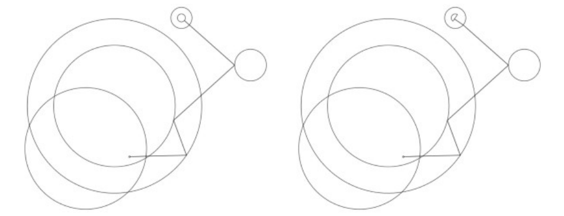
*Shortest path to a goal cylinder (left) and a goal line (right). The effect of measuring the shortest path to the end of the speed section can be seen by the kinked leg to the goal line.*

The figure contains two almost identical line diagrams, one for each goal type. Each diagram shows, in plan view: three large, mutually overlapping turnpoint cylinders occupying the lower left (drawn as thin circles — one large outer circle with a second circle nested inside its upper part, and a third circle overlapping both from the lower left); a medium-sized cylinder to the upper right (the end of the speed section); and a small circle at the top representing the goal. In the left diagram the small goal circle contains a concentric inner circle (a goal cylinder); in the right diagram it instead has a short straight stroke through it (a goal line). The computed shortest path is drawn as a chain of straight legs: it starts at a small dot at the centre of one of the large cylinders, runs horizontally right to a point where the overlapping cylinder edges are touched, makes a sharp V-shaped kink (two short legs meeting at a vertex just outside the inner cylinder's edge), then continues as one long straight leg up and to the right to touch the edge of the medium end-of-speed-section cylinder, and finally turns up-left in a final straight leg to the goal circle. The kinked leg near the goal illustrates that the path is optimised to the end of the speed section rather than straight to the goal line.

While finding the shortest path seems to be simple for human beings using pen and paper, there exists no closed mathematical solution for this problem. We therefore must resort to an iterative approach that converges on a minimum in most cases.

The calculations required to determine this path are best suited to plane geometry, so all WGS84 coordinates, of starting point, of the turnpoint cylinder centers and goal points, are transformed to cartesian coordinates. The planar distance of the calculated path is not used, but the resulting position fixes on the cylinders (and goal line) are transformed back to WGS84 coordinates and used to calculate the ellipsoidal distance.

This document describes the algorithms needed to perform these calculations, which are as much about speed and ease of use as they are about acceptable accuracy.

What this document does not yet address is:

- the transformation method from WGS84 to cartesian coordinates
- the method of transforming cartesian fix positions back to WGS84 coordinates

### 2 Calculations

These calculations require a set of points representing the cylinders and lines in cartesian coordinates, a radius in metres and a fix position that will mark the point on the cylinder (or line) of the shortest path. This fix position is initially set as the center position.

When the calculations are used to determine the distance a pilot still must fly to goal, the set of points is created from the pilot's track point and the remaining control zones not yet reached by the pilot.

#### 2.1 Core algorithm

The base calculation uses three sequential points (P1, P2, P3) and finds the shortest distance between P1 and P3 that touches the P2 control zone. P1 and P3 are taken from their fix positions. The point found
<!-- PDF p.48 -->
on the P2 control zone is stored as the P2 fix. The leg distance is measured between the P1 and P2 fix positions.

The algorithm sequentially steps through the remaining points and performs this calculation on each one, so the most recent P2 fix becomes the P1 fix used in the next step. On completion, all points will have a fix position on their cylinder (or line) and the shortest distance found will be the sum of the leg distances.

This algorithm is then repeated, using the points from the previous iteration, until no more shortening is possible or the maximum number of iterations has been reached.

#### 2.2 Required settings

In order that implementations give the same results, it is necessary to define some basic settings.

*Tolerance*

The value of the tolerance affects the final task distance. It also affects the number of iterations required, which itself is dependent on the complexity of the task.

A tolerance of 1 metre is enough, since all other distance measurements are also in meters. A smaller value may shorten the planar distance by a fraction of one metre, but this will not always be reflected in the final ellipsoidal distance and will require many more additional iterations.

*Maximum number of iterations*

The algorithm does not in all cases converge on the absolute minimum distance. To ensure completion, and prevent infinite loops, we need to define a maximum number of iterations, to cover the case where a local minimum is encountered, and a subsequent iteration results in a distance larger than the previous one is found. This could happen in complex cylinder configurations or if a cylinder erroneously intersects another. The maximum number of iterations is set to 200.

*Order of evaluation*

The first point used in the evaluation must be at index 1, because the distance is measured from the center of the launch waypoint (regardless of whether it has been given a radius).

The order in which the points are evaluated is also important. While the number of iterations may be reduced by evaluating odd then even indexed points, or other such tricks, the results cannot be consistently replicated across difference cylinder configurations. Evaluation order must be sequentially upwards.

*Summary of required settings:*

- The tolerance value is 1 metre.
- The maximum number of iterations is 200.
- Points are evaluated sequentially upwards.

<!-- PDF p.49 -->
### 3 Definitions

The pseudo code used to convey the intention and flow of the calculations is written in a C-like style and presented as a series of simple functions.

#### 3.1 Point object

In these examples the object, or struct, representing a cylinder or line is denoted as a `point`. It has the following properties, or members:

- **x** — (float) the x coordinate
- **y** — (float) the y coordinate
- **radius** — (int) the radius in metres
- **fx** — (float) the x coordinate of the fix
- **fy** — (float) the y coordinate of the fix

On construction, or when creating a new instance, the fx and fy properties must be initialized to the x and y values.

```c
function createPoint(x, y, radius = 0)
{
    // Using ECMAScript object literals to convey object creation
    return {x: x, y: y, radius: radius, fx: x, fy: y};
}

function createPointFromCenter(point)
{
    return createPoint(point.x, point.y, point.radius)
}

function createPointFromFix(point)
{
    return createPoint(point.fx, point.fy, point.radius)
}
```

#### 3.2 Planar calculations

The entry point is the getShortestPath function, which initiates and keeps track of the distances found and the number of iterations.

The main function is optimizePath, which is responsible for stepping through the set of points and calculating the shortest distance. It uses the following helper functions:

- getTargetPoints
<!-- PDF p.50 -->
- processCylinder
- processLine

<!-- PDF p.51 -->
##### 3.2.1 Cylinder evaluation

In general the solution to finding the shortest path is either one of intersection or reflection, as shown in the image below.

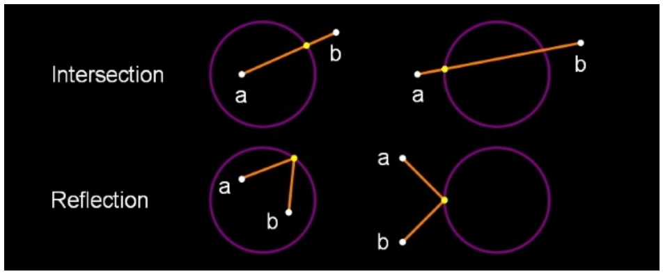

*The yellow dot marks the fix on the cylinder between point A and point B.*

The diagram (white points and orange path segments on a black background, the cylinder drawn as a purple circle) shows two rows of two cases each:

- **Intersection** (top row): the straight segment from a to b crosses the circle, so the fix (yellow dot) is placed where the segment intersects the circle. Left case: a is inside the circle and b outside, the segment a–b cuts the boundary once and the yellow dot sits at that crossing. Right case: both a and b are outside on opposite sides, the segment passes through the circle and the yellow dot sits at the crossing nearer a.
- **Reflection** (bottom row): the straight segment does not give a valid fix, so the path reflects off the circle — two orange segments from a and from b meet at the yellow dot on the circle. Left case: a and b are both inside the circle, the two segments meet at a point on the arc above them. Right case: a and b are both outside the circle (to its left), the two segments meet at the yellow dot on the near side of the circle.

The functions to solve these problems are:

- setIntersection1
- setIntersection2
- setReflection

Exceptions to the above are when point A and point B are the same, or when one them is on the cylinder. The latter situation can only occur if a cylinder erroneously intersects another, which may result in a miscalculation or extra iterations. These situations are handled by:

- projectOnCircle
- pointOnCircle

<!-- PDF p.52 -->
##### 3.2.2 getShortestPath

This is the outer controlling function that iterates through a sequence of distance optimizations until the difference between the optimized distances obtained by the previous and the current iteration is less than the tolerance, or the maximum number of iterations has been reached.

```c
// Inputs:
// points - array of point objects
// line - goal line endpoints, or empty array

function getShortestPath(points, line)
{
    tolerance = 1.0;
    lastDistance = INT_MAX;
    finished = false;
    count = getArrayLength(points);

    // opsCount is the number of iterations allowed
    opsCount = 200;

    while (!finished && opsCount-- > 0) {
        distance = optimizePath(points, count, line);

        // See if the difference between the last distance is
        // smaller than the tolerance
        finished = lastDistance - distance < tolerance;
        lastDistance = distance;
    }
}
```

<!-- PDF p.53 -->
##### 3.2.3 optimizePath

The algorithm sequentially steps through the cylinder points, taking three consecutive points at each step, with the middle one being the target of the calculation.

Each set of three points is passed to an appropriate function that finds the shortest path between the outer points and the target. The position of the fix on the target cylinder (or goal line) is set as a property of the target point. The target point subsequently becomes the first point in the next iteration step and this fix property is used to denote its position.

```c
// Inputs:
// points - array of point objects
// count - number of points
// line - goal line endpoints, or empty array

function optimizePath(points, count, line)
{
    distance = 0;
    hasLine = getArrayLength(line) == 2;

    for (index = 1; index < count; index++) {
        // Get the target cylinder c and its preceding and succeeding points
        c, a, b = getTargetPoints(points, count, index);

        if (index == count - 1 && hasLine) {
            processLine(line, c, a);
        } else {
            processCylinder(c, a, b);
        }

        // Calculate the distance from A to the C fix point
        legDistance = hypot(a.x - c.fx, a.y - c.fy);
        distance += legDistance;
    }

    return distance;
}
```

<!-- PDF p.54 -->
##### 3.2.4 getTargetPoints

Returns a set of three consecutive points comprising the target cylinder C, plus its preceding and succeeding points (A and B). The target point C is taken directly from the points array (ie. it is a reference, or copied by reference), while the other two are created as new point objects from either their fix or center positions.

The end of speed section is taken from its center position, so that its fix is pinned to the preceeding points, rather than any subsequent points at a different position.

```c
// Inputs:
// points - array of point objects
// count - number of points
// index - index of the target cylinder (from 1 upwards)

function getTargetPoints(points, count, index)
{
    // Set point C to the target cylinder
    c = points[index];

    // Create point A using the fix from the previous point
    a = createPointFromFix(points[index - 1]);

    // Create point B using the fix from the next point
    // (use point C center for the last point).
    if (index == count - 1) {
        b = createPointFromCenter(c);
    } else {
        b = createPointFromFix(points[index + 1]);
    }

    return [c, a, b];
}
```

<!-- PDF p.55 -->
##### 3.2.5 processCylinder

Sets the fix on the target cylinder C from the fixes on the previous point A and the next point B.

The distance from point C center to the AB line segment determines if it intersects the cylinder (distCtoAB < C radius). If it does and both points are inside the cylinder it requires the reflection solution, otherwise one of the intersection solutions. If the line does not intersect the cylinder or is tangent to it, it requires the reflection solution.

See Cylinder evaluation for more information.

```c
// Inputs:
// c, a, b - target cylinder, previous point, next point

function processCylinder(c, a, b)
{
    distAC, distBC, distAB, distCtoAB = getRelativeDistances(c, a, b);

    if (distAB == 0.0) {
        // A and B are the same point: project the point on the circle
        projectOnCircle(c, a.x, a.y, distAC);

    } else if (pointOnCircle(c, a, b, distAC, distBC, distAB, distCtoAB) {
        // A or B are on the circle: the fix has been calculated
        return;

    } else if (distCtoAB < c.radius) {
        // AB segment intersects the circle, but is not tangent to it

        if (distAC < c.radius && distBC < c.radius) {
            // A and B are inside the circle
            setReflection(c, a, b);

        } else if (distAC < c.radius && distBC > c.radius ||
                   (distAC > c.radius && distBC < c.radius)) {
            // One point inside, one point outside the circle
            setIntersection1(c, a, b, distAB);

        } else if (distAC > c.radius && distBC > c.radius) {
            // A and B are outside the circle
            setIntersection2(c, a, b, distAB);
        }
    } else {
        // A and B are outside the circle and the AB segment is
        // either tangent to it or or does not intersect it
        setReflection(c, a, b);
    }
}
```

<!-- PDF p.56 -->
##### 3.2.6 getRelativeDistances

Returns the distances between points A, B and C, plus the distance from C to the AB line segment.

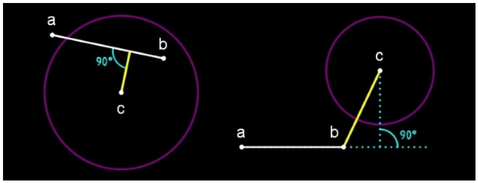

*The distance from C to the AB line segment is shown by the yellow line.*

The diagram (white points and segments on a black background, cylinders drawn as purple circles, the C-to-AB distance in yellow, right angles marked in cyan) shows the two cases of the point-to-segment distance:

- Left: c lies below the chord a–b inside its own circle. The yellow line runs from c perpendicularly to the segment a–b; the 90° angle at the foot of the perpendicular is marked. The perpendicular foot falls between a and b, so distCtoAB is the perpendicular distance.
- Right: c is the centre of a circle up and to the right of a horizontal segment a–b that ends before the circle. The perpendicular from c (dotted cyan, with a 90° mark) would meet the line beyond the b end of the segment, so the distance (yellow line) is instead measured from c to the endpoint b.

```c
// Inputs:
// c, a, b - target cylinder, previous point, next point

function getRelativeDistances(c, a, b)
{
    // Calculate distances AC, BC and AB
    distAC = hypot(a.x - c.x, a.y - c.y);
    distBC = hypot(b.x - c.x, b.y - c.y);
    len2 = (a.x - b.x)**2 + (a.y - b.y)**2;
    distAB = sqrt(len2);

    // Find the shortest distance from C to the AB line segment
    if (len2 == 0.0) {
        // A and B are the same point
        distCtoAB = distAC;
    } else {
        t = ((c.x - a.x) * (b.x - a.x) + (c.y - a.y) * (b.y - a.y)) / len2;

        if (t < 0.0) {
            // Beyond the A end of the AB segment
            distCtoAB = distAC;
        } else if (t > 1.0) {
            // Beyond the B end of the AB segment
            distCtoAB = distBC;
        } else {
            // On the AB segment
            cpx = t * (b.x - a.x) + a.x;
            cpy = t * (b.y - a.y) + a.y;
            distCtoAB = hypot(cpx - c.x, cpy - c.y);
        }
    }

    return [distAC, distBC, distAB, distCtoAB];
}
```

<!-- PDF p.57 -->
##### 3.2.7 getIntersectionPoints

Returns the two intersection points (s1, s2) of circle C by the AB line, plus the midpoint (e) of the line between them. The intersection points will either be within the AB segment, beyond point A (s1) or beyond point B (s2).

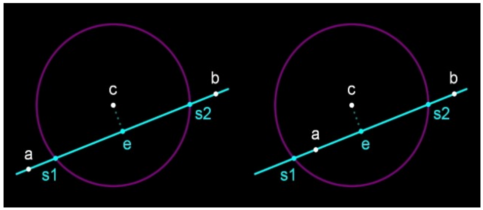
*Intersection of circle C by the AB line, in two configurations.*

Two panels on a black background, each a purple circle with white centre point c. A cyan line runs through white points a (lower left) and b (upper right) and crosses the circle at cyan points s1 (near a) and s2 (near b); cyan point e, the midpoint between s1 and s2, sits on the line at the foot of a dotted perpendicular from c. Left panel: a lies outside the circle, so s1 is within the AB segment. Right panel: a lies inside the circle, so s1 falls on the line beyond point A (outside the segment); s2 is within it in both panels.

```c
// Inputs:
// c, a, b - target cylinder, previous point, next point
// distAB - AB line segment length

function getIntersectionPoints(c, a, b, distAB)
{
    // Find e, which is on the AB line perpendicular to c center
    dx=(b.x-a.x)/distAB;
    dy=(b.y-a.y)/distAB;
    t2=dx*(c.x-a.x)+dy*(c.y-a.y);

    ex=t2*dx+a.x;
    ey=t2*dy+a.y;

    // Calculate the intersection points, s1 and s2
    dt2=c.radius**2-(ex-c.x)**2-(ey-c.y)**2;
    dt=dt2>0?sqrt(dt2):0;

    s1x=(t2-dt)*dx+a.x;
    s1y=(t2-dt)*dy+a.y;
    s2x=(t2+dt)*dx+a.x;
    s2y=(t2+dt)*dy+a.y;

    return [createPoint(s1x,s1y),createPoint(s2x,s2y),createPoint(ex,ey)];
}
```

<!-- PDF p.58 -->
##### 3.2.8 pointOnCircle

Sets the C fix position if either point A or point B is on the circle C.

- If point A is on the circle, the fix is taken from point A.
- If point B is on the circle, the fix is either taken from the intersection point closest to point A (if the AB segment intersects the circle and point A is outside it), or from point B.

Returns `false` if neither point is on the circle, otherwise `true`.

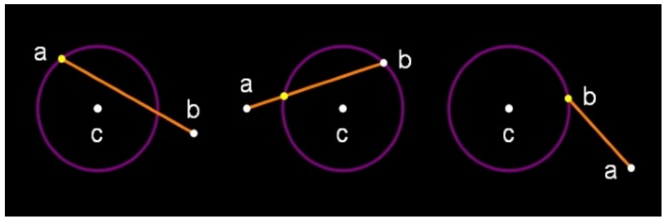
*The three pointOnCircle cases: A on the circle; B on the circle with the AB segment crossing it; B on the circle with A outside.*

Three panels on a black background, each a purple circle with white centre point c and an orange segment joining white points a and b; the chosen fix is a yellow dot. Left panel: a sits exactly on the circle (yellow), b outside — the fix is taken from a. Middle panel: b sits on the circle, a is outside and the AB segment crosses the circle — the fix (yellow) is the intersection point closest to a, where the segment enters the circle. Right panel: b sits on the circle (yellow) with a outside below it and the segment not re-entering the circle — the fix is taken from b.

```c
// Inputs:
// c, a, b - target cylinder, previous point, next point
// Distances between the points

function pointOnCircle(c, a, b, distAC, distBC, distAB, distCtoAB)
{
    if(fabs(distAC-c.radius)<0.0001){
        // A on the circle (perhaps B as well): use A position
        c.fx=a.x;
        c.fy=a.y;
        return true;
    }

    if(fabs(distBC-c.radius)<0.0001){
        // B on the circle

        if(distCtoAB<c.radius&&distAC>c.radius){
            // AB segment intersects the circle and A is outside it
            setIntersection2(c,a,b,distAB);
        }else{
            // Use B position
            c.fx=b.x;
            c.fy=b.y;
        }
        return true;
    }

    return false;
}
```

<!-- PDF p.59 -->
##### 3.2.9 projectOnCircle

Projects a point (P) on the circle C, at the intersection of the circle by the CP line. The result is stored in the C fix position.

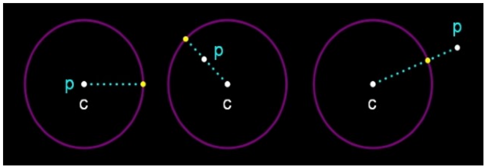
*Projection of point P onto circle C along the CP line, for P inside, near the rim, and outside the circle.*

Three panels on a black background, each a purple circle with white centre point c. A dotted cyan line runs from c through the point p (white dot), and the projected result is the yellow dot where that line crosses the circle. Left panel: p is inside the circle, just left of centre beside c, and the dotted line runs due east so the projection lands on the right-hand rim. Middle panel: p is inside the circle above-left of centre; the projection lands on the upper-left rim. Right panel: p is outside the circle to the upper right; the projection lands on the rim where the cp line leaves the circle.

```c
// Inputs:
// c - the circle
// x, y - coordinates of the point to project
// len - line segment length, from c to the point

function projectOnCircle(c, x, y, len)
{
    if(len==0.0){
        // The default direction is eastwards (90 degrees)
        c.fx=c.radius+c.x;
        c.fy=c.y;
    }else{
        c.fx=c.radius*(x-c.x)/len+c.x;
        c.fy=c.radius*(y-c.y)/len+c.y;
    }
}
```

<!-- PDF p.60 -->
##### 3.2.10 setIntersection1

Sets the intersection of circle C by the AB line segment when one point is inside and the other is outside the circle (ie. there is only one intersection point on the AB line segment). The result is stored in the C fix position.

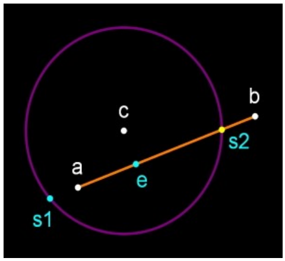
*setIntersection1: point a inside the circle, point b outside — the single intersection on the AB segment (here s2) becomes the fix.*

A purple circle with white centre point c on a black background. An orange segment joins white point a (inside the circle, lower left of centre) to white point b (outside, upper right). The full AB line meets the circle at cyan point s1 (lower left, outside the segment) and at s2 (yellow, on the segment where it exits the circle); cyan point e is the midpoint between s1 and s2. Only s2 lies between a and b, so it is chosen as the fix.

```c
// Inputs:
// c, a, b - target cylinder, previous point, next point
// distAB - AB line segment length

function setIntersection1(c, a, b, distAB)
{
    // Get the intersection points (s1, s2)
    s1,s2,e=getIntersectionPoints(c,a,b,distAB);

    as1=hypot(a.x-s1.x,a.y-s1.y);
    bs1=hypot(b.x-s1.x,b.y-s1.y);

    // Find the intersection lying between points a and b
    if(fabs(as1+bs1-distAB)<0.0001){
        c.fx=s1.x;
        c.fy=s1.y;
    }else{
        c.fx=s2.x;
        c.fy=s2.y;
    }
}
```

<!-- PDF p.61 -->
##### 3.2.11 setIntersection2

Sets the intersection of circle C by the AB line segment when both points are outside the circle (i.e. there are two intersection points on the AB line segment).

The result is stored in the C fix position and is the intersection that is closest to point A. This will lie between point A and point E (the midpoint of the line between the intersection points).

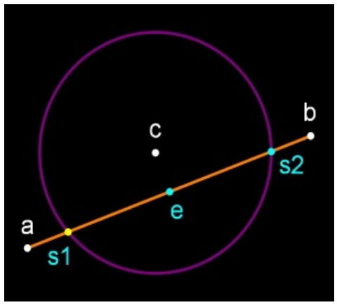
*setIntersection2: both a and b outside the circle — the intersection closest to a (here s1) becomes the fix.*

A purple circle with white centre point c on a black background. An orange segment joins white point a (outside, lower left) to white point b (outside, upper right), crossing the circle at s1 (yellow, near a) and cyan point s2 (near b); cyan point e is the midpoint between them. s1, the intersection closest to a, is highlighted as the chosen fix and lies between a and e.

```c
// Inputs:
// c, a, b - target cylinder, previous point, next point
// distAB - AB line segment length

function setIntersection2(c, a, b, distAB)
{
    // Get the intersection points (s1, s2) and midpoint (e)
    s1,s2,e=getIntersectionPoints(c,a,b,distAB);

    as1=hypot(a.x-s1.x,a.y-s1.y);
    es1=hypot(e.x-s1.x,e.y-s1.y);
    ae=hypot(a.x-e.x,a.y-e.y);

    // Find the intersection between points a and e
    if(fabs(as1+es1-ae)<0.0001){
        c.fx=s1.x;
        c.fy=s1.y;
    }else{
        c.fx=s2.x;
        c.fy=s2.y;
    }
}
```

<!-- PDF p.62 -->
##### 3.2.12 setReflection

Sets the reflection point of two external or internal points (A and B) on the circle C. This uses the triangle AFB (where F is the current C fix position) to find the point (K) on the AB line segment where it is cut by the AFB angle bisector. The reflected point is found by projecting K on the circle and is stored as the latest C fix position.

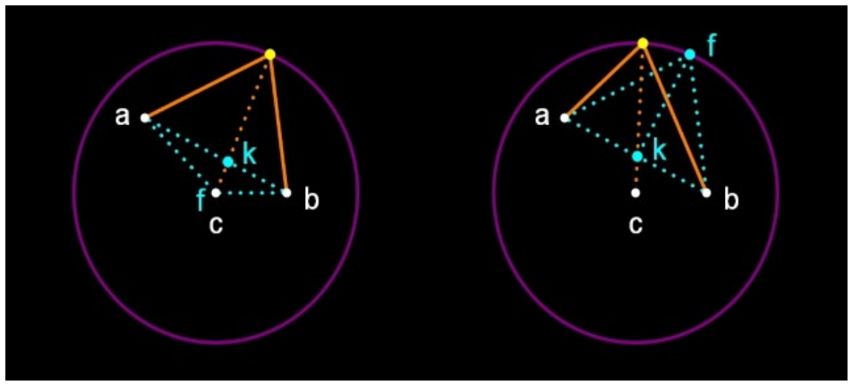
*setReflection: the AFB angle bisector cuts AB at k; projecting k onto the circle gives the new fix (yellow), for f inside (left) and outside (right) the circle.*

Two panels on a black background, each a large purple circle with white centre point c. White points a (left) and b (right) lie inside the circle and are joined by dotted cyan lines to the current fix f (cyan) — left panel: f inside the circle just above c; right panel: f outside on the upper-right rim area. Cyan point k marks where the AFB angle bisector (dotted orange from the top) cuts the AB segment. An orange dotted radial line runs from c through k up to the yellow dot on the circle at the top — the projection of k, which becomes the new fix; solid orange lines join that yellow point to a and to b.

```c
// Inputs:
// c, a, b - target circle, previous point, next point

function setReflection(c, a, b)
{
    // The lengths of the adjacent triangle sides (af, bf) are
    // proportional to the lengths of the cut AB segments (ak, bk)
    af=hypot(a.x-c.fx,a.y-c.fy);
    bf=hypot(b.x-c.fx,b.y-c.fy);
    t=af/(af+bf);

    // Calculate point k on the AB segment
    kx=t*(b.x-a.x)+a.x;
    ky=t*(b.y-a.y)+a.y;
    kc=hypot(kx-c.x,ky-c.y);

    // Project k onto the radius of c
    projectOnCircle(c,kx,ky,kc);
}
```

<!-- PDF p.63 -->
##### 3.2.13 Line control zone optimization

The optimization solution must find a point O on the line segment L such that the length of the route from previous point A to point O and then to next point B is minimum. There are two scenarios:

1. The line is in the middle of the task
2. The line is in the beginning or at the end of the task

In the first scenario there are 3 cases for the positioning of the points A (previous point), B (next point) and the line L:

a) Line segment A-B and line segment L intersect

b) B’ is a reflection point of point B over line L and line segment A-B’ and line segment L intersect

c) Line segments A-B and A-B’ does not intersect line segment L

In the second scenario there are only 2 cases for the position of line L and point A/B (there is no other point because the line is first/last sector in the task):

a) Point A projection A’ on line L lies within the line segment L

b) Point A’ lies outside of the line segment L

Here we will describe how the optimization must be done in the first scenario. There is no need to describe how to optimize in the second scenario - it must be familiar for you as it’s very similar to optimizing to a goal semicircle.

Scenario 1a: Point O is the intersection point of line segments A-B and L

Scenario 1b: Point O is the intersection point of line segments A-B’ and L

Scenario 1c: Point O is either Endpoint1 or Endpoint2. We calculate lengths of routes A-EP1-B and A-EP2-B and depending on which one is smaller - we choose the corresponding EP.

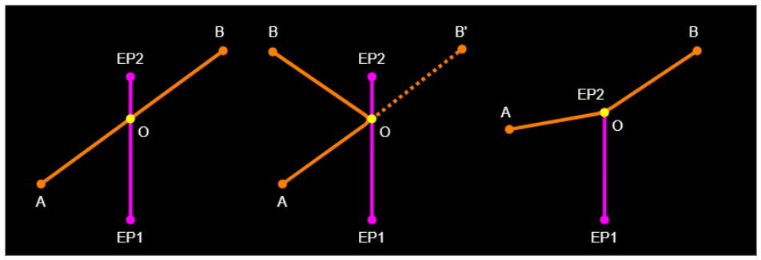
*Line control zone optimization: scenario 1a (A-B crosses L), 1b (A-B′ crosses L), and 1c (O at an endpoint of L).*

Three panels on a black background, each with a vertical magenta line segment L running from EP1 (bottom) to EP2 (top) and orange route legs; the optimal point O is a yellow dot on L. Left panel (1a): the straight orange segment from A (lower left) to B (upper right) crosses L, and O is that intersection. Middle panel (1b): A is lower left and B upper left, on the same side of L; B′ (upper right) is B reflected over L, drawn with a dotted orange segment from O — the solid legs A-O and O-B meet at O where A-B′ crosses L. Right panel (1c): A (left) and B (upper right) are positioned so neither A-B nor A-B′ crosses L; O coincides with the endpoint EP2 at the top of L, where the two orange legs meet.

<!-- PDF p.64 -->
##### 3.2.14 processLine

Finds the closest point on the goal line (g1, g2) from point A, storing the result in the C fix position. This will either be on the line itself, or at one of its endpoints.

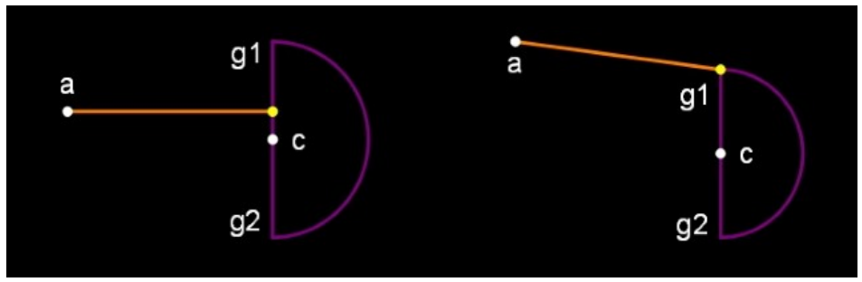
*processLine: the closest point on the goal line from a falls on the line itself (left) or at an endpoint (right).*

Two panels on a black background, each showing a goal: a vertical purple line from g1 (top) to g2 (bottom) with c at its midpoint, and a purple semicircle bulging to the right of the line. An orange segment runs from white point a (upper left) to the yellow chosen fix. Left panel: a is due west of the goal, so the perpendicular projection falls on the line segment itself, just above c. Right panel: a is higher, beyond the g1 end of the segment, so the projection falls outside the segment and the fix is the endpoint g1 itself.

```c
// Inputs:
// line - array of goal line endpoints
// c, a - target (goal), previous point

function processLine(line, c, a)
{
    g1=line[0],g2=line[1];
    len2=(g1.x-g2.x)**2+(g1.y-g2.y)**2;

    if(len2==0.0){
        // Error trapping: g1 and g2 are the same point
        c.fx=g1.x;
        c.fy=g1.y;
    }else{
        t=((a.x-g1.x)*(g2.x-g1.x)+(a.y-g1.y)*(g2.y-g1.y))/len2;

        if(t<0.0){
            // Beyond the g1 end of the line segment
            c.fx=g1.x;
            c.fy=g1.y;
        }else if(t>1.0){
            // Beyond the g2 end of the line segment
            c.fx=g2.x;
            c.fy=g2.y;
        }else{
            // Projection falls on the line segment
            c.fx=t*(g2.x-g1.x)+g1.x;
            c.fy=t*(g2.y-g1.y)+g1.y;
        }
    }
}
```

---

## Appendix (not part of S7F): Source-extraction notes

Everything above is a faithful transcription of the 1 May 2024 PDF. This
appendix is ours: it records where the source document itself is defective,
where the transcription had to exercise judgement, and what the PDF's text
layer gets wrong (the reason this transcription exists). Page numbers are PDF
pages, which equal the printed page numbers in this document.

### Defects in the source PDF (reproduced or marked, never repaired)

Truncated formulas — the equation is cut off in the published PDF and its tail
is printed nowhere; each is marked `<!-- UNREADABLE -->` in place:

- **p.28, §8.6.1** — the first `bestDistance` formula runs off the right page
  edge, ending at `min(∀track_p.point_i sho…` (evidently the start of a
  shortest-distance-to-goal term).
- **p.35, §11.3** — `LeadingFactor_p = max` ends with no arguments; the
  leading-factor formula is unrecoverable from this edition.
- **p.41, §12.3.3** — the stopped-task validity for
  `NumberOfPilotsReachedESS = 0` ends at `StoppedTaskValidity = min`.
- **p.42, §12.3.6** — both lines of the altitude-bonus `bestDistance` formula
  run off the right margin.

Other source defects, kept verbatim:

- Equation blocks typeset run-together (Word display-array collapse): the
  §6.4.1/§6.4.2 definitions on pp.22–23 (the next equation's left-hand side
  is jammed onto the end of the previous line), and the four
  `Available…Points` equations on p.31. Split at the evident boundaries; the
  p.23 report's most plausible logical parse is noted in the PR record, not
  in the transcription.
- **p.33** — the `DifficultyFraction` equation's own rendering is corrupted
  (stray vertical bars for a `∗`, a clipped closing parenthesis); it was
  reconstructed as the linear interpolation consistent with the adjacent
  `iDist10_p = int(Distance_p ∗ 10)` definition.
- **p.42, §12.3.5** — `timePointsReduction = timePoints` (the second
  condition's right-hand side reads as an apparent authoring omission but is
  printed cleanly, so it is transcribed without an UNREADABLE mark).
- **p.46, §15** — an orphaned line `numberOfTasks` in equation font sits below
  the section's last paragraph.
- Unbalanced parentheses as printed: `…ShortestDistanceToESS)` (p.36) and the
  `pointOnCircle(…)` condition in `processCylinder` (p.55).
- Typos as printed: `DifffScore` (p.34), `∀i: ≤` missing its `i` (p.33),
  `4.43:55` (p.35, Table 1), `14.50` for `14:50` (p.21), "preceeding" and
  "or or" (pp.54–55), "when one them is on the cylinder" (p.51), "x/y plain"
  (pp.14, 18), `typeOfTask`/`TypeOfTask` casing switch (p.41),
  `distToEss`/`distToESS` on consecutive lines (p.37), and `getShortestPath`
  in Annex A computes `distance` but never returns it (p.52).
- **Annex A is carried over from the previous edition**: every page from p.49
  to the end has the running header "1st May 2023", and the annex's listings
  are printed with **no spaces at all** (see below).
- §1.3 says changes from the previous edition are marked red; the 2024 file
  contains no red-marked text at all.

### Editorial reconstructions (judgement calls, recorded)

- **Annex A code spacing.** The listings are printed space-less in the PDF
  itself (`functiongetShortestPath(points,line)`), so spacing, 4-space
  indentation and blank-line grouping are reconstructed, C-style, per the
  annex's own "C-like style" note. Identifiers and comment wording are
  verbatim. Segmentations chosen: "goal line endpoints", `} else if (`.
- **p.34 `SpeedFraction`** — the raster's exponent placement is ambiguous
  between numerator⁵ and (whole fraction)⁵; transcribed as the whole fraction
  raised to the 5th power, the only reading consistent with the prose and
  with Table 1's zero-points times (2:00 → 3:24:51 = 2 + √2 h).
- **Highlight extents** — the extraction JSON's per-highlight word lists
  occasionally bleed one line beyond the coloured band (text-layer
  spillover); wherever the word list and the rectangle disagreed, the
  rectangle position on the raster decided (e.g. p.42's `GlideRatio = 5.0`
  is HG/blue and `= 4.0` PG/orange; p.31's `DistanceWeight` polynomial is
  shared, not HG).
- **Vector-drawn charts** (Figures 1, 3, 4, 5, 8, 10, 14) have no embedded
  image objects, so their `figures/pNN-chart1.png` crops are cut from the
  150 dpi page raster; curve readings in their prose descriptions are read
  off the charts and are approximate by nature.

### What the PDF text layer gets wrong (why raster reading was required)

- Every Word equation object serialises as garbled glyph soup — doubled
  mock-italic characters, detached sub/superscripts, interleaved section
  headings (e.g. the §9.2/§9.3 validity formulas, all six leading-coefficient
  formulas, `CalculatedFTV`).
- Highlighted HG/PG paragraphs sitting beside formulas are interleaved
  character-by-character with them in reading order (pp.31, 34, 40, 41).
- All spaces are dropped inside Annex A listings; rotated axis labels come out
  mirrored (`ytidilaV hcnuaL`); numbered-list markers detach from their items
  (pp.19–20); footnote superscripts land on separate lines (p.3); the p.12
  flowchart loses its box labels' spaces and all arrow geometry.
- Bullet glyphs of highlighted blocks are unmapped characters (U+0000 boxes);
  they are list decoration and were dropped.

### Verification status

Every page was transcribed from its raster with the text layer as an aid, in
eight independently-run page ranges; the four truncated-formula findings and
the p.41/p.42 highlight colours were re-verified against the rasters during
assembly, as were all six re-cropped chart figures.
