<!--
  Machine-readable transcription of the FAI Sporting Code, Section 7F —
  XC Scoring, 2026 Edition V1.0 (effective 1 May 2026). Produced from the
  official PDF; see INGESTION.md in this directory for edition-specific
  notes and ../fai-s7f-xc-scoring-2024/INGESTION.md for the pipeline.
-->

# FAI Sporting Code Section 7F — XC Scoring (2026 Edition V1.0) — annotated transcription

**This file is a transcription, not the authority.** The authoritative
document is the CIVL-published PDF. Wording, spelling, numbering and the
source's own typos are reproduced verbatim; what this file adds is machine
readability:

- **Formulas** are LaTeX (`$$ … $$` display, `$…$` inline), reconstructed from
  page rasters because the PDF text layer garbles every Word equation object.
- **Discipline colour coding is made textual.** In the PDF, a blue band with a
  hang-glider margin icon means *hang-gliding only*; an orange band with a
  paraglider icon means *paragliding only* (§1.4). Here: `> **HG only:** …` /
  `> **PG only:** …` blockquotes for exclusive paragraphs,
  `*(Hang-gliding only.)*` / `*(Paragliding only.)*` under a heading for
  exclusive subsections, and `**[HG: …]**` / `**[PG: …]**` for phrases.
  Unmarked text applies to both disciplines.
- **Red change-marking is made textual.** Text printed red in the PDF is what
  changed in this edition (§1.3). Here: whole red blocks are preceded by
  `*(Red in source: changed in this edition.)*`; short red phrases are
  wrapped `<ins>…</ins>`.
- **Figures** are raster crops in `figures/`, each with a prose description
  complete enough to stand in for the image.
- **`<!-- PDF p.NN -->`** comments mark where each source page begins.
- **`<!-- UNREADABLE … -->`** marks anywhere the source PDF itself is
  defective — see the "Source-extraction notes" appendix at the end.

---

<!-- PDF p.01 -->

# FAI Sporting Code

**Section 7F – XC Scoring**

**CIVL GAP Centralised Cross-Country Competition Scoring for Hang Gliders and Paragliders Classes 1 to 5**

**2026 Edition, V1.0**

**Effective May 1st, 2026**

Maison du Sport International
Av. de Rhodanie 54
CH-1007 Lausanne
(Switzerland)
Tél. +41 (0)21 345 10 70
Fax +41 (0)21 345 10 77
E-mail: sec@fai.org
Web: www.fai.org

<!-- PDF p.02 -->

**FEDERATION AERONAUTIQUE INTERNATIONALE**
**MSI - Avenue de Rhodanie 54 – CH-1007 Lausanne – Switzerland**

Copyright 2026

All rights reserved. Copyright in this document is owned by the Fédération Aéronautique Internationale (FAI). Any person acting on behalf of the FAI or one of its Members is hereby authorised to copy, print, and distribute this document, subject to the following conditions:

1. The document may be used for information only and may not be exploited for commercial purposes.
2. Any copy of this document or portion thereof must include this copyright notice.
3. Regulations applicable to air law, air traffic and control in the respective countries are reserved in any event. They must be observed and, where applicable, take precedence over any sport regulations

Note that any product, process or technology described in the document may be the subject of other Intellectual Property rights reserved by the Fédération Aéronautique Internationale or other entities and is not licensed hereunder.

<!-- PDF p.03 -->

**RIGHTS TO FAI INTERNATIONAL SPORTING EVENTS**

All international sporting events organised wholly or partly under the rules of the Fédération Aéronautique Internationale (FAI) Sporting Code[^1] are termed *FAI International Sporting Events*[^2]. Under the FAI Statutes[^3], FAI owns and controls all rights relating to FAI International Sporting Events. FAI Members[^4] shall, within their national territories[^5], enforce FAI ownership of FAI International Sporting Events and require them to be registered in the FAI Sporting Calendar[^6].

An event organiser who wishes to exploit rights to any commercial activity at such events shall seek prior agreement with FAI. The rights owned by FAI which may, by agreement, be transferred to event organisers include, but are not limited to advertising at or for FAI events, use of the event name or logo for merchandising purposes and use of any sound, image, program and/or data, whether recorded electronically or otherwise or transmitted in real time. This includes specifically all rights to the use of any material, electronic or other, including software, that forms part of any method or system for judging, scoring, performance evaluation or information utilised in any FAI International Sporting Event[^7].

Each FAI Air Sport Commission[^8] may negotiate agreements, with FAI Members or other entities authorised by the appropriate FAI Member, for the transfer of all or parts of the rights to any FAI International Sporting Event (except World Air Games events[^9]) in the discipline[^10], for which it is responsible[^11] or waive the rights. Any such agreement or waiver, after approval by the appropriate Air Sport Commission President, shall be signed by FAI Officers[^12].

Any person or legal entity that accepts responsibility for organising an FAI Sporting Event, whether or not by written agreement, in doing so also accepts the proprietary rights of FAI as stated above. Where no transfer of rights has been agreed in writing, FAI shall retain all rights to the event. Regardless of any agreement or transfer of rights, FAI shall have, free of charge for its own archival and/or promotional use, full access to any sound and/or visual images of any FAI Sporting Event. The FAI also reserves the right to arrange at its own expense for any and all parts of any event to be recorded.

[^1]: FAI Statutes, Chapter 1, para. 1.6
[^2]: FAI Sporting Code, Gen. Section, Chapter 4, para 4.1.2
[^3]: FAI Statutes, Chapter 1, para 1.8.1
[^4]: FAI Statutes, Chapter 2, para 2.1.1; 2.4.2; 2.5.2 and 2.7.2
[^5]: FAI By-Laws, Chapter 1, para 1.2.1
[^6]: FAI Statutes, Chapter 2, para 2.4.2.2.5
[^7]: FAI By-Laws, Chapter 1, paras 1.2.2 to 1.2.5
[^8]: FAI Statutes, Chapter 5, paras 5.1.1, 5.2, 5.2.3 and 5.2.3.3
[^9]: FAI Sporting Code, Gen. Section, Chapter 4, para 4.1.5
[^10]: FAI Sporting Code, Gen. Section, Chapter 2, para 2.2.
[^11]: FAI Statutes, Chapter 5, para 5.2.3.3.7
[^12]: FAI Statutes, Chapter 6, para 6.1.2.1.3

<!-- PDF p.04 -->

**Editor's note**

Hang-gliding and paragliding are sports in which both men and women participate. Throughout this document the words "he", "him" or "his" are intended to apply equally to either sex unless it is specifically stated otherwise.

**Document history**

| Date | Version | Authors | Changes |
|---|---|---|---|
| 2026-04-17 | Edition 2026 V1.0 | Jörg Ewald | • Apply all the changes from the 2026 CIVL Plenary (2.1.1.15).<br>• Explanation of the minimum task validity requirement in PG (section 15).<br>• 9.2: edited for clarity<br>• Correct sample code for projection between Cartesian and Geodesic coordinates: refLat instead of centerLatitude, parameter +k_0 instead of deprecated +k (A.1). |
| 2025-03-23 | Edition 2025 V1.0 | Jörg Ewald | • Apply all changes from the 2025 CIVL Plenary, see "2025" in 2.1 History.<br>• Rename all internal references from "section" to "chapter" .<br>• Clarify that distance, time, arrival, and leading points each rounded to one decimal place.<br>• Clarify that after application of penalty, scores are again rounded to one decimal place.<br>• Replace all instances of "spheroid" with "ellipsoid", since ellipsoid is the more general term.<br>• Clarify that in Time Trials and in Races with multiple gates, pilots are scored for the flight segment that results in the biggest covered distance. |
| 2024-12-26 | Edition 2024 V1.1 | Jörg Ewald | • 9.1.1: introduce definition of "tolerance zone"<br>• 9.2.1: edited for clarification |
| 2024-09-21 | Edition 2024 V1.0 | Jörg Ewald | • Correct layout errors and textual omissions introduced in previous editions<br>• 6.2.2: edit for clarification and consistency with the rest of the document<br>• 9.1.1: clarify tolerance values to be used in FAI Category 2 competitions<br>• 9.1.2: edit for clarification and consistency with the rest of the document<br>• 9.2.2: edit for clarification and consistency with the rest of the document<br>• **Error! Reference source not found.**: clarify application of tolerance in goal lines<br>• 9.4.1: clarify "best time" for HG and PG<br>• 12.3.1: improve formula definitions for better readability |

<!-- PDF p.05 -->

## Contents

- 1 Introduction — 7
  - 1.1 Scope — 7
  - 1.2 Sources — 7
  - 1.3 Changes from previous edition — 7
  - 1.4 Differences between Hang-Gliding and Paragliding — 7
- 2 The GAP Philosophy — 8
  - 2.1 History — 8
  - 2.2 Scoring Process — 10
- 3 Definitions — 12
- 4 Measurements — 13
  - 4.1 Position — 13
  - 4.2 Distance between two points — 13
  - 4.3 Altitude — 13
  - 4.4 Time — 13
- 5 Competition Parameters — 14
  - 5.1 Nominal Distance — 14
  - 5.2 Minimum Distance — 14
  - 5.3 Nominal Time — 14
  - 5.4 FTV factor — 14
    - 5.4.1 FAI Category 1 competitions — 14
    - 5.4.2 Other competitions — 15
- 6 Task Setting — 16
  - 6.1 Definition of a task — 16
  - 6.2 Control zones — 16
    - 6.2.1 Turnpoint cylinder — 16
    - 6.2.2 Line — 17
    - 6.2.3 Goal — 19
  - 6.3 Task types — 21
    - 6.3.1 Race — 21
    - 6.3.2 Time Trial — 21
- 7 Task and flight distance calculations — 22
  - 7.1 Algorithms — 22
    - 7.1.1 Common definitions — 22
    - 7.1.2 GeodesicToCartesian & CartesianToGeodesic — 23
    - 7.1.3 PathFinder — 23
    - 7.1.4 DirectGeodesic & InverseGeodesic — 23
    - 7.1.5 EllipsoidDistance — 24
    - 7.1.6 FindTaskAreaCentre — 24
    - 7.1.7 ProjectionCorrection — 25
    - 7.1.8 RouteOptimizer — 26
  - 7.2 Task distances — 26
- 8 Flying a task — 27
  - 8.1 Re-starting — 27
- 9 Task evaluation — 28
  - 9.1 Tolerances — 28
    - 9.1.1 Cylinder tolerance — 28
    - 9.1.2 Line tolerance — 28
<!-- PDF p.06 -->
    - 9.1.3 Goal line tolerance — 28
  - 9.2 Control zone validation — 29
    - 9.2.1 Cylinder crossings — 29
    - 9.2.2 Line crossings — 30
    - 9.2.3 Goal crossing — 30
    - 9.2.4 Validation — 31
  - 9.3 Flown distance — 31
  - 9.4 Time for speed section — 32
    - 9.4.1 Best time — 32
- 10 Task Validity — 33
  - 10.1 Launch Validity — 33
  - 10.2 Distance Validity — 33
  - 10.3 Time Validity — 34
- 11 Points Allocation — 35
- 12 Pilot score — 37
  - 12.1 Distance points — 37
    - 12.1.1 Difficulty calculation — 37
  - 12.2 Time points — 39
    - 12.2.1 Example — 39
  - 12.3 Leading points — 39
    - 12.3.1 Leading coefficient — 40
    - 12.3.2 Example — 42
  - 12.4 Arrival points — 42
- 13 Special cases — 44
  - 13.1 Underflying Elevated Goal — 44
  - 13.2 ESS but not goal — 44
  - 13.3 Early start — 45
  - 13.4 Stopped tasks — 45
    - 13.4.1 Stop task time — 45
    - 13.4.2 Minimum duration of stopped tasks — 46
    - 13.4.3 Stopped task validity — 46
    - 13.4.4 Scored time window — 46
    - 13.4.5 Time points for pilots at or after ESS — 46
    - 13.4.6 Distance points with altitude bonus — 47
  - 13.5 Penalties — 48
- 14 Task ranking — 49
- 15 Competition ranking — 50
- 16 FTV – Fixed Total Validity — 51

<!-- PDF p.07 -->

## 1 Introduction

This document contains all definitions required to score centralised cross-country competitions for both hang-gliding and paragliding. Its main purpose is to serve as an addendum to sections 7A and 7B of the FAI sporting code. Additionally, it should serve as an educational tool for all parties involved in such competitions, as a reference for the implementation of scoring systems, as well as a basis for future improvements and modifications.

### 1.1 Scope

The document's scope is restricted to scoring of FAI Category 1 cross-country competitions for hang-gliding and paragliding: World and Continental championships in both sports. CIVL's rule setting targets these competitions exclusively, whereas organisers of FAI Category 2 competitions as well as non-sanctioned competitions are free to score their competitions however they like. Most of them do follow CIVL's lead, though, so this document should also cover most Category 2 events.

### 1.2 Sources

The remainder of this document is based on:

"The GAP Guide" (2011 edition)

FAI Sporting Code Section 7A for Hang-Gliding (2013 edition)

FAI Sporting Code Section 7B for Paragliding (2013 edition)

The scoring implementation within CIVL's scoring software, FS (aka "FScomp")

Appendix C of the Paragliding World Cup Association's 2013 Competition Rules

### 1.3 Changes from previous edition

Changes from the previous edition of this document are marked in <ins>red colour</ins>. If the chapter title is marked in red it means the whole chapter text was added or changed.

### 1.4 Differences between Hang-Gliding and Paragliding

Initially, both hang-gliding and paragliding competitions used the same system for scoring, generally known as "GAP". But over time, through their two separate sporting codes, the two disciplines introduced more and more changes that would only apply to one, but not the other. This mainly in non-standard situations such as stopped tasks, pilots landing just short of goal, or pilots crossing the start line too early. Where not explicitly stated otherwise, the contents of this document always apply to both disciplines. Definitions applying only to one, but not the other, are clearly marked as such.

> **HG only:** Text marked in blue applies exclusively to hang-gliding.

> **PG only:** Text marked in orange applies exclusively to paragliding.

<!-- PDF p.08 -->

## 2 The GAP Philosophy

CIVL's scoring system is generally known as "GAP", named after the first-name initials of its three inventors Gerolf Heinrichs (G), Angelo Crapanzano (A) and Paul Mollison (P). Their intention was to "create a fair scoring system easily adaptable to any competition anywhere in the world, both for hang gliding and paragliding, with a philosophy that is easy for the pilot to understand, regardless of the mathematical complexity of the underlying formulas".

### 2.1 History

Work on GAP started in 1998, and it was officially introduced in 2000, to allow scoring of competitions based on GPS track logs, instead of photographic evidence as it had been used until then.

#### 2.1.1.1 2002

An updated version, named "GAP 2002" was published. This introduced the concept of leading points, which are calculated by comparing the complete track logs of all pilots in a task. Leading points replaced the departure points used in GAP 2000

#### 2.1.1.2 2005

A variation of GAP 2002 was introduced in Australia, named "OzGAP" or "OzGAP 2005". The difference to GAP lies mainly in the way arrival points are calculated, but this was never adopted by CIVL.

#### 2.1.1.3 2008

"GAP 2008" was officially released. The main scoring mechanisms remained unchanged from the 2002 edition, but the implementation of GAP 2008 included several rules introduced in the sporting codes for either hang-gliding or paragliding. These cover stopped tasks, starting too early, and landing between the end of the speed section and goal.

#### 2.1.1.4 2011

"GAP 2011" marked another software release where the main scoring remained unchanged from the 2002 definition and implementation. The main changes were all for paragliding: altitude bonus in stopped tasks, as well as a reduced number of available points in stopped tasks and in tasks with no pilots in goal.

#### 2.1.1.5 2012

The "Jump the Gun" rule for early starts in hang-gliding competitions changed in S7A. This was implemented in FS, but this was also released, unfortunately, as "GAP 2011".

#### 2.1.1.6 2014

The edition introduced several significant changes for paragliding, a few of which also applied to hang gliding. Most of those changes originated from the Paragliding World Cup Association (PWCA), and 2014 was the first time that both CIVL and PWCA scored their paragliding competitions using the same formula. The changes were:

1. Nominal launch competition parameter (hang gliding and paragliding)
2. Final glide decelerator(paragliding)
3. Goal shape, see 6.2.2 (paragliding)
4. Purely linear distance points, see 12.1 (paragliding)
5. Adjusted formula for leading points, see 12.3 (paragliding)
6. No more arrival points, see 12.4 (paragliding)
7. Scoring of stopped tasks, see 13.4 (hang gliding and paragliding)
8. Use of FTV for competition scoring, see 16(paragliding)

#### 2.1.1.7 2015

This 2015 edition applies the 2014 changes in leading points calculations for paragliding now also to hang gliding. In paragliding, the use of final glide deceleration methods is no longer mandatory. QNH is now used as the primary altitude measurement. Distance calculations continue to be based on the FAI sphere,

<!-- PDF p.09 -->
the introduction of a new distance measurement regime, based on the WGS84 ellipsoid, has been postponed.

#### 2.1.1.8 2016

In Paragliding, the leading points weight (maximum available leading points) is doubled compared to the previous version. This reduces the available time points. Also, if no pilot is in goal, the weight is now calculated as the ratio between task distance and actual distance covered by the pilot who flew the furthest. The maximum in this case is 0.1 (equivalent to 100 points for a task with task quality 1).

In Hang-gliding, the penalty for jumping the gun was increased for one point every three seconds to one point every 2 seconds.

#### 2.1.1.9 2018

Distance measurement for paragliding is based on the WGS84 ellipsoid. For FAI Category 1 events, a lower turnpoint radius tolerance is chosen. In hang-gliding, the goal line is now also replaced by a semi-circle facing away from the previous turnpoint.

#### 2.1.1.10 2020

The changes are:

1. Remove final glide decelerators
2. No more prescribed turnpoint direction (including start)
3. Clarify task distance calculation
4. Clarify rule for restarts for races with multiple start gates and for elapsed time tasks
5. Use a constant leading weight for paragliding
6. Task results are given with one decimal point, only round once when calculating competition results
7. Adopt the PWCA’s leading points calculation for paragliding
8. Adopt the PWCA’s time points calculation for paragliding and hang-gliding
9. Minimum time for stopped tasks depends on Nominal Time
10. Stopped tasks: Redistribute removed time points as distance points
11. FTV: Use best score for FTV validity

#### 2.1.1.11 2021

The changes are:

1. Start the Leading Coefficient graph used for leading points calculation at task start time (11.3.1)
2. Fix error in time points reduction formula in stopped tasks with multiple start gates (12.3.5)
3. Clarification of order in which penalties are applied (12.3)

#### 2.1.1.12 2022

The changes are related to the method of Task distance calculation (chapter 7.2)

#### 2.1.1.13 2023

The changes are:

1. Use GNSS altitude as default (chapter 4.3)
2. Paragliding: New points distribution, using Leading Time Ratio (LTR) (chapters 6.1 and 11)
3. Hang-gliding Class 2: No more Arrival Points (chapter 11)
4. Simplification and correction of some mistakes in formulas for Leading Coefficient (chapter 12.3.1)

#### 2.1.1.14 2025

The changes are:

1. Nominal Launch is no longer a Competition Parameter, but  a fixed value of 96% (5, 10.1)
2. Nominal Goal is no longer a Competition Parameter, but a fixed value of 30% (5, 10.2)
3. Paragliding: In FAI Category 1 competitions, the FTV factor is always 25% (5.4.1)
4. The only start procedure is what was so far known as “Air Start”, “Ground Start” is no longer covered by GAP (6)
<!-- PDF p.10 -->
5. The only task type is what was so far known as “Race task” (either as “Race to Goal” or as “Elapsed Time task”), “Open Distance” tasks are no longer covered by GAP (6.1)
6. The range for the Leading Time Ratio is now 0..26% (was 0..50%) (6.1, 11)
7. Orientation of Goal Line: Follow optimized route, instead of turnpoint centres. (6.2.3.1)
8. Rename “Race to Goal” to “Race” and “Elapsed Time” to “Time Trial” (6.2.3.2)
9. Define projection algorithm for planar calculations (7.1.2)
10. New definition of algorithm for route optimization (7.1.3)
11. Define algorithm for geodesic calculations (7.1.4, 7.1.5)
12. The relative turnpoint tolerance is now 0.1% for all competitions, and will be reduced to 0% in 2026 (9.1)
13. Tolerance is also applied to the straight portion of a goal semicircle (9.1.3)
14. Adjusted coefficient in Launch Validity formula, to correct a typo from about 2014 (10.1)
15. Paragliding: new leading coefficient calculation (12.3.1)
16. Hang-gliding: Score-back time is now a fixed value of 15 minutes (13.4.1)
17. Paragliding: Score-back time is now a fixed value of 5 minutes (13.4.1)
18. Paragliding: new minimum requirements for stopped tasks (13.4.2, 15)
19. Paragliding: Bonus Glide Ratio is now 2.5 instead of 4.0, and will be reduced to 0 in 2026 (13.4.6)
20. Bonus Distance is calculated only for the pilot’s position at Task Stop Time (13.4.6)
21. Competition results are given with one decimal place (15)

#### 2.1.1.15 2026

*(Red in source: changed in this edition.)*

1. Introduces Elevated Goal (6.2.3.2, 9.2.3.2, 13.1)
2. In stopped tasks, the new method to score pilots between ESS and goal at the task stop time is applied (13.4.5)
3. Introduces upper and lower limits for control zones (6.2.1, 6.2.2, 9.2.1, 9.2.2)
4. Clarifies “scored time window for stopped tasks” – no change in calculations (13.4.4)
5. Adjusts definition of algorithm for geodesic calculations (7.1.4, 7.1.5)
6. Relative turnpoint tolerance is 0% (decided in 2025 Plenary, 9.1)
7. Paragliding: Bonus Glide Ratio for stopped tasks remains at 2.5 (CIVL Bureau decision, for consistency with PWCA rules, 13.4.6)

## 2.2 Scoring Process

Scoring follows a nine-step process, as depicted in Figure 1:

1. Setting the competition parameters, or “GAP parameters”, according to the competition site, the expected pilot level and the expected tasks. This happens once for each competition, at the outset, and must not be changed throughout the competition. See chapter 5.
2. Setting a task – this happens typically once per day on flyable days. See chapter 6.
3. Letting the pilots fly the task. See chapter 8.
4. Evaluating the task, by collecting all pilots’ track logs for this task, and determining for each pilot the distance flown and, if the end of speed section was reached, in what time this happened. See chapter 9.
5. Calculating the task validity based on the task’s statistical values such as fastest time to ESS, number of pilots in goal, average distance flown and several others. See chapter 10.
6. Points allocation: Calculating the maximum number of points awarded for distance, speed, leading and arrival, based on the task validity and the statistical values found in the task evaluation. See chapter 11.
7. Scoring each pilot’s flight, by calculating the awarded points for distance, speed, leading and arrival. The outcome, the pilots’ total score, is the sum of these four values. See chapters 12 and 13.
8. Ranking all pilots according to their total score for the task results. See chapter 14.
9. Aggregation of task results for competition scoring and ranking. See chapter 15.

<!-- PDF p.11 -->
<!-- Figure 1 is vector-drawn in the PDF; no figure crop was extracted for p.11. Prose description follows. -->

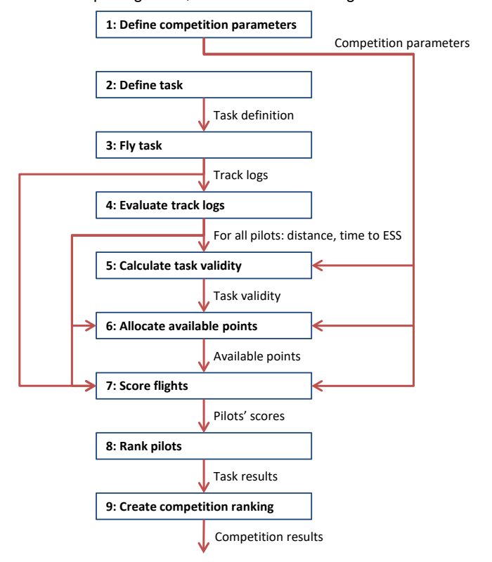

**Figure 1: Scoring process**

Flowchart of the nine-step scoring process. Nine numbered rectangular boxes are stacked vertically: “1: Define competition parameters”, “2: Define task”, “3: Fly task”, “4: Evaluate track logs”, “5: Calculate task validity”, “6: Allocate available points”, “7: Score flights”, “8: Rank pilots”, “9: Create competition ranking”. Boxes 2 through 9 are connected in sequence by downward arrows, each labelled with the data it carries: “Task definition” (2→3), “Track logs” (3→4), “For all pilots: distance, time to ESS” (4→5), “Task validity” (5→6), “Available points” (6→7), “Pilots’ scores” (7→8), “Task results” (8→9), and a final downward arrow out of box 9 labelled “Competition results”. Box 1’s output, labelled “Competition parameters”, runs down the right-hand side of the diagram and feeds into boxes 5, 6 and 7 from the right. The “Track logs” output of box 3 also branches down the left-hand side directly into box 7, and the “For all pilots: distance, time to ESS” output of box 4 also branches down the left into boxes 6 and 7. Thus box 7 (“Score flights”) receives four inputs: track logs, per-pilot distance/time, available points, and competition parameters.

<!-- PDF p.12 -->
## 3 Definitions

The definitions of flights, locations, distances and times of CIVL GAP are described in Section 7A 5.2.1.

    Flight
    Free flight
    Competition task
    Competition flight
    Take-off
    Speed section
    Start of speed section (SSS)
    Turnpoint (TP)
    Control zone
    End of speed section (ESS).
    Goal
    Landing place
    Task distance
    Flown distance
    Finish point
    Race start
    Start time
    Start gate
    Window open time
    Task deadline
    Finish time
    Task time
    Landing time

<!-- PDF p.13 -->
## 4 Measurements

### 4.1 Position

Coordinates of positions, such as turn points or pilot positions, are always given as WGS84 coordinates, based on the WGS84 ellipsoid. The coordinate format is UTM by default, but other formats can be chosen by organisers as appropriate.

### 4.2 Distance between two points

In general, task evaluation occurs in the x/y plain, therefore distance measurements are always exclusively horizontal measurements. Distances between two geographic points are calculated on the WGS84 ellipsoid, using the algorithms given in chapters 7.1.4 and 7.1.5.

For altitude bonus in stopped tasks (12.3.6), altitude is also considered, but this does not affect distance calculations between two geographic points.

For the more complex task distance calculations, as well as the calculation of pilots’ distance along the course, see chapter 7.

### 4.3 Altitude

All altitude evaluation is primarily based on GNSS altitude, as recorded in the flight instrument tracklog. Recorded barometric altitude (the International Standard Atmosphere pressure altitude, QNE), from the primary tracklog or a backup log, and if necessary corrected by the scoring software for the pressure conditions of the task (QNH), may be taken into consideration only in case of problems with GNSS altitude logging.

Category 2 event organisers may choose to use barometric altitude instead of GNSS altitude.

### 4.4 Time

Time evaluation is based on UTC time, as given in GPS tracklogs. For better readability, times of the day may be expressed in local time for the competition location.

<!-- PDF p.14 -->
## 5 Competition Parameters

Before the first task, the following parameters must be defined by the meet director, or another person or group as defined by the competition’s local regulations:

1. Nominal Distance
2. Minimum Distance
3. Nominal Time

The values set for these parameters define how each task’s validity is calculated. They should therefore be chosen very carefully, considering the realistic potential of the flying site. Setting the values too low will prevent the formula from distinguishing between demanding, high-quality tasks and quick, easy low-quality tasks which are sometimes the only option due to weather conditions.

In addition, to allow for discards in competition results, the FTV factor must be set.

### 5.1 Nominal Distance

Nominal distance should be set to the expected average task distance for the competition. Depending on the other competition parameters and the distances flown by pilots, tasks shorter than Nominal Distance will be devalued in most cases. Tasks longer than nominal distance will usually not be devalued, if the pilots fly most of the distance.

For GAP to be able to distinguish between good and not-so-good tasks, and devalue the latter, it is important to set nominal distance high enough[^13].

[^13]: See also this excellent series of articles on the subject: Part 1: http://ozreport.com/1360767307; Part 2: http://ozreport.com/1360858575; Part 3: http://ozreport.com/1360944246

### 5.2 Minimum Distance

The minimum distance awarded to every pilot who takes off. It is the distance below which it is pointless to measure a pilot's performance. The minimum distance parameter is set so that pilots who are about to "bomb out" will not be tempted to fly into the next field to get past a group of pilots – they all receive the same number of points anyway.

### 5.3 Nominal Time

Nominal time indicates the expected task duration, the amount of time required to fly the speed section. If the fastest pilot’s time is below nominal time, the task will be devalued. There is no devaluation if the fastest pilot’s time is above nominal time.

Nominal time should be set to the expected “normal” task duration for the competition site, and nominal distance / nominal time should be a bit higher than typical average speeds for the area.

### 5.4 FTV factor

#### 5.4.1 FAI Category 1 competitions

> **HG only:** `FTV_factor=0%`

> **PG only:** `FTV_factor=25%`

<!-- PDF p.15 -->
#### 5.4.2 Other competitions

The FTV factor is set by the organizers as they deem appropriate.

<!-- PDF p.16 -->

## 6 Task Setting

### 6.1 Definition of a task

A task definition consists of:

- A launch point, given as WGS84 coordinates
- Several control zones (6.2)
- A goal (6.2.3)
- An indication which of the control zones is the Start of Speed Section (often referred to as "Start" or "Airstart")
- If goal does not serve as End of Speed Section: An indication which of the control zones is the End of Speed Section
- A launch time window
- A start procedure, including timing (6.2.3.2)
- Optionally, a task deadline
- Leading-Time-Ratio (LTR): The portion of points out of the pool reserved for time, arrival (hang-gliding only) and leading points that will be allocated to leading points. Can be set between 0% (no leading points) and 26% (of all the points not allocated to distance points, 26% go to leading, and 74% go to time points). The default LTR is 26% in paragliding, and 17.5% in hang-gliding. See also chapter 11.

### 6.2 Control zones

Control zones are geographical areas which must be reached by the pilots during a task. The types of control zones are:

1. Turnpoint cylinder, see 6.2.1
2. Line, see 6.2.2
3. Goal, see 6.2.3

#### 6.2.1 Turnpoint cylinder

A turnpoint cylinder is defined as:

- A centre point *c*, given as WGS84 coordinates
- A radius *r*, given in meter
- <ins>An optional upper altitude limit, given in meter AMSL. If not set, the upper altitude limit is set to ∞ (infinite).</ins>
- <ins>An optional lower altitude limit, given in meter AMSL. If not set, the lower altitude limit is set to 0 (zero).</ins>

A turnpoint cylinder is then given as the cylinder with radius *r* around the axis which cuts the x/y plain orthogonally at the cylinder's centre point *c*. For task evaluation purposes, only the cylinder's projection in the x/y plain is considered: a circle of radius *r* around *c*.

*(Red in source: changed in this edition.)*
If altitude limits are set, then the turnpoint cylinder is given as the cylinder segment from the lower to the upper altitude limits, and for task evaluation purposes, a pilot's altitude when crossing the cylinder's projection in the x/y plain must also be considered.

Note that the designation of "enter" or "exit" cylinder has been removed, to reduce a potential source of confusion and task setting errors. Whether a turnpoint is considered reached is determined either by the presence of a single tracklog point inside the turnpoint cylinder's tolerance band, or by the presence of two consecutive tracklog points which lie on opposite sides of the turnpoint cylinder boundary (a "crossing"). The direction in which such a crossing occurs is irrelevant.

<!-- PDF p.17 -->

Task setters may still choose to indicate whether the start or subsequent turnpoint cylinders are "enter" or "exit", to explain their intended task route. But pilots are not bound to those indications.

#### 6.2.2 Line

The line control zone is defined as follows:

- Centre point c, and two end points e1 and e2, given by their WGS84 coordinates. These three points are calculated from the following parameters, following the procedures described below
- Waypoint w, given as WGS84 coordinates, one of the official competition waypoints
- Distance d between w and the line's centre point c, given in kilometer. The distance must lie between -100 km and 100 km, default is 0.0 km.
- Orientation o, given in degrees. This specifies in what world direction (relative to true north) we must travel the distance d from w to reach c. Orientation can be expressed in one of two ways:
  a. as decimal degrees in multiples of 2.5°
  b. as cardinal direction in English, which will then be converted into degrees according to Table 1.

  There is no default orientation, it must be specified.
- Length l, given in kilometer. This defines the distance between c and e1 and e2, respectively. The length must lie between 0.1 and 50.0 km, default is 1.0 km.
- <ins>An optional upper altitude limit, given in meter AMSL. If not set, the upper altitude limit is set to ∞ (infinite).</ins>
- <ins>An optional lower altitude limit, given in meter AMSL. If not set, the lower altitude limit is set to 0 (zero).</ins>

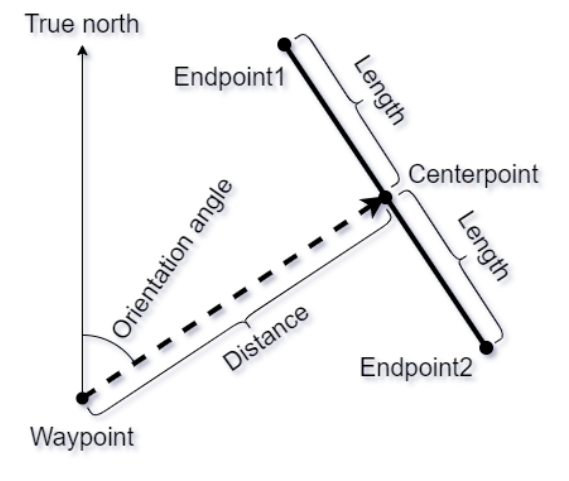

*Figure 2: general linear control zone*

Line diagram in black on white. A vertical arrow labelled "True north" rises from a point labelled "Waypoint" at the lower left. A dashed arrow labelled "Distance" leaves the waypoint towards the upper right, ending at a point labelled "Centerpoint"; the angle between the true-north arrow and this dashed distance vector, opening clockwise from north, is marked with an arc labelled "Orientation angle". Through the centerpoint runs a thick solid line perpendicular to the distance vector, from "Endpoint1" (upper left) to "Endpoint2" (lower right); the two segments from the centerpoint to each endpoint are each bracketed and labelled "Length".

Procedure for calculating the 3 points c, e1 and e2 (see Figure 2):

1. Calculate the geodesic line starting from the point w with the initial azimuth equal to the angle o.
2. On this geodesic line, find the point at travel distance d. This is the centre point c.
3. Find the arriving azimuth.
4. From c, calculate a geodesic line at azimuth equal to the arriving azimuth (from step 3) plus 90.0°.
5. On this geodesic line, find the point at travel distance l. This is the endpoint e1.
6. From c calculate another geodesic line at azimuth equal to the arriving azimuth (from step 3) minus 90.0°.
7. On this geodesic line find the point at travel distance l. This is the endpoint e2.

<!-- PDF p.18 -->

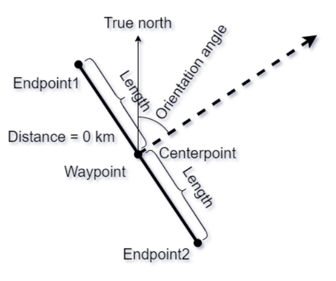

*Figure 3: linear control zone with d=0*

Line diagram in black on white. The label "Distance = 0 km" sits at the left. A point at the centre carries both labels "Waypoint" and "Centerpoint" — they coincide. A vertical arrow labelled "True north" rises from this point, and a dashed arrow leaves it towards the upper right; the angle between them, marked with an arc, is labelled "Orientation angle". Through the coincident waypoint/centerpoint runs a thick solid line perpendicular to the dashed direction vector, from "Endpoint1" (upper left) to "Endpoint2" (lower right), each half bracketed and labelled "Length".

Procedure for calculating the 3 points c, e1 and e2 in case of d = 0 (see Figure 3):

1. The centre point c in this case is the same as the defining waypoint w.
2. To calculate e1 and e2, continue with steps 4 through 7 in the generic procedure.

##### 6.2.2.1 Orientation

Orientation may be expressed as a decimal number (the angle in degrees between true North and the distance vector in clockwise direction), but it also can be expressed cardinal direction. The possible options cardinal directions, and their corresponding angles are given in Table 1.

| Cardinal direction | Angle |
|---|---|
| N | 0.0° |
| NNE | 22.5° |
| NE | 45.0° |
| ENE | 67.5° |
| E | 90.0° |
| ESE | 112.5° |
| SE | 135.0° |
| SSE | 157.5° |
| S | 180.0° |
| SSW | 202.5° |
| SW | 225.0° |
| WSW | 247.5° |
| W | 270.0° |
| WNW | 292.5° |
| NW | 315.0° |
<!-- PDF p.19 -->
| NNW | 337.5° |

**Table 1: Cardinal directions**

The total line length will always be equal to two times length l. For example, the default total line length will be 2.0 kilometers, because the default length is 1.0 km. The minimum total line length will be 200 m, because the minimum length is 0.1 km = 100 meters.

A negative value for the distance d means the same absolute distance, but in the opposite direction. For example, a line oriented at NE at distance -5.0 km will be absolutely the same as a line at distance 5.0 km, but oriented SW.

#### 6.2.3 Goal

The final control zone in a task is called "goal". A goal can be either of:

- <ins>A goal cylinder, which is a turnpoint cylinder (6.2.1) without the option to set altitude limits</ins>
- A goal line (6.2.3.1)

*(Red in source: changed in this edition.)*
By default, goal is a ground-based at the goal waypoint altitude. Optionally, a goal can be declared as an Elevated Goal (6.2.3.2), which encourages pilots to cross it at a safe minimum altitude.

##### 6.2.3.1 Goal line

The Goal Line is defined by:

a. A centre point *c*, given as WGS84 coordinates
b. A length l, given in meters
c. A previous point *p*, given as WGS84 coordinates

The previous point *p* is defined as the optimized route point on the last control zone before goal. This point is obtained as part of the task distance calculation, see chapter 7.2.

The goal line is defined as the line that crosses through *c*, lies perpendicular to the line between *p* and *c*, and extends by l/2 meters from c in each direction.

The goal line control zone consists of the semi-circle with radius *r* behind the goal line, when coming from *p*. See Figure 4. This allows to reach Goal from any direction.

Physical lines can be used in addition to the official, virtual goal line as defined by WGS84 coordinates, to increase attractiveness for spectators and media, and to increase visibility for pilots. Physical lines must be at least 50m long and 1m wide, made of white material and securely attached to the ground. The physical line must match as closely as possible the corresponding virtual line as defined by the goal GPS coordinates and the direction of the last task leg. It must not be laid out further from the previous turn point than the goal GPS coordinates.

<!-- PDF p.20 -->

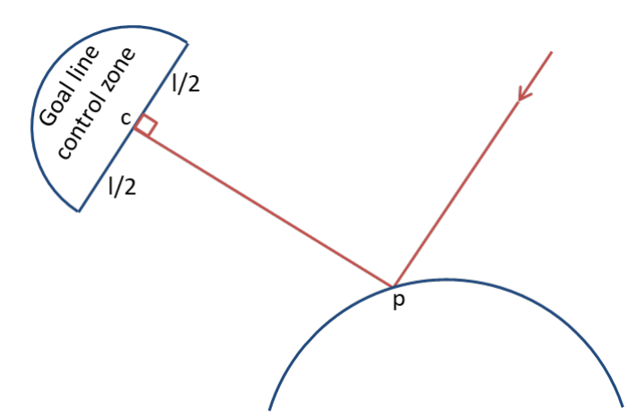

*Figure 4: Goal line*

Diagram in dark blue and red on white. At the upper left, a semi-circle (dark blue outline) is labelled "Goal line control zone"; its flat side is the goal line, whose two halves either side of the centre point *c* are labelled "l/2" and "l/2". From *c* a red line runs down-right to a point *p*, meeting the goal line at a right angle (marked with a small red square at *c*). *p* sits on the top of a large dark-blue circular arc at the lower right — the last control zone before goal. A second red line with an arrowhead pointing down towards *p* comes in from the upper right, indicating the direction of arrival from the previous turnpoint. The semi-circular control zone bulges away from *p*, behind the goal line.

##### 6.2.3.2 Elevated Goal

*(Red in source: whole section new in this edition; figure caption printed black.)*

An Elevated Goal is a Goal Line or Goal Cylinder that sits above the published goal waypoint altitude. The elevation above goal is by default 300 m but can be increased up to 1000 m for each task. When an elevated goal is declared, it implicitly also serves as the End of Speed Section (ESS): the point where a pilot's race time is taken.

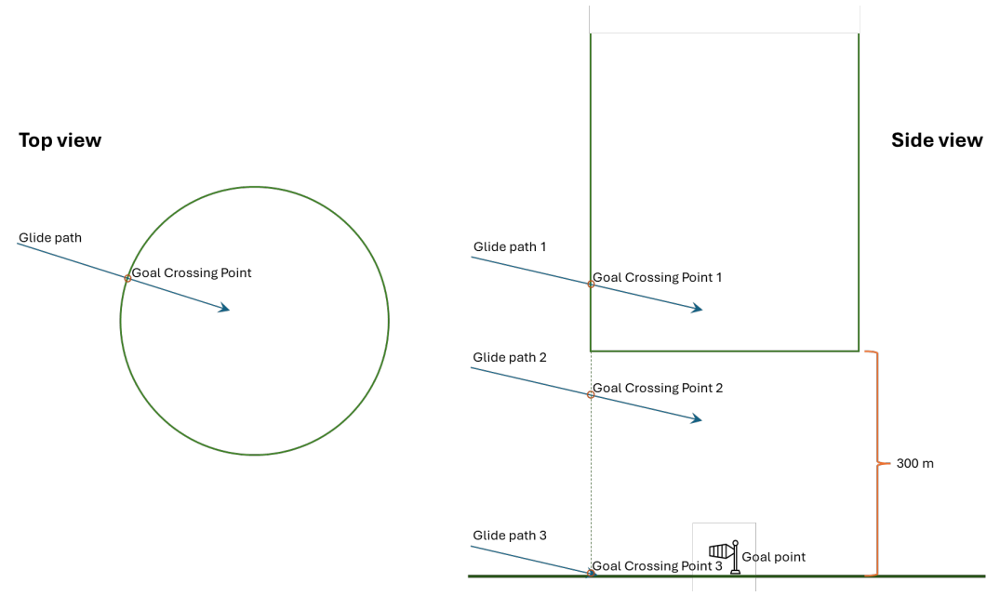

*Figure 5: Elevated Goal concept*

Two-panel colour diagram. Left panel, "Top view": a green circle (the goal cylinder seen from above) with a blue arrow labelled "Glide path" entering it from the left; where the arrow crosses the circle's boundary an orange ring marks the "Goal Crossing Point". Right panel, "Side view": the ground is a horizontal dark-green line at the bottom, with a windsock icon marking the "Goal point" on it. A green rectangle (the elevated goal seen from the side) floats above the ground; an orange bracket at the right labels the gap between its lower edge and the ground as "300 m". Three blue arrows descend from the left as glide paths: "Glide path 1" crosses the vertical face of the elevated rectangle at "Goal Crossing Point 1" (above the set elevation); "Glide path 2" crosses the same vertical (shown dashed below the rectangle) at "Goal Crossing Point 2", below the rectangle's lower edge but above the ground; "Glide path 3" reaches "Goal Crossing Point 3" essentially at ground level next to the goal point. Each crossing point is marked with a small orange ring.

*(Red in source: changed in this edition.)*
The concept of the Elevated Goal is shown in Figure 5. Pilots can cross an Elevated Goal at any altitude to complete the task. But they will only receive their full points if they cross goal at or above the set elevation. Lower crossings lead to a points reduction (13.1)

<!-- PDF p.21 -->

### 6.3 Task types

The task type defines how an individual pilot's start time is determined. The two types are:

1. Race (6.3.1)
2. Time Trial (6.3.2)

Both task types use air starts: the competitors are free to launch any time during the launch window. If control zones are set before the start, the pilots are free to fly that part of the route and cross these control zones as they see fit. Race start is defined as the last crossing of the start control zone before continuing to fly through the remainder of the task.

#### 6.3.1 Race

In a Race task, start is defined by one or more so-called "start gates". The first – or only – start gate is given as a daytime. Subsequent start gates are given as a time interval, along with the number of start gates.

Example 1: "We have a Race; the start gate opens at 13:00"

Example 2: "We have a Race with 5 start gates from 13:30 at a 20-minute interval." – the start gate times in this case are 13:30, 13:50, 14:10, 14:30, and 14.50.

Pilots are free to start any time after the first (or single) start gate. A pilot's start time is then defined as the time of the last start gate after which he started flying the speed section of the task.

Example 3: Given the start gates from Example 2 above, pilot A, crossing the start cylinder at 13:49:01, will be given a start time of 13:30. Pilots who start after 14:50 will be given a start time of 14:50.

Starting before the first (or only) start gate is considered a failed start. The two disciplines handle failed starts differently, see chapter 13.3.

#### 6.3.2 Time Trial

In a Time Trial task, start is defined by a single "start gate", given as a daytime. Pilots are free to start any time after this start gate. A pilot's start time is then defined as the time at which he started flying the speed section of the task. Each pilot has therefore an individual start time.

Example 1: "We have a Time Trial, the start gate opens at 12:30" – pilot A starting at 12:31:03 has a start time of 12:31:03, pilot B starting at 15:48:28 has a start time of 15:48:28.

<!-- PDF p.22 -->

## 7 Task and flight distance calculations

Determining a task's distance is based on finding the shortest ("optimized") path for a route from a start point and an end point, touching any number of intermittent cylinders or lines. The same calculation is also used to determine the distance a pilot must still fly to complete a task from any position in their tracklog, and therefore their flight distance up to that point (9.3).

The calculation of such shortest path requires several algorithms. This chapter defines these algorithms and shows how they are used to calculate task and flight distances.

### 7.1 Algorithms

While track recordings and waypoints are given on the WGS84 ellipsoid, the calculations required to find the shortest path work in planar (Cartesian) geometry. Therefore, all WGS84 coordinates, of starting point, of the control zones (cylinder centres and line end points), and of the goal, must be transformed to Cartesian coordinates. We do not use the planar distance of the calculated shortest path. Instead, we transform the resulting path points for each control back to WGS84 coordinates, correct them for any error resulting from the projection, and then calculate the distance on the ellipsoid.

The calculations make use of the following algorithms:

1. **GeodesicToCartesian**, to calculate the Cartesian coordinates of a point on the WGS84 ellipsoid (7.1.1).
2. **PathFinder**, to calculate the path points that define the shortest path from point A to point B via a set of control zones, in Cartesian geometry (7.1.3).
3. **CartesianToGeodesic**, to calculate the WGS84 coordinates from the Cartesian coordinates of a point (7.1.1).
4. **DirectGeodesic**, to find a point on the WGS84 ellipsoid that is a given distance and direction from a given point (0).
5. **InverseGeodesic**, to find distance and direction between two points on the WGS84 ellipsoid (0).
6. **EllipsoidDistance**, an optimized version of InverseGeodesic, which only delivers distance, but with significantly less computational effort (7.1.5).
7. **FindTaskAreaCentre**, to find the centre of a task's area, as required by WGS84ToCartesian and CartesianToWGS84 (7.1.6).
8. **ProjectionCorrection**, to ensure that the path points in WGS84 lie on their corresponding control zone boundaries, regardless of any projection distortion that may occur (7.1.7).
9. **RouteOptimizer,** to calculate the path points that define the shortest path from point A to point B via a set of control zones, on the WGS84 ellipsoid, as well as the distance from A to B along this path (7.1.8).

#### 7.1.1 Common definitions

$$
\mathit{geodesicRouteElement} = \mathrm{cylinder}(\mathit{lat}, \mathit{lon}, \mathit{radius}) \,\big|\, \mathrm{line}\big(\mathrm{point}_1(\mathit{lat}, \mathit{lon}), \mathrm{point}_2(\mathit{lat}, \mathit{lon})\big) \,\big|\, \mathrm{goal}(\mathit{lat}, \mathit{lon}, \mathit{radius}, \mathit{type})
$$

$$
\mathit{cartesianRouteElement} = \mathrm{cylinder}(x, y, \mathit{radius}) \,\big|\, \mathrm{line}\big(\mathrm{point}_1(x_1, y_1), \mathrm{point}_2(x_2, y_2)\big) \,\big|\, \mathrm{goal}(x, y, \mathit{radius}, \mathit{type})
$$

$$
\mathit{geodesicRouteDefinition} = \left\{ \begin{matrix} \mathit{startPoint}(\mathit{lat}, \mathit{lon}), \\ \mathit{geodesicRouteElement}_1, \ldots, \mathit{geodesicRouteElement}_n, \\ \mathit{endPoint}(\mathit{lat}, \mathit{lon}) \end{matrix} \right\}
$$

$$
\mathit{cartesianRouteDefinition} = \left\{ \begin{matrix} \mathit{startPoint}(x, y), \\ \mathit{cartesianRouteElement}_1, \ldots, \mathit{cartesianRouteElement}_n, \\ \mathit{endPoint}(x, y) \end{matrix} \right\}
$$

$$
\mathit{geodesicPath} = \{\mathit{point}_1, \ldots, \mathit{point}_n\} \text{ where } \mathit{point}_i = \mathrm{point}(\mathit{lat}_i, \mathit{lon}_i)
$$

$$
\mathit{cartesianPath} = \{\mathit{point}_1, \ldots, \mathit{point}_n\} \text{ where } \mathit{point}_i = \mathrm{point}(x_i, y_i)
$$

<!-- PDF p.23 -->

#### 7.1.2 GeodesicToCartesian & CartesianToGeodesic

To convert coordinates on the WGS84 ellipsoid to Cartesian coordinates, and back, a localized Transverse Mercator projection (LTM) is used, which is based on the centre point of the area of interest. This ensures a high accuracy within the task area, within 100 km of the centre point, with minimum distortions resulting from the conversions.

LTM differs from the well-known Universal Transverse Mercator projection (UTM) in the following ways:

1. Scaling depends on the centre point's latitude:

$$
\mathit{scaling} = \begin{cases} \mathit{centre.lat} \le 55°: 0.99994 \\ \mathit{centre.lat} > 55°: 0.99994 + \dfrac{\mathit{centre.lat} - 55}{60} * 1.3 * 10^{-4} \end{cases}
$$

2. The centre meridian is defined by the centre point's longitude.
3. The cartesian point (0, 0) is defined as the centre point's Cartesian projection.

This can be achieved with the library PROJ[^14]. Annex A gives a sample how PROJ can be used to create the two converters. For systems where PROJ is not available, an alternative implementation is also given in Annex A.

$$
\mathbf{GeodesicToCartesian}\big(\mathit{point}(\mathit{lat}, \mathit{lon})\big): \boldsymbol{point}(\boldsymbol{x}, \boldsymbol{y})
$$

$$
\mathbf{CartesianToGeodesic}\big(\mathit{point}(x, y)\big): \boldsymbol{point}(\boldsymbol{lat}, \boldsymbol{lon})
$$

#### 7.1.3 PathFinder

PathFinder is the name we gave the algorithm presented in Ding et al. (2018)[^15], to find the shortest path from point A to B via a set of control zones in Cartesian space. Ding et al.'s paper handles circular control zones only. For linear control zones, their algorithm must be extended, to find the path point on the line. This extension is described in Annex B.

$$
\mathbf{PathFinder}(\mathit{cartesianRouteDefinition}): \mathit{cartesianPath}
$$

PathFinder needs to know when to stop finding a more accurate solution. For our purpose, a threshold of 10cm is sufficient to ensure that the solution is accurate within 1m.

$$
\varepsilon = 0.1\mathrm{m}
$$

#### 7.1.4 DirectGeodesic & InverseGeodesic

Geodesic algorithms solve two distinct problems on the WGS84 ellipsoid:

1. Find the distance d between two points A and B, and their relative directions a and a' ("azimuth"): This is the inverse geodesic problem:

$$
\mathbf{InverseGeodesic}\big(\mathit{point}_1(\mathit{lat}, \mathit{lon}), \mathit{point}_2(\mathit{lat}, \mathit{lon})\big): \boldsymbol{distance}, \boldsymbol{azimuth}
$$

2. Find the point B that lies at a distance d in direction a from a given starting point A: This is the direct geodesic problem.

$$
\mathbf{DirectGeodesic}\big(\mathit{point}_1(\mathit{lat}, \mathit{lon}), \mathit{distance}, \mathit{azimuth}\big): \boldsymbol{point}_2(\boldsymbol{lat}, \boldsymbol{lon})
$$

[^14]: https://proj.org
[^15]: Ding, Xie, Jiang, An Efficient Algorithm for Touring n Circles, EITCE 2018. Download here: https://www.matec-conferences.org/articles/matecconf/pdf/2018/91/matecconf_eitce2018_03027.pdf *(Transcriber's note: a local transcription and copy of this paper live at [../ding-2018-touring-n-circles/](../ding-2018-touring-n-circles/ding-2018-touring-n-circles.md).)*

<!-- PDF p.24 -->

*(Red in source: changed in this edition.)*

To resolve these problems, we use either of these algorithms, subject to availability and suitability for the scoring system:

1. the algorithms presented in Karney (2013)[^16], and implemented in GeographicLib[^17]
2. the algorithms presented by Thomas (1970)[^18] and implemented in the Boost Geometry library[^19]
3. the algorithms presented by Vincenty (1975)[^20]

All these algorithms deliver results with similar accuracy (+/- 1 millimeter or less), several orders of magnitude above what is relevant for the scoring of a sport where distances are always measured in whole meters.

#### 7.1.5 EllipsoidDistance

*(Red in source: changed in this edition.)*

In many cases, only the distance between two geographic points on the WGS84 ellipsoid is required, and not the azimuth between them.

Scoring software shall calculate this distance by using the InverseGeodesic algorithm defined in 7.1.4 and using only its distance result.

Navigation devices are not required to use InverseGeodesic. They may use a simpler approximation if the distance they display differs from InverseGeodesic by less than 5 m for distances up to 200 km.

#### 7.1.6 FindTaskAreaCentre

The algorithms GeodesicToCartesian and CartesianToGeodesic (7.1.1) require the definition of a centre point of the area of interest.

The FindTaskAreaCentre algorithm given below relies on two additional algorithms:

1. FindBoundingBox: To find the northern, eastern, southern and western boundaries of the smallest area that contains a set of points given as WGS84 coordinates (7.1.6.1).
2. FindCentrePointOfBox: To find the centre point of a bounding box, given by its south-western and north-eastern corners (7.1.6.2).

$$
\begin{aligned}
&\mathbf{FindTaskAreaCentre}(\mathit{geodesicRouteDefinition}): \\
&\mathit{boundingBox}_{\mathit{temp}} = \mathrm{FindBoundingBox}(\mathit{geodesicRouteDefinition}) \\
&\mathit{centrePoint}_{\mathit{temp}} = \mathrm{FindCentrePointOfBox}\big(\mathit{boundingBox}_{\mathit{temp}}\big) \\
&\mathit{cartesianRouteDefinition}_{\mathit{temp}} = \mathrm{GeodesicToCartesian}\big(\mathit{geodesicRouteDefinition}, \mathit{centrePoint}_{\mathit{temp}}\big) \\
&\mathit{cartesianPath}_{\mathit{temp}} = \mathrm{PathFinder}\big(\mathit{cartesianRouteDefinition}_{\mathit{temp}}\big) \\
&\mathit{geodesicPath}_{\mathit{temp}} = \mathrm{CartesianToGeodesic}\big(\mathit{cartesianPath}_{\mathit{temp}}, \mathit{centrePoint}_{\mathit{temp}}\big) \\
&\mathit{correctedPath}_{\mathit{temp}} = \mathrm{ProjectionCorrection}\big(\mathit{geodesicPath}_{\mathit{temp}}, \mathit{geodesicRouteDefinition}\big) \\
&\mathit{boundingBox}_{\mathit{final}} = \mathrm{FindBoundingBox}\big(\mathit{corrected\ Path}_{\mathit{temp}}\big) \\
&\boldsymbol{taskAreaCentre} = \mathrm{CentrePoint}\big(\mathit{boundingBox}_{\mathit{final}}\big)
\end{aligned}
$$

This must only be done once per task. The coordinates of *taskAreaCentre* should then be stored for this task and used for all further uses of GeodesicToCartesian and CartesianToGeodesic.

##### 7.1.6.1 FindBoundingBox

[^16]: Karney, C. F. F. (2013). Algorithms for geodesics. *Journal of Geodesy*, 87(1), 43–55.
[^17]: https://geographiclib.sourceforge.io/
[^18]: Thomas, P. D. (1970). Spheroidal geodesics, reference systems, and local geometry. U.S. Naval Oceanographic Office, SP-138. Retrieved from https://books.google.com/books?id=nFDrrWJ8GecC
[^19]: https://www.boost.org/libs/geometry
[^20]: Vincenty, T. (1975). Direct and inverse solutions of geodesics on the ellipsoid with application of nested equations. *Survey Review*, 22(176), 88–93.

<!-- PDF p.25 -->

Given a set of points P on the WGS84 ellipsoid, each given as latitude and longitude, the bounding box is defined as the smallest area defined by a maximum and minimum latitude and longitude that contains all points within P.

$$
\begin{aligned}
&\mathbf{FindBoundingBox}\big(P = \{\mathrm{point}_1(\mathrm{lat}, \mathrm{lon}), \mathrm{point}_2(\mathrm{lat}, \mathrm{lon}), \ldots, \mathrm{point}_n(\mathrm{lat}, \mathrm{lon})\}\big) \\
&\mathit{minimumLatitude} = \min(\forall \mathrm{point}_i \in P: \mathrm{point}_i.\mathrm{lat}) \\
&\mathit{maximumLatitude} = \max(\forall \mathrm{point}_i \in P: \mathrm{point}_i.\mathrm{lat}) \\
&\mathit{normalizedLongitudes} = \{\forall \mathrm{point}_i \in P: ((\mathrm{point}_i.\mathit{lon} + 180)\ mod\ 360) - 180\} \\
&\mathit{sortedLongitudes} = \mathit{SortAscending}(\mathit{normalizedLongitudes}) \\
&\mathit{longitudeGaps} = \{\forall \mathrm{lon_i} \in \mathit{sortedLongitudes}, 1 < i \le n: \mathrm{lon_i} - \mathrm{lon_{i-1}}\} \\
&\mathit{maxGap} = \max(\forall \mathrm{gap}_i \in \mathit{longitudeGap})
\end{aligned}
$$

$$
\begin{aligned}
&\mathit{maxGap} > 180°: \\
&\mathit{minimumLongitude} = \mathit{lon}_k\ (\mathit{lon}_j, \mathit{lon}_k \in \mathit{sortedLongitudes}\ \&\ k = j + 1\ \&\ \mathit{lon}_k - \mathit{lon}_j = \mathit{maxGap}) \\
&\mathit{maximumLongitude} = \mathit{lon}_j\ (\mathit{lon}_j, \mathit{lon}_k \in \mathit{sortedLongitudes}\ \&\ k = j + 1\ \&\ \mathit{lon}_k - \mathit{lon}_j = \mathit{maxGap})
\end{aligned}
$$

$$
\begin{aligned}
&\mathit{maxGap} \le 180°: \\
&\mathit{minimumLongitude} = \min(\forall \mathit{lon} \in \mathit{normalizedLongitudes}) \\
&\mathit{maximumLongitude} = \max(\forall \mathit{lon} \in \mathit{normalizedLongitudes})
\end{aligned}
$$

$$
\begin{aligned}
&\boldsymbol{boundingBox} = \mathit{rectangle}(\mathit{point}_{SW}(\mathit{mimimumLatitude}, \mathit{minimumLongitude}), \\
&\mathit{point}_{NE}(\mathit{mimimumLatitude}, \mathit{minimumLongitude}))
\end{aligned}
$$

##### 7.1.6.2 FindCentrePointOfBox

$$
\begin{aligned}
&\mathbf{FindCentrePointOfBox}\big(\mathit{box}(\mathit{point}_{SW}, \mathit{point}_{NE})\big): \\
&\mathit{lat} = \frac{\mathit{box}.\mathit{point}_{SW}.\mathit{latitude} + \mathit{box}.\mathit{point}_{NE}.\mathit{latitude}}{2}
\end{aligned}
$$

$$
\begin{aligned}
&\mathit{box}.\mathit{point}_{SW}.\mathit{longitude} > \mathit{box}.\mathit{point}_{NE}.\mathit{longitude}: \\
&\mathit{lon} = \frac{\mathit{Box}.\mathit{point}_{SW}.\mathit{longitude} + \mathit{Box}.\mathit{point}_{NE}.\mathit{longitude} + 360°}{2}\ mod\ 360 \\
&\mathit{lon} > 180°: \mathit{lon} = \mathit{lon} - 360°
\end{aligned}
$$

$$
\begin{aligned}
&\mathit{Box}.\mathit{point}_{SW}.\mathit{longitude} \le \mathit{Box}.\mathit{point}_{NE}.\mathit{longitude}: \\
&\mathit{lon} = \frac{\mathit{Box}.\mathit{point}_{SW}.\mathit{longitude} + \mathit{Box}.\mathit{point}_{NE}.\mathit{longitude}}{2}
\end{aligned}
$$

$$
\boldsymbol{centrePoint} = \mathit{point}(\mathit{lat}, \mathit{lon})
$$

#### 7.1.7 ProjectionCorrection

Despite the use of the high-accuracy projection algorithms used to convert WGS84 coordinates to Cartesian coordinates, and back (7.1.2), the WGS84 projections of the path points found by PathFinder (7.1.3) still often do not lie exactly on the control zone's boundary. We therefore apply a simple correction where we find the point on the control zone boundary that is closest to the calculated path point and use this corrected point for all distance calculations.

$$
\begin{aligned}
&\mathbf{ProjectionCorrection}(\mathit{geodesicPath}, \mathit{geodesicRouteDefinition}): \\
&n = \mathit{geodesicRouteDefintion}.\mathit{routeElements}.\mathit{count} \\
&\forall \mathit{point}_i \in \mathit{geodesicPath}: 1 \le i \le n\ \&\ \mathit{geodesicRouteDefinition}.\mathit{element}_i.\mathit{type} = \mathit{cylinder}: \\
&\mathit{distance}, \mathit{azimuth} = \mathrm{InverseGeodesic}(\mathit{point}_i, \mathit{geodesicRouteDefinition}.\mathit{element}_i.\mathit{point}) \\
&\mathit{correctedPoint}_i \\
&= \mathrm{DirectGeodesic}(\mathit{geodesicRouteDefinition}.\mathit{element}_i.\mathit{point}, \mathit{azimuth}, \mathit{geodesicRouteDefinition}.\mathit{element}_i.\mathit{radius})
\end{aligned}
$$

$$
\begin{aligned}
&\forall \mathit{point}_i \in \mathit{geodesicPath}: 1 \le i \le n\ \&\ \mathit{geodesicRouteDefinition}.\mathit{element}_i.\mathit{type} = \mathit{line}: \\
&\mathit{lineLength}, \mathit{lineAzimuth} \\
&= \mathrm{InverseGeodesic}(\mathit{geodesicRouteDefinition}.\mathit{element}_i.\mathit{point}_1, \mathit{geodesicRouteDefinition}.\mathit{element}_i.\mathit{point}_2) \\
&\mathit{pathPointDistance}, \mathit{pathPointAzimuth} \\
&\qquad = \mathit{InverseGeodesic}(\mathit{geodesicRouteDefinition}.\mathit{element}_i.\mathit{point}_1, \mathit{point}_i) \\
&\mathit{dAzimuth} = |\mathit{lineAzimuth} - \mathit{pathPointAzimuth}|
\end{aligned}
$$

<!-- PDF p.26 -->

$$
\begin{aligned}
&\mathit{corectedPathPointDistance} = \mathit{pathPointDistance} * \cos(\mathit{dAzimuth}) \\
&\mathit{correctedPoint}_i \\
&\ = \mathrm{DirectGeodesic}(\mathit{geodesicRouteDefinition}.\mathit{element}_i.\mathit{point}_1, \mathit{lineAzimuth}, \mathit{correctePathPointDistance})
\end{aligned}
$$

$$
\boldsymbol{correctedPath} = \left\{ \begin{matrix} \mathit{geodesicRouteDefinition}.\mathit{startPoint}, \\ \forall i: 1 \le i \le n: \mathit{correctedPoint}_i, \\ \mathit{geodesicRouteDefinition}.\mathit{endPoint} \end{matrix} \right\}
$$

#### 7.1.8 RouteOptimizer

At the core of all task and flight distance calculations lies the RouteOptimizer algorithm that calculates the shortest path for a route from a start point through a series of control zones to a destination point. The result of this algorithm is a sequence of Geodesic points that represent the optimal crossing points for shortest overall distance from start point to destination, along with the Geodesic distance over all those points.

$$
\begin{aligned}
&\mathbf{RouteOptimizer}(\mathit{geodesicRouteDefinition}, \mathit{taskAreaCentre}): \\
&\mathit{cartesianRouteDefinition} = \mathrm{GeodesicToCartesian}(\mathit{geodesicRouteDefinition}, \mathit{taskAreaCentre}) \\
&\mathit{cartesianPath} = \mathrm{PathFinder}(\mathit{cartesianRouteDefinition}) \\
&\mathit{geodesicPath} = \mathrm{CartesianToGeodesic}(\mathit{cartesianPath}, \mathit{taskAreaCentre}) \\
&\boldsymbol{optimizedPath} = \mathit{ProjectionCorrection}(\mathit{geodesicPath}, \mathit{geodesicRouteDefinition}) \\
&\boldsymbol{optimizedDistance} = \sum_{0}^{n-1} \mathrm{EllipsoidDistance}(\ \mathit{correctedPath}.\mathit{point}_i, \mathit{correctedPath}.\mathit{point}_{i+1})
\end{aligned}
$$

### 7.2 Task distances

Task distance is defined as the distance of the optimized path from launch to goal. Speed section distance is defined as the distances of the optimized path from launch to ESS, minus the distance of the pre-start portion.

$$
\mathit{launch} = \mathrm{point}(\mathit{lat}_{\mathit{launch}}, \mathit{lon}_{\mathit{launch}})
$$

$$
\mathit{task} = \left\{ \begin{matrix} \mathit{launch}, \\ \mathit{preElement}_1, \ldots, \mathit{preElement}_m, \\ \mathit{startOfSpeedSection}, \\ \mathit{element}_1, \ldots, \mathit{element}_n, \\ \mathit{endOfSpeedSection} \\ \mathit{postElement}_1, \ldots, \mathit{postElement}_n, \\ \mathit{goal}.\mathit{point} \end{matrix} \right\}
$$

$$
\boldsymbol{taskDistance} = \begin{cases} \mathit{goal}.\mathit{type} = \mathit{line}: \mathrm{RouteOptimizer}(\mathit{task}).\mathit{optimizedDistance} \\ \mathit{goal}.\mathit{type} = \mathit{cylinder}: \mathrm{RouteOptimizer}(\mathit{task}).\mathit{optimizedDistance} - \mathit{goal}.\mathit{radius} \end{cases}
$$

$$
\mathit{launchToESS} = \left\{ \begin{matrix} \mathit{launch}, \\ \mathit{preTurnpoint}_1, \ldots, \mathit{preTurnpoint}_m, \\ \mathit{startOfSpeedSection}, \\ \mathit{turnpoint}_1, \ldots, \mathit{turnpoint}_n, \\ \mathit{endOfSpeedSection} \\ \mathit{endOfSpeedSection}.\mathit{point} \end{matrix} \right\}
$$

$$
\begin{aligned}
&\mathit{launchToESSPath} = \mathrm{RouteOptimizer}(\mathit{launchToESS}).\mathit{optimizedPath} \\
&\mathit{launchToESSDistance} \\
&\qquad = \mathrm{RouteOptimizer}(\mathit{launchToESS}).\mathit{optimizedDistance} - \mathit{endOfSpeedSection}.\mathit{radius} \\
&\mathit{preSpeedSectionDistance} \\
&\quad = \sum_{0}^{\mathit{startOfSpeedSection}.\mathit{index}-1} \mathrm{EllipsoidDistance}(\ \mathit{launchToESSPath}.\mathit{point}_i, \mathit{launchToESSPath}.\mathit{point}_{i+1})
\end{aligned}
$$

$$
\boldsymbol{speedSectionDistance} = \mathit{launchToESSDistance} - \mathit{preSpeedSectionDistance}
$$

<!-- PDF p.27 -->

## 8 Flying a task

### 8.1 Re-starting

In Races with multiple start gates and in Time Trials, pilots may return to the start and take a later start time after already having flown a portion of the Speed Section. They will be scored for that start which resulted in the biggest covered distance. If multiple starts resulted in them reaching goal, they will be scored for the last start after which they reached goal.

<!-- PDF p.28 -->

## 9 Task evaluation

From each pilot's track, task evaluation determines the distance this pilot flew along the task, and the time this pilot took to fly the speed section.

### 9.1 Tolerances

#### 9.1.1 Cylinder tolerance

To compensate for the very slight distance measurement differences resulting from the use of different distance measurement algorithms in flight recorders and evaluation programs, a tolerance, consisting of a percentage and an absolute minimum, is applied when determining whether a pilot reached a cylinder (e.g. SSS, turnpoint of Goal). This had to be introduced so that a pilot reading the distance to the next cylinder centre from his flight instrument can rely on having reached the turnpoint when the distance displayed by the instrument is smaller than the defined turnpoint cylinder radius.

*(Red in source: changed in this edition.)*

$$
\mathit{relativeTolerance} = 0.0\%
$$

$$
\begin{aligned}
&\mathit{absoluteTolerance} = 5m \\
&\mathit{turnpoint}_i: \mathit{innerRadius}_i = \mathit{min}(\ \mathit{radius}_i * (1 - \mathit{relativeTolerance}), \mathit{radius}_i - \mathit{absoluteTolerance}) \\
&\mathit{turnpoint}_i: \mathit{outerRadius}_i = \mathit{max}(\ \mathit{radius}_i * (1 + \mathit{relativeTolerance}), \mathit{radius}_i + \mathit{absoluteTolerance})
\end{aligned}
$$

The tolerance zone is defined as the zone between the two cylinders defined by the turnpoint's center point and its innerRadius and its outerRadius, respectively.

#### 9.1.2 Line tolerance

For the same reasons that a tolerance is applied to cylinder control zones, a tolerance is applied to the line control zones. The absolute tolerance is 5 meters.

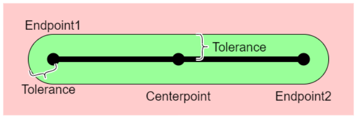

*Figure 6: Line tolerance*

Diagram on a pink rectangular background. A thick black horizontal line runs between three black dots: "Endpoint1" (labelled above the left end), "Centerpoint" (labelled below the middle dot) and "Endpoint2" (labelled below the right end). Surrounding the whole line is a green stadium shape (a rectangle with semi-circular caps around each endpoint) representing the tolerance zone. A curly brace between the line and the upper edge of the green zone, right of the centerpoint, is labelled "Tolerance"; a second curly brace between the left semi-circular cap and the left endpoint, at the lower left, is also labelled "Tolerance". The pink area outside the green shape is outside the tolerance zone.

#### 9.1.3 Goal line tolerance

For the semi-circle portion of the goal line, the same tolerance is applied as for a regular turnpoint cylinder (9.1.1).

$$
\mathit{toleranceDistance} = \mathit{outerRadius}_{\mathit{Goal}} - \mathit{radius}_{\mathit{Goal}}
$$

The same tolerance is also applied to the straight portion of the goal line control zone: The tolerance zone's boundaries are here defined by the line l' that is parallel to the goal line but lies closer to the goal line's previous point p by toleranceDistance. Additionally, the boundary is defined by the two circles of radius toleranceDistance around the end points of line l.

See Figure 7.

<!-- PDF p.29 -->

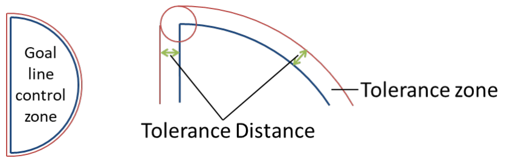

*Figure 7: Goal line tolerance*

Two diagrams. Left: a shape labelled "Goal line control zone" — a blue semicircle whose flat side is the (vertical) goal line, outlined by a thin red boundary running just outside the blue outline. Right: an enlarged detail of one end of the goal line geometry: a vertical blue segment (the goal line) joins a blue circular arc (the semicircle's curved boundary); thin red lines run parallel just outside both the segment and the arc, and a small red circle caps the junction point at the line's end so the red boundary wraps smoothly around the corner. Two short green double-headed arrows — one between the blue segment and its red parallel, one between the blue arc and its red parallel — are jointly labelled "Tolerance Distance". The outer red boundary is labelled "Tolerance zone".

### <ins>9.2 Control zone validation</ins>

*(Red in source: changed in this edition.)*

When a pilot reaches a control zone, that control zone is "validated". Validation happens at a specific time – validation time, and at a specific altitude – validation altitude.

To determine whether a pilot validated a specific control zone in the task, the pilot's track log must show evidence that:

1. The pilot validated the previous control zone in the task definition
2. It contains at least one valid crossing for the control zone
   a. after the valid crossing of the previous control zone in the task definition
   b. not earlier than the start time
   c. no later than the task deadline

#### <ins>9.2.1 Cylinder crossings</ins>

A cylinder crossing is defined as crossing into or out of the turnpoint's tolerance zone, in any direction.

$$
\begin{gathered}
\forall i: \exists \mathit{turnpoint}_i: \mathit{crossings}_i = \forall j:\\
(((\mathit{distance}(\mathit{turnpoint}_i.\mathit{center}, \mathit{trackpoint}_{j-1} < \mathit{innerRadius}_i \;\land\\
\mathit{distance}(\mathit{turnpoint}_i.\mathit{center}, \mathit{trackpoint}_j) \geq \mathit{innerRadius}_i)\ \lor\\
(\mathit{distance}(\mathit{turnpoint}_i.\mathit{center}, \mathit{trackpoint}_{j-1} \geq \mathit{innerRadius}_i \;\land\\
\mathit{distance}(\mathit{turnpoint}_i.\mathit{center}, \mathit{trackpoint}_j) < \mathit{innerRadius}_i))\\
\lor\\
((\mathit{distance}(\mathit{turnpoint}_i.\mathit{center}, \mathit{trackpoint}_{j-1} \leq \mathit{outerRadius}_i \;\land\\
\mathit{distance}(\mathit{turnpoint}_i.\mathit{center}, \mathit{trackpoint}_j) > \mathit{outerRadius}_i)\ \lor\\
(\mathit{distance}(\mathit{turnpoint}_i.\mathit{center}, \mathit{trackpoint}_{j-1} > \mathit{outerRadius}_i \;\land\\
\mathit{distance}(\mathit{turnpoint}_i.\mathit{center}, \mathit{trackpoint}_j) \leq \mathit{outerRadius}_i)))
\end{gathered}
$$

Crossing time and altitude for each crossing is the time at which the corresponding tracklog point was recorded.

$$
\begin{gathered}
\mathit{crossing}_{i,j}.\mathit{time} = \mathit{trackpoint}_j.\mathit{time}\\
\mathit{crossing}_{i,j}.\mathit{altitude} = \mathit{trackpoint}_j.\mathit{altitude}
\end{gathered}
$$

*(Red in source: changed in this edition.)*

$$
\mathit{crossings}_i = \left\{\forall j: \exists \mathit{crossing}_{i,j}: \mathit{crossing}_{i,j}\right\}
$$

*(Red in source: changed in this edition.)*

If altitude limits exist for a turnpoint, a crossing's altitude must lie within its upper and lower limits for that crossing to be considered as a potential valid crossing

*(Red in source: changed in this edition.)*

$$
\begin{gathered}
\mathit{crossings}_i\\
= \left\{\forall j: \exists \mathit{crossing}_{i,j} \land (\mathit{turnpoint}_i.\mathit{lowerLimit} - \mathit{absoluteTolerance}) \leq \mathit{crossing}_{i,j}.\mathit{altitude}\right.\\
\left.\leq (\mathit{turnpoint}_i.\mathit{upperLimit} + \mathit{absoluteTolerance}): \mathit{crossing}_{i,j}\right\}
\end{gathered}
$$

<!-- PDF p.30 -->

#### <ins>9.2.2 Line crossings</ins>

*(Red in source: changed in this edition.)*

A line crossing is defined as either of the following:

1. Two consecutive tracklog points exist that lie on opposite sides of the line and the speed required to obtain these points while flying around the closer line end exceeds 120 km/h. For crossing time and crossing altitude, the second of those tracklog points is considered.
2. If no such two tracklog points exist, a single tracklog point exists that lies within the line's tolerance zone. For crossing time and crossing altitude, this tracklog point is considered.
3. If altitude limits exist for a line, a crossing's altitude must lie within its upper and lower limits for that crossing to be considered as a potential valid crossing

##### 9.2.2.1 Example

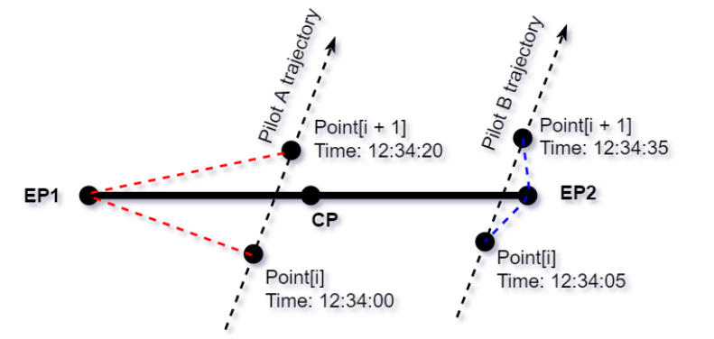

*Figure 8: Sample line trajectories*

A thick horizontal black line runs from a point labelled **EP1** (left) to a point labelled **EP2** (right), with its centre point labelled **CP**. Two dashed straight trajectories cross this line diagonally, each with an arrowhead showing flight direction (upward, left-to-right). The left trajectory, labelled "Pilot A trajectory", crosses between CP and EP1: below the line is "Point[i], Time: 12:34:00" and above it "Point[i + 1], Time: 12:34:20". Red dashed segments connect EP1 to Point[i] and EP1 to Point[i + 1] — the path around the closer line end. The right trajectory, labelled "Pilot B trajectory", crosses very close to EP2: below the line is "Point[i], Time: 12:34:05" and above it "Point[i + 1], Time: 12:34:35". Blue dashed segments connect EP2 to Point[i] and EP2 to Point[i + 1].

Figure 8 shows the trajectories of two pilots crossing a line. They both do not have a point in the tolerance zone - the validation must be done by evaluating times and distances.

Pilot A has two points (Point[i] and Point[i + 1]) on the two opposite sides of the line. The time between the two points is 20 seconds. The length of the red dashed line is 2.0 km. Therefore, the speed required to go around the line is 2000 m / 20 s = 100 m/s = 360 km/h.

Pilot B has also two points on the two sides of the line, the time between the two points is 30 seconds and the length of the blue line is 800 m. Therefore, the speed required to go around the line is 800 m / 30 s = 26.67 m/s = 96 km/h.

For pilot A, the line is validated (speed > 120 km/h), but for pilot B, the line is **not** validated (speed < 120 km/h).

#### <ins>9.2.3 Goal crossing</ins>

##### 9.2.3.1 Goal line crossing

<ins>If goal is defined as a line (6.2.3.1), it is crossed if:</ins>

1. The line segment between two subsequent tracklog points intercepts the outer boundaries of the tolerance zone as defined in 9.1.3. Therefore, Goal can be reached from any direction.
2. The first of the two tracklog points shows the pilot as in flight.

###### 9.2.3.1.1 Physical goal line

If a physical line is used, crossing either the virtual or the physical goal line counts as having reached goal. An official observation (through a goal marshal or similar) of a pilot crossing the line in flight overrules a negative goal crossing decision based on the pilot's tracklog. Not crossing a physical goal line for obvious safety reasons must be considered in the pilots' favour.

<!-- PDF p.31 -->

> **HG only:** The physical goal line is crossed when the hang glider's nose cuts the line, in the correct direction, before a landing is made.

> **PG only:** The physical goal line is crossed when the paraglider pilot's leading foot cuts the line, in the correct direction, before a landing is made.

##### 9.2.3.2 Elevated Goal crossing

*(Red in source: changed in this edition.)*

All crossings of an elevated goal (in the x/y plane) are considered for validation, regardless of altitude.

#### <ins>9.2.4 Validation</ins>

Given all n crossings for a control zone, sorted in ascending order by their crossing time, the control zone's validation time is determined.

In Races with single start gate, a control zone's validation time is always the first crossing time after the start gate time, and after the previous control zone's validation time.

$$
\begin{gathered}
\mathit{validationTime}_i = \mathit{crossing}_{i,n}.\mathit{time}\\
(n = min(m): \mathit{crossing}_m.\mathit{time} > \mathit{validationTime}_{i-1})
\end{gathered}
$$

In Races with multiple start gates and in Time Trials, we must first determine which flight segment resulted in the biggest covered distance. Then the validation time for SSS is the last SSS crossing time that is before all the subsequent control zones' validation times within that segment. The validation time for any control zone after SSS is that control zone's first crossing time after the previous control zone's validation time.

$$
\begin{gathered}
\mathit{within\ the\ flight\ segment\ that\ gives\ the\ longest\ distance}:\\
\mathit{turnpoint}_i = \mathit{SSS}: \mathit{validationTime}_i = \mathit{crossing}_{i,n}.\mathit{time}\\
(n = max(m): \mathit{crossing}_{i,m}.\mathit{time} < \mathit{validationTime}_{i+1})\\
\mathit{turnpoint}_i \neq \mathit{SSS}: \mathit{validationTime}_i = \mathit{crossing}_{i,n}.\mathit{time}:\\
(n = min(m): \mathit{crossing}_{i,m}.\mathit{time} > \mathit{validationTime}_{i-1})
\end{gathered}
$$

##### 9.2.4.1 Start time

In Race tasks the start time for pilots who reached SSS after the first start gate time is equal to the last start gate time before their SSS validation time.

$$
\begin{gathered}
\forall p: p \in \mathit{PilotsFlown} \land \exists \mathit{validationTime}_{p,\mathit{SSS}}: \mathit{startTime}_p = \mathit{SSS}.\mathit{gateTime}_n:\\
n = max(m): \mathit{SSS}.\mathit{gateTime}_m < \mathit{validationTime}_{p,\mathit{SSS}}
\end{gathered}
$$

In Time Trials, the pilot's start time is equal to their validation time of SSS.

$$
\forall p: p \in \mathit{PilotsFlown} \land \exists \mathit{validationTime}_{p,\mathit{SSS}}: \mathit{startTime}_p = \mathit{validationTime}_{p,\mathit{SSS}}
$$

### 9.3 Flown distance

To determine the distance of a pilot's flight, given the pilot's tracklog, we determine for each point where the pilot is still flying the remaining distance to goal from that point, considering any previously reached control zones (9.2). For this the same method is used as for calculating the task distance (7).Then we calculate the flight distance as the task distance minus the smallest of those remaining distances.

If a pilot flies less than minimum distance, they will be scored for their minimum distance. This also applies to pilots who are not able to produce a valid tracklog, but for whom launch officials verify launch within the launch window.

If a pilot reaches goal, they will be scored for the task distance.

<!-- PDF p.32 -->

$$
\mathit{task} = \left\{
\begin{gathered}
\mathit{preElement}_1, \ldots, \mathit{preElement}_m,\\
\mathit{startOfSpeedSection},\\
\mathit{element}_1, \ldots, \mathit{element}_n,\\
\mathit{endOfSpeedSection}\\
\mathit{postElement}_1, \ldots, \mathit{postElement}_n,\\
\mathit{goal}.\mathit{point}
\end{gathered}
\right\}
$$

$$
\begin{gathered}
\forall \mathit{point}_i \in \mathit{track}: \mathit{isFlying}(\mathit{point}_i):\\
\mathit{remainingTask}(\mathit{point}_i) = \mathit{point}_i + \left(\mathit{task} - \mathit{reachedElements}(\mathit{point}_i)\right)
\end{gathered}
$$

$$
\begin{gathered}
\mathit{remainingDistance}(\mathit{point}_i)\\
= \begin{cases}
\mathit{goal}.\mathit{type} = \mathit{line}: \mathrm{RouteOptimizer}\left(\mathit{remainingTask}(\mathit{point})\right).\mathit{optimizedDistance}\\
\mathit{goal}.\mathit{type} = \mathit{cylinder}: \mathrm{RouteOptimizer}\left(\mathit{remainingTask}(\mathit{point})\right).\mathit{optimizedDistance} - \mathit{goal}.\mathit{radius}
\end{cases}
\end{gathered}
$$

$$
\begin{gathered}
\forall p: p \in \mathit{PilotsLandingBeforeGoal}: \mathit{bestDistance}_p\\
= max(\mathit{minimumDistance}, \mathit{taskDistance}\\
- min(\forall \mathit{track}_p.\mathit{point}_i: \mathit{isFlying}\left(\mathit{track}_p.\mathit{point}_i\right): \mathit{remainingDistance}(\mathit{track}_p.\mathit{point}_i)))
\end{gathered}
$$

$$
\forall p: p \in \mathit{PilotsReachingGoal}: \mathit{bestDistance}_p = \mathit{taskDistance}
$$

### 9.4 Time for speed section

The time a pilot took to fly the speed section is determined by his start time (which is influenced by the task's start procedure and the time he crossed the start of speed section cylinder) and the time when he crossed the end of speed section after reaching all previous turn points. The smallest unit for time measurement is one second.

Pilots who do not reach the end of speed section cylinder do not get a time.

$$
\forall p: p \in \mathit{PilotsReachingESS}: \mathit{time}_p = \mathit{timeAtESS}_p - \mathit{startTime}_p
$$

#### 9.4.1 Best time

The best time achieved in a task, which is used to calculate time validity (see 10.3) and pilots' time points (see 12.2) is defined in hang-gliding as the shortest time of all pilots who reached ESS:

> **HG only:** $\mathit{BestTime} = \forall p \in \mathit{PilotsReachingESS}: \mathit{Min}(\mathit{time}_p)$

In paragliding, a pilot's time is only considered for best time if they reached goal, since this is required for them to receive the corresponding time points:

> **PG only:** $\mathit{BestTime} = \forall p \in \mathit{PilotsReachingGoal}: \mathit{Min}(\mathit{time}_p)$

<!-- PDF p.33 -->

## 10 Task Validity

The task validity is a value between 0 and 1 and measures how suitable a competition task is to evaluate pilots' skills. It is calculated for each task after the task has been flown, by multiplying the three validity coefficients: Launch validity, distance validity, and time validity.

$$
\mathit{TaskValidity} = \mathit{LaunchValidity}*\mathit{DistanceValidity}*\mathit{TimeValidity}
$$

### 10.1 Launch Validity

Launch Validity in paragliding competitions is determined by the Nominal Launch value (set at 96%), and the percentage of pilots who launch. If 96% or more of the pilots present at take-off launch, Launch Validity is 1. It decreases as the percentage of launching pilots drops below this threshold.

This mechanism serves as a safety feature. If a significant number of pilots choose not to launch due to unfavourable or dangerous conditions, the points awarded to those who do launch are reduced.

For scoring purposes, 'Pilots present' includes all pilots not marked as 'Absent' (ABS), comprising those who took off and those present but did not fly (DNF). DNF status should be assigned carefully, distinguishing between pilots who choose not to fly due to conditions and those absent for other reasons like illness.

$$
\mathit{NominalLaunch} = 96\%
$$

$$
\mathit{LVR} = min(1, \frac{\mathit{NumberOfPilotsFlying}}{\mathit{NumberOfPilotsPresent}\ *\ \mathit{NominalLaunch}})
$$

$$
\mathit{LaunchValidity} = 0.028 * \mathit{LVR} + 2.917 * \mathit{LVR}^2 - 1.944 * \mathit{LVR}^3
$$

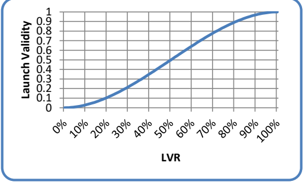

*Figure 9: Launch validity curve*

(No image crop — the chart is vector-drawn in the source.) A line chart inside a rounded blue border. X axis: "LVR", labelled 0% to 100% in 10% steps. Y axis: "Launch Validity", 0 to 1 with gridlines every 0.1. A single blue S-shaped curve starts at (0%, 0), rises slowly at first, climbs most steeply between roughly 30% and 70% (passing about 0.5 near 50%), then flattens and reaches 1 at 100%.

### 10.2 Distance Validity

Distance validity depends on the competition parameter Nominal Distance, the Nominal Goal value (set at 30%), the longest distance flown, and the sum of all distances flown beyond minimum distance. If the task distance is quite short in relation to nominal distance, the day is probably not a good measure of pilot skill because there would not be many decisions to make.

If a task is longer than nominal distance, the day will not be devalued because of distance validity, even if the nominal goal parameter value is not achieved, as long as a fair percentage of pilots fly a good distance. This sounds like a vague statement, but the task setter should try to set tasks that are reasonable for the day and achievable. If everyone lands in goal, you must ask if this was a valid test of skill - it probably was if the fastest time and the distance flown were reasonably long. If everyone lands short of goal, was it an unsuitable task but still a good test of pilot skill? You also can have the case where a task that is shorter than nominal distance, has a distance validity of almost 1. This will happen when a large percentage of

<!-- PDF p.34 -->

the pilots fly a large percentage of the course but, in this case, you still have a practical devaluation because there will be little spreading between pilots' scores.

In the formula below, 'p' denotes an individual pilot.

$$
\mathit{DistanceWeight} = 30\%
$$

$$
\mathit{SumOfFlownDistancesOverMinDist} = \sum_p max(0, \mathit{FlownDist}_p - \mathit{MinDist})
$$

$$
\begin{gathered}
\mathit{NomDistArea}\\
= \frac{((\mathit{DistanceWeight} + 1) * (\mathit{NomDist} - \mathit{MinDist})) + max(0, (\mathit{DistanceWeight} * (\mathit{BestDist} - \mathit{NomDist})))}{2}
\end{gathered}
$$

$$
\mathit{DVR} = \frac{\mathit{SumOfFlownDistancesOverMinDist}}{\mathit{NumPilotsFlying} * \mathit{NomDistArea}}
$$

$$
\mathit{DistanceValidity} = min(1, \mathit{DVR})
$$

### 10.3 Time Validity

Time validity depends on the fastest time to complete the speed section, in relation to nominal time. If the fastest time to complete the speed section is longer than nominal time, then time validity is always equal to 1.

If the fastest time is quite short, the day is probably not a good measure of pilot skill because there would not be many decisions to make and, because of this, luck can distort scores as there will be little possibility to recover any accidental loss of time.

If no pilot finishes the speed section, then time validity is not based on time but on distance: The distance of the pilot who flies the furthest in relation to nominal distance is then used to calculate the time validity the same way as if it was the time.

If one pilot reached ESS: $\mathit{TVR} = min(1, \frac{\mathit{BestTime}}{\mathit{NominalTime}})$

If no pilot reached ESS: $\mathit{TVR} = min(1, \frac{\mathit{BestDistance}}{\mathit{NominalDistance}})$

$$
\mathit{TimeValidity} = max(0, min(1, -0.271 + 2.912 * \mathit{TVR} - 2.098 * \mathit{TVR}^2 + 0.457 * \mathit{TVR}^3))
$$

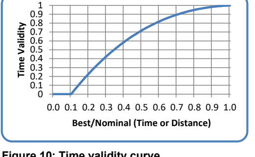

*Figure 10: Time validity curve*

(No image crop — the chart is vector-drawn in the source.) A line chart inside a rounded blue border. X axis: "Best/Nominal (Time or Distance)", labelled 0.0 to 1.0 in 0.1 steps. Y axis: "Time Validity", 0 to 1 with gridlines every 0.1. A single blue curve lies at 0 from 0.0 until roughly 0.1, then rises steeply (passing about 0.4 near 0.3 and about 0.7 near 0.5), progressively flattening to reach 1 at 1.0.

<!-- PDF p.35 -->

## 11 Points Allocation

The available points for each task are 1000*Task Validity. These points are distributed between distance points, time points, leading points, and arrival points. The distribution depends on the percentage of pilots who reached goal before the task deadline, compared to pilots who launched, as well as the chosen goal form. It is expressed in terms of weight factors for each of the four categories: Distance weight, time weight, leading weight, and arrival weight. Weight factors are always between 0 and 1. A weight factor of 0.5 for distance, for example, means that 50% of the day’s available overall points are available for distance points.

The parameter *LeadingTimeRatio* is set for each task, with a value between 0 and 26%.

> **HG only:** The default LeadingTimeRatio in hang-gliding is 17.5%

> **PG only:** The default LeadingTimeRatio in paragliding is 26%.

$$\mathit{GoalRatio} = \frac{\mathit{NumberOfPilotsInGoal}}{\mathit{NumberOfPilotsFlying}}$$

$$\mathit{DistanceWeight} = 0.9 - 1.665 * \mathit{GoalRatio} + 1.713 * \mathit{GoalRatio}^{2} - 0.587 * \mathit{GoalRatio}^{3}$$

> **HG only:**
> $$\mathit{LeadingWeight} = (1 - \mathit{DistanceWeight}) * \mathit{LeadingTimeRatio}$$
> $$\mathit{HG\ Class} \neq 2 : \mathit{ArrivalWeight} = (1 - \mathit{DistanceWeight}) * 12.5\%$$
> $$\mathit{HG\ Class} = 2 : \mathit{ArrivalWeight} = 0$$

> **PG only:**
> $$\mathit{GoalRatio} = 0 : \mathit{LeadingWeight} = (1 - \mathit{DistanceWeight})$$
> $$\mathit{GoalRatio} > 0 : \mathit{LeadingWeight} = (1 - \mathit{DistanceWeight}) * \mathit{LeadingTimeRatio}$$
> $$\mathit{ArrivalWeight} = 0$$

$$\mathit{TimeWeight} = 1 - \mathit{DistanceWeight} - \mathit{LeadingWeight} - \mathit{ArrivalWeight}$$

$$\mathit{AvailableDistancePoints} = round(1000 * \mathit{TaskValidity} * \mathit{DistanceWeight}, 0)$$

$$\mathit{AvailableTimePoints} = round(1000 * \mathit{TaskValidity} * \mathit{TimeWeight}, 0)$$

$$\mathit{AvailableLeadingPoints} = round(1000 * \mathit{TaskValidity} * \mathit{LeadingWeight}, 0)$$

$$\mathit{AvailableArrivalPoints} = round(1000 * \mathit{TaskValidity} * \mathit{ArrivalWeight}, 0)$$

> **HG only:**
> 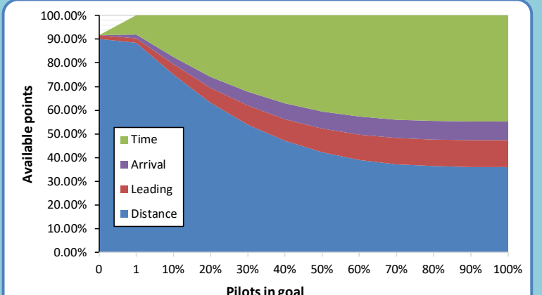
>
> *Figure 11: Points allocation for hang gliding, Class 1 and Class 5, for default LeadingTimeRatio of 17.5%*
>
> Stacked-area chart of the four weight categories. X axis: "Pilots in goal", labelled 0, 1, then 10% to 100% in 10% steps. Y axis: "Available points", 0.00% to 100.00% in 10% gridlines. Four stacked layers, bottom to top: Distance (blue), Leading (red), Arrival (purple), Time (green). At 0 pilots in goal, Distance is about 90% with thin Leading and Arrival slivers above it and only a small Time share. As the fraction of pilots in goal grows, Distance falls smoothly towards roughly 36–37% at 100%, the Leading and Arrival bands stay narrow (Leading widening to roughly 10%, Arrival a thinner purple band above it, together reaching about 54% cumulative), and Time expands to fill the remainder up to 100%.

<!-- PDF p.36 -->

> **HG only:**
> 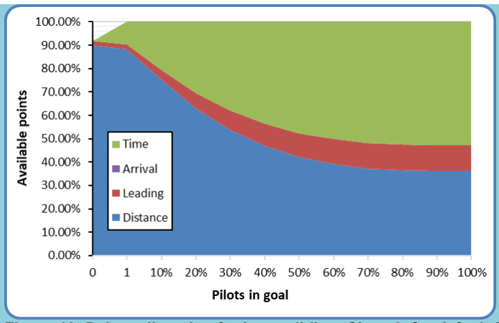
> *Figure 12: Points allocation for hang gliding, Class 2, for default LeadingTimeRatio of 17.5%*
>
> Same stacked-area layout as Figure 11 (X axis "Pilots in goal": 0, 1, 10%–100%; Y axis "Available points": 0.00%–100.00%). The legend lists Time (green), Arrival (purple), Leading (red), Distance (blue), but no purple Arrival band is visible because ArrivalWeight is 0 for Class 2. Distance falls from about 90% at 0 pilots in goal to roughly 36% at 100%; the red Leading band above it widens to roughly 11%; Time fills the remainder.

> **HG only:**
> From the above it follows that in hang-gliding, if nobody reaches ESS, then a maximum of 900 points are available for distance and 18 points for leading but, of course, no points for time nor arrival.
>
> $$\mathit{numberOfPilotsAtESS} = 0 :$$
> $$\mathit{AvailableDistancePoints} = round(1000 * \mathit{TaskValidity} * \mathit{DistanceWeight}, 0)$$
> $$\mathit{AvailableTimePoints} = 0$$
> $$\mathit{AvailableLeadingPoints} = round(1000 * \mathit{TaskValidity} * \mathit{LeadingWeight}, 0)$$
> $$\mathit{AvailableArrivalPoints} = 0$$
> $$\mathit{Max}(\,\mathit{AvailableDistancePoints}) = 900$$
> $$\mathit{Max}(\,\mathit{availableLeadingPoints}) = 18$$
> $$\mathit{Max}(\,\mathit{availableTotalPoints}) = 918$$

> **PG only:**
> 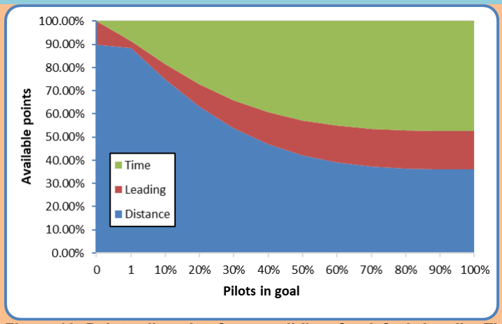
> *Figure 13: Points allocation for paragliding, for default LeadingTimeRatio of 26%*
>
> Stacked-area chart. X axis: "Pilots in goal", labelled 0, 1, then 10% to 100%. Y axis: "Available points", 0.00% to 100.00%. Three layers, bottom to top: Distance (blue), Leading (red), Time (green) — no Arrival layer. At 0 pilots in goal, Distance is about 90% and Leading fills the entire remainder to 100% (no Time area, since LeadingWeight = 1 − DistanceWeight when GoalRatio = 0). Once pilots reach goal, the green Time area appears and grows steadily; Distance falls to roughly 36% at 100% pilots in goal, with the red Leading band above it widening to roughly 16%, and Time filling the rest.

<!-- PDF p.37 -->

## 12 Pilot score

Each pilot’s score is the sum of that pilot’s distance, time, leading and arrival points, rounded to one decimal place:

$$\forall p : p \in \mathit{PilotsLaunched} : \mathit{TotalScore}_p = round(\mathit{DistancePoints}_p + \mathit{TimePoints}_p + \mathit{LeadingPoints}_p + \mathit{ArrivalPoints}_p, 1)$$

### 12.1 Distance points

The distance considered for each pilot to calculate distance points is that pilot’s best distance along the course line, up until the pilot landed or the task deadline was reached, whichever comes first.

$$\mathit{Distance}_p = \max\,(\mathrm{MinimumDistance}, \mathrm{taskDistance} - \min\big(\forall \mathit{track}_p.\mathit{point}_i : \mathit{shortestDistanceToGoal}(\,\mathit{track}_p.\mathit{point}_i)\big))$$

Distance points are rounded to one decimal place.

> **HG only:**
> One half of the available distance points are assigned to each pilot linearly, based on the pilot’s distance flown in relation to the best distance flown in the task. The other half is assigned taking into consideration the difficulty of the kilometers flown.
>
> $$\mathit{LinearFraction}_p = \frac{\mathit{Distance}_p}{2 * \mathit{BestDistance}}$$
> $$\mathit{iDist10}_p = int(\,\mathit{Distance}_p * 10)$$
> $$\mathit{DifficultyFraction}_p = \mathit{DiffScore}_{\mathit{iDist10}_p} + ((\mathit{DiffScore}_{\mathit{iDist10}_p+1} - \mathit{DiffScore}_{\mathit{iDist10}_p}) * (\mathit{Distance}_p * 10 - \mathit{iDist10}_p))$$
> $$\mathit{DistancePoints}_p = (\mathit{LinearFraction}_p + \mathit{DifficultyFraction}_p) * \mathit{AvailableDistancePoints}$$

> **PG only:**
> The available distance points are assigned to each pilot linearly, based on the pilot’s distance flown in relation to the best distance flown in the task.
>
> $$\mathit{DistancePoints}_p = \frac{\mathit{Distance}_p}{\mathit{BestDistance}} * \mathit{AvailableDistancePoints}$$

In the case of a stopped task, a pilot’s distance may be increased by an altitude bonus (see 12.3.2).

#### 12.1.1 Difficulty calculation

> **HG only:**
> To measure the relative difficulty of each 100 meters of the task, we consider the number of pilots who landed in the successive few kilometers, and the distance flown.
>
> In a first step, for each 100-meter section of the task, the number of pilots who landed in that section is counted. Pilots who landed before minimum distance are counted as having landed at minimum distance. Only pilots who landed out are considered for this calculation, pilots who reached goal are not counted.
>
> $$\forall i : i < \mathrm{int}(\mathit{MinDist} * 10) : \mathit{PilotsLanded}_i = 0$$
> $$\mathit{PilotsLanded}_{\mathrm{int}(\mathit{MinDist} * 10)} = \sum_{\forall \mathit{Pilot} : \mathrm{int}(\mathit{Pilot}.\mathit{Distance} * 10) \le \mathrm{int}(\mathit{MinDist} * 10)} 1$$
> $$\forall i : i > \mathrm{int}(\mathit{MinDist} * 10) \;\&\; i \le \mathrm{int}(\mathit{MaxDist} * 10) : \mathit{PilotsLanded}_i = \sum_{\forall q : q \in \mathit{PilotsLandedOut} : \mathrm{int}(\mathit{Distance}_q * 10) = i} 1$$
>
> Then the difficulty for each 100-meter section of the task is calculated by counting the number of pilots who landed further along the task. If 100 pilots land out on a flight of 100 km, the next 3 km are considered. If 10 pilots land out in 100 km, the next 30 km are considered. The variable LookAheadDist contains the number of 100-meter slots to look ahead for this.

<!-- PDF p.38 -->

> **HG only:**
> $$\mathit{LookAheadDist} = \max(30, \mathit{round}(\frac{30 * \mathit{BestDistanceFlown}}{\mathit{NumberOfPilotsLandedOut}}, 0))$$
> $$\forall i : \le \mathrm{int}(\mathit{MaxDist} * 10) : \mathit{Difficulty}_i = \sum_{j=i}^{j=\min(i+\mathit{LookAheadDist}\,,\,\mathrm{int}(\mathit{BestDistanceFlown} * 10))} \mathit{PilotsLanded}_j$$
> $$\mathit{SumOfDifficulty} = \sum_{i} \mathit{Difficulty}_i$$
>
> Relative difficulty is then calculated by dividing each 100-meter slot’s difficulty by twice the sum of all difficulty values.
>
> $$\forall i : i \le \mathrm{int}(\mathit{MaxDist} * 10) : \mathit{RelativeDifficulty}_i = \frac{\mathit{Difficulty}_i}{2 * \mathit{SumOfDifficulty}}$$
>
> Finally, we can calculate the difficulty score percentage for each 100-meter slot.
>
> $$\forall i : i \le \mathrm{int}(\mathit{MinDist} * 10) : \mathit{DiffScore}_i = \sum_{j=0}^{j=\mathrm{int}(\mathit{MinDist} * 10)} \mathit{RelativeDifficulty}_j$$
> $$\forall i : i > \mathrm{int}(\mathit{MinDist} * 10) \;\&\; i < \mathrm{int}(\mathit{BestDistanceFlown} * 10) : \mathit{DiffScore}_i = \sum_{j=0}^{j=i} \mathit{RelativeDifficulty}_j$$
> $$\forall i : i \ge \mathrm{int}(\mathit{BestDistanceFlown} * 10) : \mathit{DifffScore}_i = 0.5$$

> **PG only:** The difficulty calculation does not apply to paragliding.

#### 12.1.1.1 Example for difficulty calculation

> **HG only:**
> For an example of how the difficulty calculation works, see Figure 14: Note how the slope of the green curve (the total Distance points) becomes steeper before an area where many pilots landed and flatter just after. The red circles show these areas before the big group at the 41 km mark, and after the 46 km mark. There are two reasons for this:
>
> For safety and retrieval reasons, we do not want to encourage pilots to fly only a short distance past a group of landed pilots.
>
> If a pilot lands somewhere, he or she probably got into trouble just before, and then glided a while before landing.
>
> 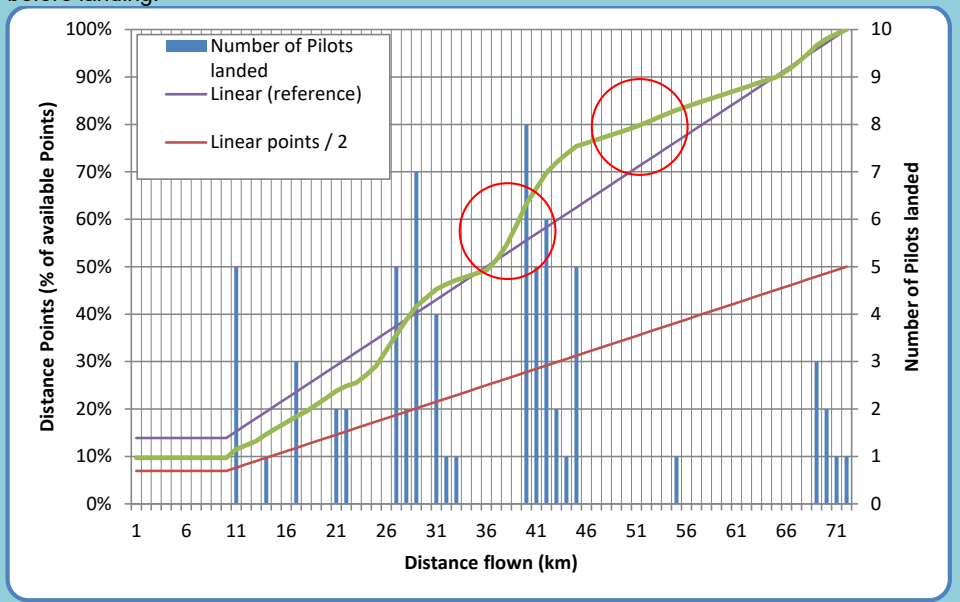
>
> *Figure 14: Sample Distance Points*
>
> Combined bar-and-line chart. X axis: "Distance flown (km)", labelled 1 to 71 in steps of 5. Left Y axis: "Distance Points (% of available Points)", 0% to 100%; right Y axis: "Number of Pilots landed", 0 to 10. Blue vertical bars mark the number of pilots landed at each distance, scattered along the course with a dense cluster around the 41 km mark (tallest bar 8 pilots, at about 40 km) and a smaller cluster near 70 km. A straight purple line ("Linear (reference)") runs diagonally from about 14% to 100%; a straight red line ("Linear points / 2") runs from about 7% to 50%. A green curve (the total distance points) rises from about 10%, tracking above the red line: its slope steepens just before the big landing cluster at 41 km and flattens just after 46 km — two red circles on the chart ring these two regions — before climbing to 100% at the best distance.

<!-- PDF p.39 -->

### 12.2 Time points

Time points are assigned to the pilot as a function of best time and pilot time – the time the pilot took to complete the speed section. Slow pilots will get zero points for speed if their time to complete the speed section is equal to or longer than the fastest time plus the square root of the fastest time. All times are measured in hours.

$$\mathit{SpeedFraction}_p = max(\,0, 1 - \sqrt[6]{\left(\frac{(\mathit{Time}_p - \mathit{BestTime})}{\sqrt{\mathit{BestTime}}}\right)^{5}}\;)$$

$$\mathit{TimePoints}_p = \mathit{SpeedFraction}_p * \mathit{AvailableTimePoints}$$

Time points are rounded to one decimal place.

#### 12.2.1 Example

For three examples of Time Point distributions for tasks with different best times, see Figure 15 and Table 2.The best time is defined as the time of the fastest pilot over the speed section who also reached the goal.

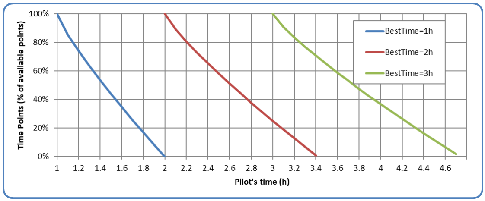
*Figure 15: Sample time point distributions*

Line chart with three curves. X axis: "Pilot's time (h)", from 1 to 4.6 in steps of 0.2. Y axis: "Time Points (% of available points)", 0% to 100% in 20% gridlines. Legend: "BestTime=1h" (blue), "BestTime=2h" (red), "BestTime=3h" (green). Each curve starts at 100% where the pilot’s time equals the best time (1 h, 2 h, 3 h) and falls with increasing steepness at first, then an increasingly steep tail: the blue curve reaches 0% at 2.0 h, the red at about 3.4 h, and the green at about 4.7 h.

| Fastest Time | 80% Time Points time | 50% Time Points time | 0 Time Points time |
|---|---|---|---|
| 1:00 | 1:08:42 | 1:26:07 | 2:00:00 |
| 2:00 | 2:12:18 | 2:36:56 | 3:24:51 (3.41 hours) |
| 3:00 | 3:15:04 | 3:45:14 | 4.43:55 (4.73 hours) |

*Table 2: Sample time point distribution (times in hours:minutes:seconds)*

### 12.3 Leading points

Leading points are awarded to encourage pilots to start early and to reward the risk involved in flying in the leading group. Pilots will get leading points even if they landed before goal or the end of speed section.

<!-- PDF p.40 -->

$$\mathit{LC}_{\min} = \min(\forall p : p \in \mathit{PilotsFlown} : \mathit{LC}_p)$$

$$\mathit{LeadingFactor}_p = \max(0, 1 - \sqrt[3]{\left(\frac{(\mathit{LC}_p - \mathit{LC}_{\min})}{\sqrt{\mathit{LC}_{\min}}}\right)^{2}}$$

$$\mathit{LeadingPoints}_p = \mathit{LeadingFactor}_p * \mathit{AvailableLeadingPoints}$$

Leading points are rounded to one decimal place.

To get an impression of the way leading points are awarded depending on a task’s minimal leading coefficient, see Figure 16.

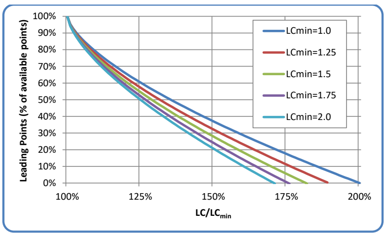

*Figure 16: Leading points for various $\mathit{LC}_{\min}$*

Line chart with five curves. X axis: "LC/LC_min", from 100% to 200% in 25% gridlines. Y axis: "Leading Points (% of available points)", 0% to 100% in 10% gridlines. Legend: "LCmin=1.0" (dark blue), "LCmin=1.25" (red), "LCmin=1.5" (green), "LCmin=1.75" (purple), "LCmin=2.0" (light blue). All five curves start at 100% of available points where LC equals LC_min (x = 100%) and descend concavely; the larger the LC_min, the steeper the fall: the LCmin=1.0 curve reaches 0% at x = 200%, while the LCmin=2.0 curve reaches 0% at about x = 170%, with the other curves ending in between.

#### 12.3.1 Leading coefficient

Each started pilot’s track log is used to calculate the leading coefficient (LC), by calculating the area underneath a graph defined by each track point’s time, and the distance to ESS at that time. The times used for this calculation are given in seconds from the first start gate time (as defined for the task), to the time when the last pilot reached ESS. For pilots who land out after the last pilot reached ESS, the calculation keeps going until they land. The distances used for the LC calculation are given in kilometres and are the distance from each point’s position to ESS, starting from SSS, but never more than any previously reached distance. This means that the graph never “goes back”: even if the pilot flies away from goal for a while, the corresponding points in the graph will use the previously reached best distance towards ESS.

Calculation of the leading coefficient (LC) for each pilot follows this formula:

$$\mathit{bestTrackPoint}_p = \mathrm{trackPointWithShortestDistanceToESS}(\mathit{trackPointsInSS}_p)$$

$$\mathrm{minToESS}(\mathit{tp}_0) = \mathit{speedSectionDistance}$$

$$\forall i : i > 0, \mathit{tp}_i \in \mathit{trackPointsInSS}_p : \mathrm{minToESS}(\mathit{tp}_i) = \min\big(\mathrm{minToESS}(\mathit{tp}_{i-1}), \mathrm{distToESS}(\mathit{tp}_i)\big)$$

$$\mathrm{taskTime}(\mathit{trackPoint}) = \min(\mathit{trackpoint}.\mathit{time}, \mathit{taskDeadline}) - \mathit{firstTaskStartTime}$$

$$\mathit{maxTime} = \min(\max(\mathit{lastOutlandingTime}, \mathit{lastESStime})\,, \mathit{taskDeadline})$$

> **HG only:**
> $$\mathit{leadingArea}_p = \sum_{i : \mathit{tp}_i \in \mathit{trackPointsInSS}_p} (\mathrm{minToESS}(\mathit{tp}_{i-1})^{2} - \mathrm{minToESS}(\mathit{tp}_i)^{2}) * \mathrm{taskTime}(\mathit{tp}_i)$$
> $$\mathit{missingArea}_p = \mathit{maxTime} * \mathrm{minToESS}\big(\mathit{bestTrackPoint}_p\big)^{2}$$
> $$\mathit{LC}_p = \frac{\mathit{leadingArea}_p + \mathit{missingArea}_p}{1800 * \mathit{speedSectionDistance}^{2}}$$

<!-- PDF p.41 -->

> **HG only:**
> 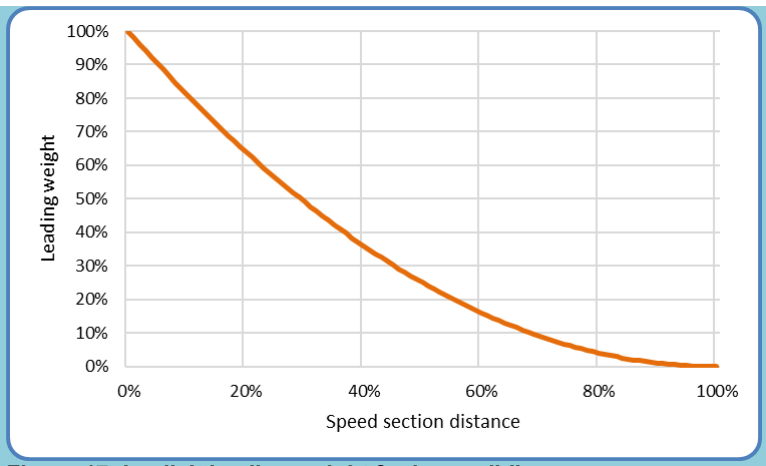
> *Figure 17: Implicit leading weight for hang-gliding*
> Line chart. X axis: "Speed section distance", 0% to 100%; y axis: "Leading weight", 0% to 100% with gridlines every 10%. A single orange curve starts at 100% leading weight at 0% speed section distance and decays monotonically with convex (easing-out) curvature: roughly 65% weight at 20% distance, 37% at 40%, 17% at 60%, 5% at 80%, reaching approximately 0% at 100% of the speed section distance.

> **PG only:**
>
> $$\mathit{leadingArea}_p = \sum_{\forall i: tp_i \in \mathit{trackPointsInSS}_p} \mathrm{minToESS}(tp_i) * \mathrm{taskTime}(tp_i) * \int_{\mathit{done}(tp_{i-1})}^{\mathit{done}(tp_i)} \mathrm{weight(x)}\, dx$$
>
> $$\mathit{missingArea}_p = \mathrm{minToESS}\left(\mathit{bestTrackPoint}_p\right) * \mathrm{maxTime} * \int_{\mathit{done}(\mathit{bestTrackPoint}_p)}^{1} \mathrm{weight(x)}\, dx$$
>
> $$\mathit{done}(p) = 1 - (\mathrm{minToEss}(p))/\mathit{speedSectionDistance}$$
>
> $$LC_p = \frac{\mathit{leadingArea}_p + \mathit{missingArea}_p}{1800 * \mathit{speedSectionDistance}}$$
>
> $$\mathrm{weight}(v) = \mathrm{weightRising}(1 - v) * \mathrm{weightFalling}(1 - v)$$
>
> $$\mathrm{weightRising}(v) = (1 - 10^{9*v-9})^5$$
>
> $$\mathrm{weightFalling}(v) = (1 - 10^{-3*v})^2$$
>
> 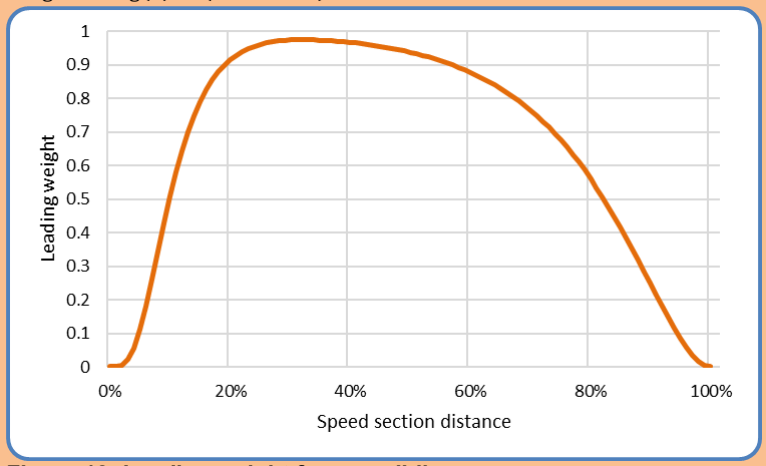
> *Figure 18: Leading weight for paragliding*
> Line chart. X axis: "Speed section distance", 0% to 100%; y axis: "Leading weight", 0 to 1 with gridlines every 0.1. A single orange curve starts at 0 at 0% distance, rises very steeply between about 5% and 15% distance, peaks at just under 1.0 (about 0.97) around 25–35% distance, declines gently to about 0.8 at 65%, then falls increasingly steeply through 0.5 at about 82%, returning to 0 at 100% of the speed section distance.

<!-- PDF p.42 -->

#### 12.3.2 Example

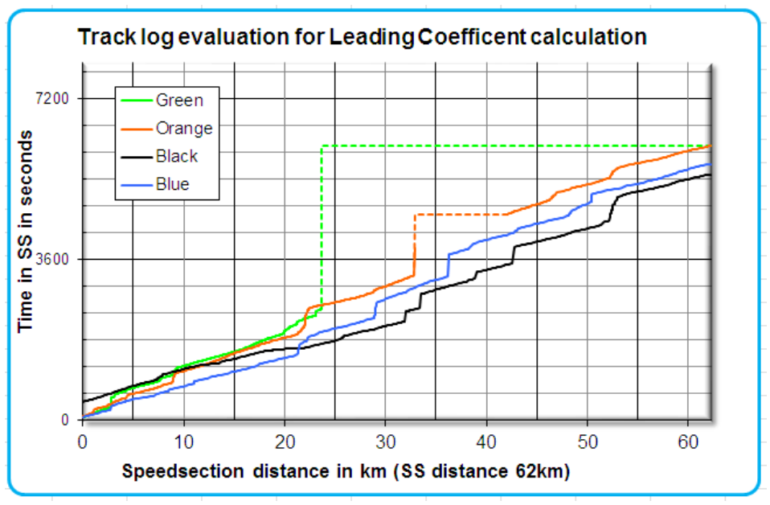
*Figure 19: Sample track log graphs for LC calculation*
Line chart titled "Track log evaluation for Leading Coefficent calculation". X axis: "Speedsection distance in km (SS distance 62km)", 0 to just past 60 km; y axis: "Time in SS in seconds", 0 to 7200 with labelled gridlines at 0, 3600 and 7200. Four stepped track log lines are plotted, identified in the legend as Green, Orange, Black and Blue, each showing cumulative time in the speed section against distance flown. Blue starts at time 0. Green starts at the same time as Blue but ends at about 23 km after just over 40 minutes; from there a dashed green horizontal-then-flat line continues at a constant time (about 6100 s) to the end of the speed section, showing how the missing part of the track is completed. Orange has a vertical dashed jump at about 33 km (a gap in the track log) and continues to the end. Black starts last (latest time at 0 km) but crosses the remaining distance with the shallowest slope, finishing first at about 62 km.

Blue was the first to enter the speed section, but Black was the first pilot to cross the end of speed section. Green started at the same time as Blue, but landed short, after about 23km and just over 40 minutes of flight inside the speed section.

Black was fastest, therefore will get the most time points, but he started late, probably had pilots out front to show the way during the first 22km but was leading after that.

If a pilot lands along the course (Green), or if his track log is interrupted (Orange), his track log is completed as shown by the dotted lines: Missing parts are calculated as if the dotted line was the actual track log, so LC becomes bigger, lowering the leading points for that pilot, compared to a track where that part is not missing. A pilot landing just short of goal will be less penalised and could even get full leading points if he led for a long while.

The pilot who used best the earliest part of the day (i.e., Black, who has the smallest area below the track log graph) gets all the available leading points, while the others get their points according to the same formula used for the time points for the same reasons. If the task in the example is fully valid, and 30% of pilots reached goal, then Black will get all of the available 81 leading points and full time points, as he was fastest; Blue gets 45 leading points because he started early but was slower; Orange receives only 18 leading points as he was slow and had a gap in his track log; Green gets 0 points even though he started early, because he was the slowest and landed fairly short.

### 12.4 Arrival points

> **HG only:** Arrival points depend on the position at which a pilot crosses ESS: The first pilot completing the speed section receives the maximum available arrival points, while the others are awarded arrival points according to the number of pilots who reached ESS before them. The last pilot to reach ESS will always receive at least 20% of the available arrival points.

<!-- PDF p.43 -->

> **HG only:**
>
> $$AC_p = 1 - \frac{\mathit{PositionAtESS}_p - 1}{\mathit{NumberOfPilotsReachingESS}}$$
>
> $$\mathit{ArrivalFraction}_p = 0.2 + 0.037 * AC_p + 0.13 * AC_p^{\,2} + 0.633 * AC_p^{\,3}$$
>
> $$\mathit{ArrivalPoints}_p = \mathit{ArrivalFraction}_p * \mathit{AvailableArrivalPoints}$$
>
> Arrival points are rounded to one decimal place.
>
> 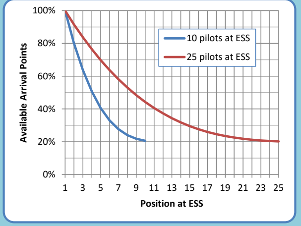
>
> *Figure 20: Sample arrival points distributions*
> Line chart. X axis: "Position at ESS", labelled at odd positions 1 through 25; y axis: "Available Arrival Points", 0% to 100% with gridlines every 20%. Two decaying curves, identified in the legend as "10 pilots at ESS" (blue) and "25 pilots at ESS" (red). Both start at 100% for the pilot in position 1 and decay towards the 20% floor: the blue curve falls faster, reaching about 20% at position 10 where it ends; the red curve declines more gradually, reaching about 20% at position 25.

> **PG only:** No arrival points are awarded in Paragliding.

<!-- PDF p.44 -->

## 13 Special cases

### 13.1 Underflying Elevated Goal

*(Red in source: changed in this edition.)*

In a task where goal is set as an Elevated Goal, a pilot may reach goal at an altitude below the goal’s elevation. In this case their Time Points will be reduced according to their actual crossing altitude.

- Let $\mathit{goal}.\mathit{altitude}$ be the published goal altitude (meters AMSL).
- Let *elevation* be the altitude difference between $\mathit{goal}.\mathit{altitude}$ and the lower goal limit, in meter (300 m by default but can be increased up to 1000 m for each task).
- Let $\mathit{crossing}_{\mathrm{goal}}.\mathit{altitude}$ be the pilot's altitude when crossing goal.
- If $\mathit{crossing}_{\mathrm{goal}}.\mathit{altitude} \le \mathit{goal}.\mathit{altitude}$, set GoalAltitudeFactor $= 0.8$.
- If $\mathit{crossing}_{\mathrm{goal}}.\mathit{altitude} \ge \mathit{goal}.\mathit{altitude} + \mathit{elevation}$, set GoalAltitudeFactor $= 1$.
- Otherwise, compute:

$$AR = \frac{\mathit{crossing}_{\mathrm{goal}}.\mathit{altitude} - \mathit{goal}.\mathit{altitude}}{\mathit{elevation}}$$

$$\mathit{GoalAltitudeFactor} = 0.8 + 0.6 \cdot AR - 0.6 \cdot AR^2 + 0.2 \cdot AR^3$$

$$\forall p: p \in \mathit{PilotsUnderflyingElevatedGoal}: \mathit{TimePoints}_p.\mathit{final} = \mathit{TimePoints}_p * \mathit{GoalAltitudeFactor}$$

A graphical representation of the GoalAltitdueFactor across the default 300 m goal elevation is given in Figure 21.

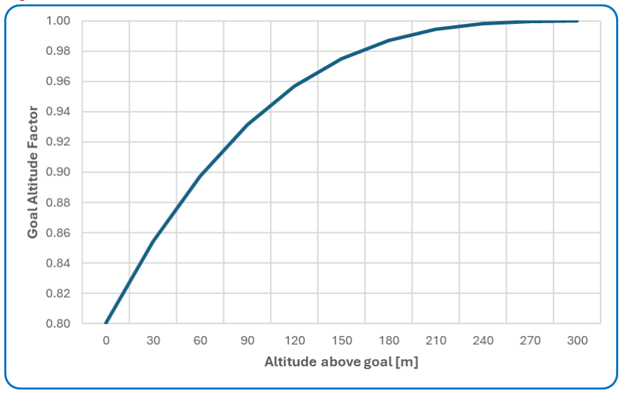
*Figure 21: GoalAltitudeFactor curve*
Line chart. X axis: "Altitude above goal [m]", 0 to 300 with gridlines every 30 m; y axis: "Goal Altitude Factor", 0.80 to 1.00 with gridlines every 0.02. A single dark-blue curve rises from 0.80 at 0 m with steadily decreasing slope (concave): about 0.90 at 60 m, 0.94 at 105 m, 0.975 at 150 m, 0.99 at 195 m, flattening to reach 1.00 at 300 m above goal.

### 13.2 ESS but not goal

In a task where ESS and goal are not identical, a pilot may reach ESS, but not goal.

Reaching goal is seen as ‘validating’ one’s speed section performance. A pilot who does not reach goal after reaching ESS will lose a portion of his time points, as defined by the scoring system penalty parameter for this situation. He will also score full distance points for the distance covered and his full leading points. The timepoint penalty for not reaching goal is seen as a safety measure, since it encourages pilots to plan their final glide to ESS with enough altitude to safely reach goal.

<!-- PDF p.45 -->

For paragliders the scoring system parameter is to be set at 0% (i.e. no time points awarded) as this discourages high-speed final glides low to the ground.

For hang gliders the default scoring system parameter of 80% is recommended but can be changed by the local regulations to suit particular sites.

> **HG only:**
> $$\forall p: p \in \mathit{PilotsLandedBetweenESSandGoal}: \mathit{TotalScore}_p = \mathit{DistancePoints}_p + \mathit{LeadingPoints}_p + 0.8 * (\mathit{TimePoints}_p + \mathit{ArrivalPoints}_p)$$

> **PG only:**
> $$\forall p: p \in \mathit{PilotsLandedBetweenESSandGoal}: \mathit{TotalScore}_p = \mathit{DistancePoints}_p + \mathit{LeadingPoints}_p + 0 * (\mathit{TimePoints}_p)$$

### 13.3 Early start

An early start occurs if a pilot’s last SSS control zone crossing occurred before the first (or only) start gate time.

> **PG only:** In paragliding, pilots who perform an early start are only scored for the distance between the launch point and the SSS control zone, as calculated when determining the complete task distance (see 7.2).

> **HG only:** In hang-gliding, the so-called “Jump the Gun”-rule applies: If the early start occurred within a time that is close to the first (or only) start gate time, the pilot is scored for his complete flight, but a penalty is then applied to his total score.
>
> The penalty calculation is based on two values X and Y, which are set in S7A, but can be changed at the task briefing (presumably by the meet director and/or the task committee). For each X seconds a pilot starts early, he incurs a 1-point penalty, up to a maximum of Y seconds. If a pilot starts more than Y seconds early, he will only be scored for minimum distance.
>
> $$X_{\mathit{default}} = 2$$
>
> $$Y_{\mathit{default}} = 300$$
>
> $$\mathit{timeDiff}_p = \mathit{firstStartGateTime} - \mathit{lastStartTime}_p$$
>
> $$\mathit{timeDiff}_p <= 0: \mathit{jumpTheGunPenalty}_p = 0$$
>
> $$\mathit{timeDiff}_p > Y: \mathit{jumpTheGunPenalty}_p = 0, \mathit{totalScore}_p = \mathit{scoreForMinDistance}$$
>
> $$0 < \mathit{timeDiff}_p <= Y: \mathit{jumpTheGunPenalty}_p = \frac{\mathit{timeDiff}_p}{X}$$
>
> $$\mathit{totalScore}_p = \max(\mathit{totalScore}_p - \mathit{jumpTheGunPenalty}_p, \mathit{scoreForMinDistance})$$

### 13.4 Stopped tasks

#### 13.4.1 Stop task time

A task can be stopped at any time by the meet director. The time when a stop was announced for the first time is the “task stop announcement time”. This time must be recorded to score the task appropriately. For scoring purposes, a “task stop” time is calculated, by “scoring back”, or deducting a number of minutes from the announcement time. Pilots’ flights will only be scored up to this task stop time.

> **HG only:**
> $$\mathit{scoreBackTime} = 15\ \mathit{min}.$$

> **PG only:**
> $$\mathit{scoreBackTime} = 5\ \mathit{min}.$$

$$\mathit{taskStopTime} = \mathit{taskStopAnnouncementTime} - \mathit{scoreBackTime}$$

<!-- PDF p.46 -->

#### 13.4.2 Minimum duration of stopped tasks

> **HG only:** In hang-gliding, stopped tasks will be scored only if they ran for a sufficiently long time.
> $$\mathit{minimumTime} = \min\left(1h, \frac{\mathit{NominalTime}}{2}\right)$$

> **PG only:** In paragliding, no such minimum time requirement exists. Instead, low-validity stopped tasks will be excluded from the competition results (see chapter 15).
> $$\mathit{minimumTime} = 0$$

#### 13.4.3 Stopped task validity

For stopped tasks, an additional validity value, the Stopped Task Validity, is calculated and applied to the Task Validity.

$$\mathit{DayQuality}_{\mathit{stopped}} = \mathit{LaunchValidity} * \mathit{DistanceValidity} * \mathit{TimeValidity} * \mathit{StoppedTaskValidity}$$

Stopped Task Validity is calculated considering the task duration, the minimum time, task distance, the flown distances of all pilots, the number of launched pilots and the number of pilots still flying at the time when the task was stopped.

$$\mathit{taskDuration} = \mathit{taskStopTime} - \max\left(\forall p \in \mathit{StartedPilots}: \mathit{startTime}_p\right)$$

$$\mathit{stoppedDurationValidity} = \mathit{taskDuration} \ge \mathit{mimumumTime}\,?\ 1:0$$

$$\mathit{stoppedDistanceValidity} = \sqrt{\frac{\mathit{BestDistFlown} - \mathit{avg}(\forall i: \mathit{DistFlown}_i)}{\mathit{DistLaunchToESS} - \mathit{BestDistFlown} + 1}} * \sqrt{\frac{\mathit{stdev}(\forall i: \mathit{DistFlown}_i)}{5}}$$

$$\mathit{stoppedFlyingValidity} = \left(\frac{\mathit{NumPilotsLandedBeforeStopTime}}{\mathit{NumPilotsLaunched}}\right)^3$$

$$\mathit{StoppedTaskValidity} = \mathit{NumberOfPilotsReachedESS} > 0\ ?\ 1: \mathit{stoppedDurationValidity} * \mathit{min}(1, \mathit{stoppedDistanceValidity} + \mathit{stoppedFlyingValidity})$$

#### 13.4.4 Scored time window

For stopped Races with a single start gate, scoring considers the same time window for all pilots: The time between the race start and the task stop time.

$$\mathit{typeOfTask} = \mathit{Race} \land \mathit{numberOfStartGates} = 1:$$

$$\forall p: p \in \mathit{StartedPilots}: \mathit{scoreTimeWindow}_p = (\mathit{startTime}, \mathit{taskStopTime})$$

Stopped Races tasks with multiple start gates, as well as stopped Time Trials, must be treated slightly differently: <ins>Only the time window available between the last official start time and the task stop time is considered for scoring. The last official start time is defined as the latest start gate or start clock taken by at least one competitor and shall not be redefined by individual pilots crossing the start line after that time.</ins>

$$\mathit{typeOfTask} \ne \mathit{Race} \lor \mathit{numberOfStartGates} > 1:$$

*(Red in source: changed in this edition.)*

$$\mathit{lastOfficialStartTime} = \max\,(\forall s: s \in \mathit{startTimes} \land \mathit{numberOfPilotsUsingStart}(s) > 0)$$

$$\mathit{scoreTime} = \mathit{taskStopTime} - \mathit{lastOfficialStartTime}$$

$$\forall p: p \in \mathit{StartedPilots}: \mathit{scoreTimeWindow}_p = (\mathit{startTime}_p, \mathit{startTime}_p + \mathit{scoreTime})$$

This means that if the last pilot started and then flew for, for example, 75 minutes until the task was stopped, all tracks are only scored for the first 75 minutes each pilot flew after taking their respective start.

#### 13.4.5 Time points for pilots at or after ESS

*(Red in source: the whole content of this subsection is changed in this edition.)*

In stopped tasks, all pilots shall be scored only for the portion of their flight up to the task stop time. No pilot shall receive any points from any flight segment after the task stop time has been announced. The handling of Time and Distance Points follows the following scheme:

<!-- PDF p.47 -->

1. If no pilot reached goal at the task stop time, available Time Points for the task are zero, and no Time Points are moved to Distance Points.
2. **If at least one pilot reached goal before the task stop time:**
   a. **If at least one pilot is between ESS and goal:**
      1. The reference pilot is the pilot between ESS and goal who, of all the pilots between ESS and goal at task stop time, would have receive the highest number of Time Points if they had reached goal. In Race tasks with a single start gate, this is the pilot with the earliest ESS crossing time. In all other tasks, it’s the pilot whose time between their start and their ESS crossing is the smallest.
      2. Calculate the Time Points this pilot would have received if they had completed the flight to goal normally, using standard Time Points calculation (Section 12.2), with no adjustments for stopped tasks or not reaching goal.
      3. Let this value be *timePointsReduction*.
      4. For each pilot in goal, subtract *timePointsReduction* from their Time Points.
      5. Add *timePointsRecution* to the available Distance Points for the task.
   b. **If no pilot is between ESS and goal:**
      1. Calculate the Time Points a pilot would have received if they had reached ESS at the task stop time and flown to goal, using standard Time Points calculation (Section 12.2). In Race tasks with multiple gates and Time Trials, the last start time taken by a pilot is considered.
      2. Let this value be *timePointsReduction*.
      3. For each pilot in goal, subtract *timePointsReduction* from their Time Points.
      4. Add *timePointsRecution* to the available Distance Points for the task.

**If at least one pilot is between ESS and goal:**

$$\mathit{timePointsReduction} = \mathit{max}(\forall p: p \in \mathit{PilotsReachedESS}: \mathit{timePoints}(\mathit{taskStopTime} - \mathit{startTime}_p))$$

**No pilot between ESS and goal:**

$$\mathit{typeOfTask} = \mathit{Race} \land \mathit{numberOfStartGates} = 1:$$

$$\mathit{timePointsReduction} = \mathit{timePoints}(\mathit{taskStopTime} - \mathit{startTime})$$

$$\mathit{typeOfTask} \ne \mathit{Race} \lor \mathit{numberOfStartGates} > 1:$$

$$\mathit{timePointsReduction} = \mathit{timePoints}(\mathit{taskStopTime} - \mathit{max}(\forall p: p \in \mathit{PilotsCrossedSSS}: \mathit{startTime}_p))$$

**Apply timePointsReduction:**

$$\forall p: p \in \mathit{PilotsInGoal}: \mathit{finalTimePoints}_p = \mathit{timePoints}_p - \mathit{timePointsReduction}$$

$$\mathit{availableDistancePoints\_new} = \mathit{availableDistancePoints} + \mathit{timePointsReduction}$$

#### 13.4.6 Distance points with altitude bonus

To compensate for altitude differences at the time when a task is stopped, a Bonus Distance is calculated for those pilots who still flew at the Task Stop Time:

1. Altitude above goal at Task Stop Time is determined
2. This altitude is multiplied by a Bonus Glide Ratio
3. The resulting Altitude Bonus is added to the task distance covered at Task Stop Time, disregarding any better distances achieved previously.
4. If the Bonus Distance (distance at stop + Altitude Bonus) exceeds the pilot’s best distance up to Task Stop Time, it is used for Distance Points calculations, including the difficulty calculations applied in hang-gliding (see 12.1.1). Time Point and Leading Point calculations remain unaffected by the Bonus Distance.

> **HG only:**
> $$\mathit{BonusGlideRatio} = 5.0$$

> **PG only:**
> $$\mathit{BonusGlideRatio} = 2.5$$

$$\forall p: p \in \mathit{PilotsFlyingAtStopTime}: \mathit{lastPoint}_p = \mathit{track}_p.\mathit{point}_{\mathit{TaskStopTime}}$$

<!-- PDF p.48 -->

$$\forall p: p \in \mathit{PilotsFlyingAtStopTime}: \mathit{altitudeBonus}_p = \max\,(0, \mathit{lastPoint}_p.\mathit{altitude} - \mathit{GoalAltitude}) * \mathit{BonusGlideRatio}$$

$$\forall p: p \in \mathit{PilotsFlyingAtStopTime}: \mathit{bonusDistance}_p = \min\,(\mathit{taskDistance}, \mathit{taskDistance} - \mathit{shortestDistanceToGoal}\left(\mathit{lastPoint}_p\right) + \mathit{altitudeBonus}_p$$

$$\forall p: p \in \mathit{PilotsFlyingAtStopTime}: \mathit{ScoredDistance}_p = \max\,(\mathit{Distance}_p, \mathit{bonusDistance}_p)$$

### 13.5 Penalties

Penalties for various actions are defined in the rules. These penalties are either expressed as an absolute number (e.g., “100 points”) or as a percentage (e.g. “10% of the pilot’s score in the task where he performed the punishable action”). The corresponding number of points is then deducted from either the pilot’s task or competition results, depending on the punishable action:

1. For unsporting behaviour, the points are deducted from the pilot’s competition score to calculate their final competition score.
2. For all punishable actions, the points is deducted from the punished pilot’s task score to calculate their final task score.

$$\mathit{finalScore}_p = \mathit{score}_p - \mathit{absolutePenalty}_p$$

$$\mathit{finalScore}_p = \mathit{score}_p * (1 - \mathit{percentagePenalty}_p)$$

Penalties are applied in the following order:

> **HG only:**
> 1. “Jump the Gun”-Penalty
> 2. Percentage penalty or bonus
> 3. Absolute points penalty or bonus

> **PG only:**
> 1. Percentage penalty or bonus
> 2. Absolute points penalty or bonus

The penalty mechanism can also be used to award bonus points to a pilot for some actions like helping a pilot in distress. In that case the penalty must be given as a negative number.

After the application of penalties, scores are again rounded to one decimal place. The lowest score a pilot can attain in a task, regardless of any incurred penalties, is zero points.

<!-- PDF p.49 -->
## 14 Task ranking

All task scores are given with one decimal place.

Definitions of types of task ranking are in Section 7A-5.2.4.

- Overall task ranking
- Female task ranking
- Nation task ranking

<!-- PDF p.50 -->
## 15 Competition ranking

All competition scores are given with one decimal place.

*(Red in source: changed in this edition.)*
> **PG only:** In paragliding competitions, the results of stopped tasks are included in the competition ranking only if the Task Validity is 0.05 or higher (the task winner has 50 or more points).

Definitions of types of Competition ranking are in Section 7A-5.2.5.

- Overall competition ranking
- Female competition ranking
- Nation competition ranking
- Ties

<!-- PDF p.51 -->
## 16 FTV – Fixed Total Validity

Fixed Total Validity (FTV) is a procedure to score pilots on their best task performances, rather than all their tasks. Fixed Total Validity means the sum (total) of available points (validity) is set (fixed) to the same value for each competitor. It takes into account the competition parameter FTV_factor.

$$
\mathit{CalculatedFTV} = (1 - \mathit{FTV\_factor}) * \sum_{t:Task} \frac{\mathit{WinnerScore}_t}{1000}
$$

To calculate a pilot's FTV score, for all his flights:

1. Calculate a performance percentage for each day by dividing the pilot's day score by the day winner's points
2. Arrange all flights in descending order of performance percentage
3. Total up the flights' raw day scores (not performance percentages) in order of performance percentage until the sum of validities for those scores reaches the pre-decided Fixed Total Validity value.

If the last score added takes that pilot's total validity above the Fixed Total Validity, then only a fraction of that score is used so that the pilot's total validity is equal to the Fixed Total Validity.

$$
\forall t: t \in \mathit{ScoredTasks}: \mathit{Performance}_{p,t} = \frac{\mathit{Score}_{p,t}}{\mathit{WinnerScore}_t}
$$

$$
\mathit{SortedPerformance}_p = \mathit{sortDescending}(\,\forall t: t \in \mathit{ScoredTasks}: \mathit{Performance}_{p,t})
$$

$$
\mathit{OrderedValidities}_p = \mathit{orderByPerformance}(\,\mathit{SortedPerformance}_p, \forall t: t \in \mathit{ScoredTasks}: \frac{\mathit{WinnerScore}_t}{1000})
$$

$$
\mathit{OrderedScores}_p = \mathit{orderByPerformance}(\,\mathit{SortedPerformance}_p, \forall t: t \in \mathit{ScoredTasks}: \mathit{Score}_{p,t})
$$

$$
\mathit{FTV\_Score}_p
= \sum_{u=0}^{\mathit{numberOfTasks}} round\left(
\mathit{OrderedScores}_{p,u} *
max\left(1, \frac{min(\,0, \mathit{CalculatedFTV} - (u > 0: \sum_{v=0}^{min(0,u-1)} \mathit{OrderedValidities}_{p,v}))}{\mathit{OrderedValidities}_{p,u}}\right), 1\right)
$$

<!-- PDF p.52 -->
## Annex A Implementation of GeodesicToCartesian & CartesianToGeodesic

This annex contains:

1. A sample of how to use the library PROJ[^21] to create the converters to convert between WGS84 (geodesic) and Cartesian coordinates, as specified in the main document above.
2. A sample implementation for the converters, to be used in systems where PROJ is not available.

[^21]: https://proj.org

### A.1 Use of PROJ

The following is in C#, but PROJ is available in several other programming languages as well.

```csharp
using System;
using ProjNet.CoordinateSystems;
using ProjNet.CoordinateSystems.Transformations;

class Program
{
    static void Main()
    {
        // Define your reference point
        double refLon = 10.0; // Reference longitude
        double refLat = 50.0; // Reference latitude

        // Calculate the scale factor based on the reference latitude
        double la = abs(refLat);
        double k0 = (la <= 55.0) ? 0.99994 : 0.99994 + ((la - 55.0) / 60.0) * 1.3E-04;

        // Create custom projection string with calculated scale factor
        string customProj = $"+proj=tmerc +lat_0={refLat} +lon_0={refLon} +k_0={k0:F10} +x_0=0 +y_0=0 +ellps=WGS84 +units=m +no_defs";

        // Initialize coordinate reference systems
        var geodesic = GeographicCoordinateSystem.WGS84;
        var cartesian = new CoordinateSystemFactory().CreateFromWkt(customProj);

        // Create transformations
        var ctFactory = new CoordinateTransformationFactory();
        var geodesicToCartesian= ctFactory.CreateFromCoordinateSystems(geodesic, cartesian);
        var cartesianToGeodesic= ctFactory.CreateFromCoordinateSystems(cartesian, geodesic);

        // Example usage
        double lon = 11.0;
        double lat = 51.0;

        // Convert WGS84 to Cartesian
        double[] cartesian = geodesicToCartesian.MathTransform.Transform(new double[] { lon, lat });
        Console.WriteLine($"Cartesian: X={cartesian[0]:F3}, Y={cartesian[1]:F3}");

        // Convert Cartesian back to WGS84
        double[] geographic = cartesianToGeodesic.MathTransform.Transform(cartesian);
        Console.WriteLine($"Geographic: Lon={geographic[0]:F6}, Lat={geographic[1]:F6}");
    }
}
```

### A.2 Alternative implementation

The following Java implementation, courtesy of Daniel Dimov, accomplishes the same as the above. In systems where PROJ is not available, this code can be used either directly or translated into other programming languages.

```java
/*
MIT License

<!-- PDF p.53 -->
Copyright (c) 2023 Daniel Dimov <danieldimov@gmail.com>

Permission is hereby granted, free of charge, to any person obtaining a copy
of this software and associated documentation files (the "Software"), to deal
in the Software without restriction, including without limitation the rights
to use, copy, modify, merge, publish, distribute, sublicense, and/or sell
copies of the Software, and to permit persons to whom the Software is
furnished to do so, subject to the following conditions:

The above copyright notice and this permission notice shall be included in all
copies or substantial portions of the Software.

THE SOFTWARE IS PROVIDED "AS IS", WITHOUT WARRANTY OF ANY KIND, EXPRESS OR
IMPLIED, INCLUDING BUT NOT LIMITED TO THE WARRANTIES OF MERCHANTABILITY,
FITNESS FOR A PARTICULAR PURPOSE AND NONINFRINGEMENT. IN NO EVENT SHALL THE
AUTHORS OR COPYRIGHT HOLDERS BE LIABLE FOR ANY CLAIM, DAMAGES OR OTHER
LIABILITY, WHETHER IN AN ACTION OF CONTRACT, TORT OR OTHERWISE, ARISING FROM,
OUT OF OR IN CONNECTION WITH THE SOFTWARE OR THE USE OR OTHER DEALINGS IN THE
SOFTWARE.
*/
package org.fai.civl;

import static java.lang.Math.*;
import java.util.concurrent.atomic.AtomicLong;

public class CoordinateConverter {

    public static final double A_M = 6378137.0; // WGS84 equatorial radius in meters
    public static final double FLAT = 1.0 / 298.257223563; // WGS84 flattening

    private static final double D2R = PI / 180.0;
    private static final double R2D = 180.0 / PI;
    private static final double LIMIT_DELTA_ANGLE = 2.2; // beyond this angle from the central meridian is a "wrong usage"
    private static final double FLAT_SQ_64 = FLAT * FLAT / 64.0;
    private static final double ONE_MINUS_F = 1.0 - FLAT;
    private static final double K1 = 0.0820944379 * 0.0820944379;
    private static final double K1_2 = K1 / 2.0;
    private static final double K2 = 0.006739496742 / 2.0;
    private static final double GEOMETRY_PRECISION = 1E-8; // precision of intersection, reflection and other geometry calculation methods
    private static final Geodesic geodesic = new Geodesic(A_M, FLAT);

    // central coordinates are in degrees
    private final double centerMeridian; // in degrees
    private final double centerMeridianR; // in radians
    private final double centerLatitude; // in degrees
    private final double centerNorthing; // in meters
    private final double scaling; // scaling factor

    // how many times the converter is used beyond the normal angle difference from the central point
    private final AtomicLong wrongUsageCounter = new AtomicLong();

    public CoordinateConverter(double centerLatitude, double centerLongitude) {
        if (centerLatitude < -80.0 || centerLatitude > 80.0 || centerLongitude <= -180.0 || centerLongitude > 180.0) {
            throw new IllegalArgumentException("Invalid center coordinates - latitude [-80,80], longitude (-180,180]!");
        }

        centerMeridian = centerLongitude;
        centerMeridianR = centerLongitude * D2R;
        this.centerLatitude = centerLatitude;

        double la = abs(centerLatitude);
        scaling = (la < 55.0) ? 0.99994 : 0.99994 + ((la - 55.0) / 60.0) * 1.3E-04;
        PointCartesian p = toCartesian(centerLatitude * D2R, centerLongitude * D2R, centerMeridianR);
        this.centerNorthing = p.north; // centerNorthing is in meters
    }

    public long getWrongUsageCount() {
        return wrongUsageCounter.get();
    }

    // for internal use, angles are in radians, results are in meters
    private PointCartesian toCartesian(double latr, double lonr, double meridianr) {
        double cla = cos(latr);
        double cla2 = cla * cla;
        double s2la = sin(2.0 * latr);
        double sdlo = sin(lonr - meridianr);
        double t = 0.5 * log((1.0 + cla * sdlo) / (1.0 - cla * sdlo));
        double easting = t * scaling * 6399593.62 / sqrt((1.0 + K1 * cla2)) * (1.0 + K1_2 * t * t * cla2 / 3.0);
        double u = (3.0 * (latr + s2la / 2.0) + s2la * cla2) / 4.0;
<!-- PDF p.54 -->
        double northing =
                (atan(tan(latr) / cos((lonr - meridianr))) - latr)
                        * scaling * 6399593.625
                        / sqrt(1.0 + 0.006739496742 * cla2)
                        * (1.0 + K2 * t * t * cla2)
                        + scaling * 6399593.625 * (
                        latr
                                - 0.005054622556 * (latr + s2la / 2.0)
                                + 4.258201531E-05 * u
                                - 1.674057895E-07 * (5.0 * u + s2la * cla2 * cla2) / 3.0
                );
        return new PointCartesian(easting, northing);
    }

    public PointGeodetic toGeodetic(double easting, double northing) {

        double easting_ = easting;
        double northing_ = centerNorthing + northing;
        double north = abs(northing_);

        double k1 = north / 6366197.724 / scaling;
        double ck1 = cos(k1);
        double ck1_2 = ck1 * ck1;
        double k1a = 0.006739496742 * ck1_2;
        double k1b = 0.006739496742 * 3.0 / 4.0;
        double s2k1 = sin(2.0 * k1);
        double k2 = sqrt((1 + k1a));
        double k3 = scaling * 6399593.625 / k2;
        double k3a = easting_ / k3;
        double k3b = k1a * k3a * k3a / 2.0;
        double k4 = 1.0 - k3b;
        double k5 = 1.0 - k3b / 3.0;
        double k6 = 3.0 * (k1 + s2k1 / 2.0) + s2k1 * ck1_2;
        double k7 = (north - scaling * 6399593.625 * (
                k1 - k1b * (k1 + s2k1 / 2.0) + k1b * k1b * k6 * 5.0 / 3.0 / 4.0
                        - k1b * k1b * k1b * 35.0 / 27.0 * (k6 * 5.0 / 4.0 + s2k1 * ck1_2 * ck1_2) / 3.0
        )) / k3 * k4 + k1;
        double lonr = atan((exp((easting_) / k3 * k5) - exp(-(easting_) / k3 * k5)) / 2.0 / cos(k7));
        double k10 = atan(cos(lonr) * tan(k7)) - k1;
        double latr = (k1 + (1.0 + k1a - 0.006739496742 * sin(k1) * ck1 * k10 * 3.0 / 2.0) * k10);

        if (northing_ < 0.0) return new PointGeodetic(-latr * R2D, (lonr + centerMeridianR) * R2D);
        else return new PointGeodetic(latr * R2D, (lonr + centerMeridianR) * R2D);
    }

    public PointCartesian toCartesian(double latitude, double longitude) {
        // validate the input
        if (latitude < -90.0 || latitude > 90.0 || longitude < -184.0 || longitude > 184.0)
            throw new IllegalArgumentException("Valid ranges: latitude [-90,90], longitude [-184,184].");

        double lon = longitude;

        if (centerMeridian > 176.0 && longitude < 0.0) lon = longitude + 360.0;
        if (centerMeridian < -176.0 && longitude > 0.0) lon = longitude - 360.0;

        if (abs(latitude - centerLatitude) > LIMIT_DELTA_ANGLE || abs(lon - centerMeridian) > LIMIT_DELTA_ANGLE)
            wrongUsageCounter.incrementAndGet();

        PointCartesian p = toCartesian(latitude * D2R, lon * D2R, centerMeridianR);
        p.north = p.north - centerNorthing;
        return p;
    }
}
```

<!-- PDF p.55 -->
## Annex B PathFinder extension for linear control zones

This annex describes the extension of the PathFinder algorithm, as presented in Ding et al. (2018)[^22], to also find the shortest path through a task where one or several of the route elements are lines.

[^22]: Ding, Xie, Jiang, An Efficient Algorithm for Touring n Circles, EITCE 2018. Download here: https://www.matec-conferences.org/articles/matecconf/pdf/2018/91/matecconf_eitce2018_03027.pdf *(Transcriber's note: a local transcription and copy of this paper live at [../ding-2018-touring-n-circles/](../ding-2018-touring-n-circles/ding-2018-touring-n-circles.md).)*

### B.1 Line control zone optimization

The optimization solution must find a point O on the line segment L such that the length of the route from previous point A to point O and then to next point B is minimum. There are two scenarios:

1. The line is in the middle of the task
2. The line is at the beginning or at the end of the task

#### B.1.1 Line in the middle of the task

For lines in the middle of the task, there are three cases for the positioning of the points A (previous point), B (next point) and the line L:

a) Line segment A-B and line segment L intersect: Point O is the intersection point of line segments A-B and L
b) B' is a reflection point of point B over line L and line segment A-B' and line segment L intersect: Point O is the intersection point of line segments A-B' and L
c) Line segments A-B and A-B' does not intersect line segment L: Point O is either Endpoint1 or Endpoint2. We calculate lengths of routes A-EP1-B and A-EP2-B and depending on which one is smaller - we choose the corresponding EP.

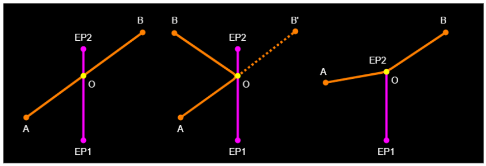

*The three cases a), b) and c) for a line in the middle of the task.*

Three panels on a black background. In each, the line control zone L is a vertical magenta segment with its lower endpoint labelled EP1 and its upper endpoint labelled EP2; the route legs are orange lines between white-dotted points A (lower left) and B (upper right), and the optimal point O is a yellow dot on L. Left panel (case a): the straight segment A-B crosses L, and O is the crossing point, roughly mid-segment. Middle panel (case b): A and B both lie to the left of L, so A-B does not cross it; a dashed orange segment continues from O to B', the reflection of B over L, and the solid route A-O-B bends at O where A-B' crosses L. Right panel (case c): neither A-B nor A-B' crosses the segment; O coincides with endpoint EP2, and the route A-EP2-B bends at the top of L.

#### B.1.2 Line at the beginning or at the end of the task

In the second scenario there are only 2 cases for the position of line L and point A/B (there is no other point because the line is first/last control zone in the task):

a) Point A projection A' on line L lies within the line segment L
b) Point A' lies outside of the line segment L

Finding the closest point on the line from point A follows the same procedure as the following code, which was originally created to find the closest point on a goal line that was not aligned with the optimized route:

<!-- PDF p.56 -->
Finds the closest point on the goal line (g1, g2) from point A, storing the result in the C fix position. This will either be on the line itself, or at one of its endpoints.

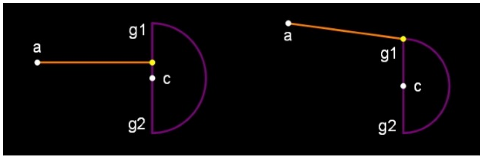

*The two cases a) and b) for a line at the beginning or at the end of the task, shown on a goal line.*

Two panels on a black background. In each, the goal line is a vertical magenta segment with upper endpoint g1 and lower endpoint g2, a purple semicircle (the goal semi-circle) bulging to the right of the line, and a white dot labelled c at the middle of the segment. Point a is a white dot to the upper left, with an orange segment running from a to the goal line, ending in a yellow dot at the closest point. Left panel (case a): a lies level with the interior of the segment, so the orange segment meets the line between g1 and g2 — the projection of a falls within the segment, just above c. Right panel (case b): a lies above the top of the line, so the projection falls outside the segment and the closest point (yellow dot) is the endpoint g1 itself.

```
//Inputs:
//line - array of goal line endpoints
//c, a - target(goal), previous point

function processLine(line, c, a)
{
g1=line[0], g2=line[1];
len2=(g1.x-g2.x)**2+(g1.y-g2.y)**2;

if(len2==0.0){
//Error trapping: g1 and g2 are the same point
c.fx=g1.x;
c.fy=g1.y;
}else{
t=((a.x-g1.x)*(g2.x-g1.x)+(a.y-g1.y)*(g2.y-g1.y))/len2;

if(t<0.0){
//Beyond the g1 end of the line segment
c.fx=g1.x;
c.fy=g1.y;
}else if(t>1.0){
//Beyond the g2 end of the line segment
c.fx=g2.x;
c.fy=g2.y;
}else{
//Projection falls on the line segment
c.fx=t*(g2.x-g1.x)+g1.x;
c.fy=t*(g2.y-g1.y)+g1.y;
}
}
}
```

---

## Appendix (not part of S7F): Source-extraction notes

Everything above is a faithful transcription of the 2026 Edition V1.0 PDF.
This appendix is ours: where the source document itself is defective, where
the transcription exercised judgement, and what the PDF's text layer gets
wrong. Page numbers are PDF pages (equal to the printed page numbers).

### Defects in the source PDF (reproduced verbatim, never repaired)

The formula truncations that plagued the 2024 edition are gone, but new
defects exist:

- **p.51, §16 (FTV)** — the printed `FTV_Score` formula has `min`/`max`
  transposed: as printed, `max(1, min(0, …)/OrderedValidities)` always
  evaluates to 1, contradicting the prose immediately above it. Implementers
  should follow the prose; the transcription reproduces the formula as
  printed and flags it in place.
- **p.25, §7.1.3** — the `FindBoundingBox` pseudocode assigns `point_NE` the
  same *(minimumLatitude, minimumLongitude)* pair as `point_SW`; NE should
  evidently use the maxima. ("mimimum" is also spelt so, twice.)
- **p.4** — the document history contains a literal unresolved Word
  cross-reference: "**Error! Reference source not found.**: clarify
  application of tolerance in goal lines". Likewise p.22's algorithm list
  items 4 and 5 cross-reference "(0)" — broken reference fields.
- **Unclosed delimiters**: the `LeadingFactor` formula (p.40) never closes
  its `max(`; the `bonusDistance` formula (p.48) never closes its `min(`;
  the four `trackpoint_{j-1}` distance calls in the cylinder-crossing
  predicate (p.29) all lack their closing parenthesis.
- **Identifier typos**: `DifffScore` (p.38, carried over from 2024),
  `mimumumTime` (p.46, vs `minimumTime` where defined),
  `timePointsRecution` twice (p.47), `GoalAltitdueFactor` (p.44),
  `geodesicRouteDefintion`, `corectedPathPointDistance` /
  `correctePathPointDistance` (p.24–25), `minToEss` vs `minToESS` (p.41),
  `WGS84ToCartesian`/`CartesianToWGS84` named inconsistently with the list
  that introduces them (p.22).
- **Missing quantifier bound**: `∀i :≤ int(MaxDist*10)` (p.38, the `i`
  before `≤` is missing — same defect as the 2024 edition's p.33).
- **The p.52 C# sample does not compile as printed** (`cartesian`
  redeclared, bare `abs()`), and its Java twin disagrees with it on a
  boundary (`la <= 55.0` vs `la < 55.0`).
- Prose slips kept verbatim: "x/y plain" (×3), "14.50" for 14:50 (p.21),
  "a ground-based at the goal waypoint altitude" (p.19), "would have
  receive" (p.47), "Stopped Races tasks" (p.46), "the points is deducted"
  (p.48), "in meter" (p.44), undefined radius *r* for the goal-line
  semicircle (p.19), a §6.1 cross-reference pointing at 6.2.3.2 instead of
  §6.3 (p.16), §2.1's history numbering jumping straight to §2.1.1.1, and
  assorted missing full stops.

### Editorial reconstructions (judgement calls, recorded)

- **p.56 `processLine` listing** — printed with all spaces stripped and,
  at 150 dpi, statement terminators ambiguous between `;` and `:`;
  restored to `;`/`,` from code logic. The p.52–54 listings are intact but
  hard-wrapped; logical lines were rejoined.
- **Discipline-band extents** — the extraction JSON's band word-lists bleed
  across formula boundaries on p.45 and p.46; the raster band positions
  decided (the `0.8∗(TimePoints + ArrivalPoints)` total-score formula is HG,
  `0∗(TimePoints)` is PG; `min(1h, NominalTime/2)` is HG,
  `minimumTime = 0` is PG).
- **p.33 §10.1** speaks only of paragliding but carries no discipline band;
  transcribed as shared text, matching the source's own marking.
- **Vector-drawn charts** (Figures 1, 9, 10, 11, 14, 16, 20) have no
  embedded image objects; their `figures/pNN-chart1.png` crops are cut from
  the 150 dpi page rasters. Curve readings in prose descriptions are
  approximate by nature.

### What the PDF text layer gets wrong (why raster reading was required)

- Every Word equation object extracts as mock-italic glyph soup with
  detached sub/superscripts; several formula blocks interleave
  character-by-character with neighbouring prose or headings (pp.22, 29,
  31–34, 41, 44, 46–48, 51).
- The p.11 flowchart loses its box-label spacing and all arrow geometry.
- The margin discipline icons (new in this edition) are embedded images and
  pollute figure-crop clustering — several `pNN-figK.png` crops are 41-px
  icon slivers, skipped here.
- **The annex code's C# syntax colouring is red-brown and triggers the
  red-change classifier** (p.52 `red_changes` in the extraction output are
  syntax colouring, not edition changes). Transcribers must distinguish the
  two; only §1.3-style change marking is annotated in this document.

### Verification status

Every page was transcribed from its raster with the text layer as an aid, in
eight independently-run page ranges. The launch-validity coefficient change
(0.027 → 0.028 vs the 2024 edition) was re-verified at 2× zoom; the
`FTV_Score` min/max transposition, the seven re-cropped chart figures, and
the red-change extents on pp.16–20, 29–31, 44–47 were re-checked during
assembly.
